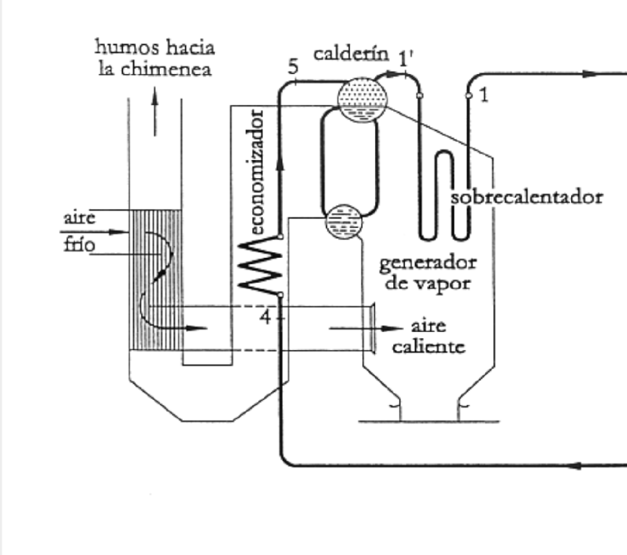

#ingeniería_energetica #central_eléctrica #termodinámica #partes_ciclo 
[[Precalentador]]
# Tipos
> [!warning] Importante #card
> Ponemos en los tubos el fluido de mayor presión 

## Acuotubular → agua en tubos y gas alrededor
Agua está a mayor presión así que va por el tubo.
## Pirotubular → gas en tubos y agua alrededor
Si nos hace falta el vapor a baja presión -> 8-10 Bar.

![[../assets/Caldera 2023-02-21 08.50.19.excalidraw]]
- [[Caldera de recuperación]] -> si [[ciclo combinado]]

![[../assets/Tema 3 Centrales Térmicas 2023-02-06 08.48.09.excalidraw]]

## Calderín
Se enta
![[../assets/Tema 3 Centrales Térmicas 2023-02-06 08.57.24.excalidraw]]
[Condensador](Condensador.md)