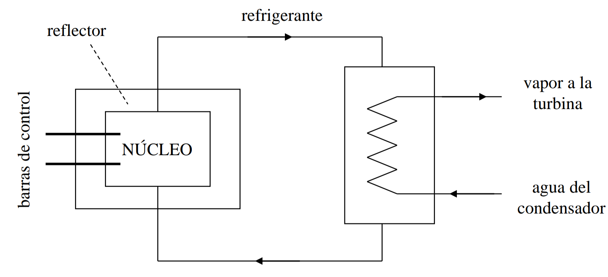
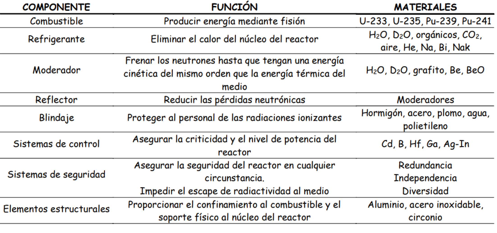
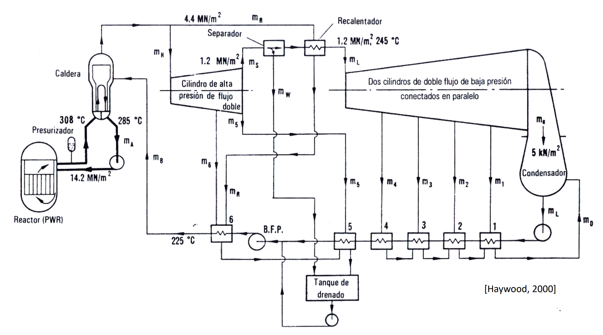

Normalmente, se usa un [Ciclo Rankine](Ciclo%20Rankine.md) donde la [Caldera de recuperación](Caldera%20de%20recuperación.md) se calienta con el refrigerante del reactor.([Agua presurizada PWR](#Agua%20presurizada%20PWR))

# Partes

## Núcleo
Contiene el combustible constituido por un núcleo físil y fértil
## Moderador
Modera la reacción, [Dispersión](Tema%206%20Energia%20nuclear.md#Dispersión) los neutrones reduciendo su velocidad.
## Reflector

## Refrigerante
Extrae calor del nucleo para usarlo en la central

| Gases | C02 He |
| ----- | ------ |
| Líquidos       | agua y sodio        |
## Barras de control
Son las que favorecen que se produzca la reacción o no.
Al incluirla se **frena** la reacción, ya que captura los neutrones.
# Tipos
## Agua presurizada PWR
Agua del ciclo no pasa por el reactor. 
A alta presión 
> [!danger] Very important #card
> Vapor saturado. No hace falta por tanto sobrecalentador. Por otra parte, la propia forma del 

## Agua de ebullición BWR

