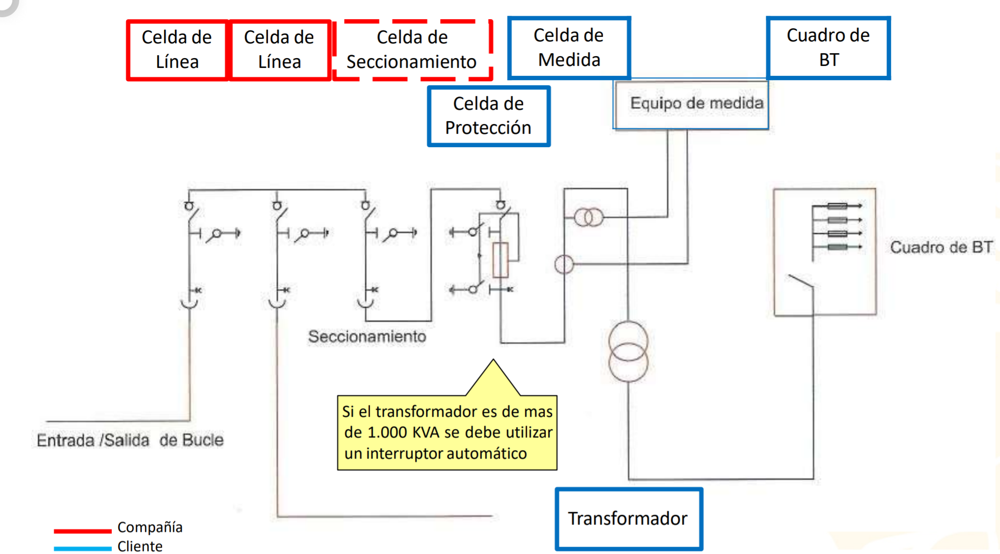
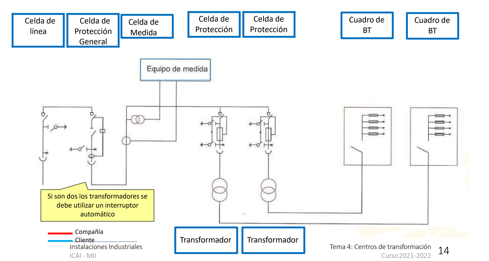

Es un enlace entre la red de media tensión y BT.
Puede tener 1 o + transformadores
![[../assets/Centro de transformación 2023-02-14 09.06.35.excalidraw]]

# Tipos
## Según la propiedad
### Público
Puede alimentar varios [CUPS](CUPS.md).
Se ha cedido a la compañía eléctrica.
Se pone un
### Privado
Solo puede alimentar un [CUPS](CUPS.md)
## Tipos de alimentación
### Antena / punta 
(en rural sobre todo)
### Anillo o bucle
### Redundante o en paralelo 
(Criterio n-1 de seguridad)
![[../assets/Centro de transformación 2023-02-14 09.12.50.excalidraw]]
# Partes
[[Celdas MT]]
[[Transformador MT-BT]]

# Aparamento

![[../assets/Centro de transformación 2023-02-14 09.17.38.excalidraw]]
# Esquemas

## Ejemplos

2 entradas de línea -> [Anillo o bucle](#Anillo%20o%20bucle)

2 entradas linea -> [Anillo o bucle](#Anillo%20o%20bucle)
celda de medida con trafo de intensidad y tensión
> [!info] Note: #card
>  
El trafo es privado por lo que se pone la celda de medida para contar las perdidas del trafo

Seccionamiento ->[Público](#Público)

Típica configuración para industria
[seccionador](Celdas%20MT.md#seccionador) y  [medida](Celdas%20MT.md#medida) ya que el trafo es privado.

