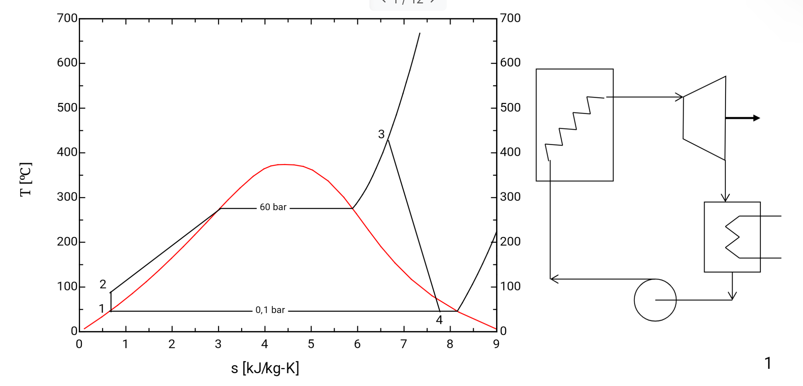

[Ciclo Rankine](../assets/Repaso%20RANKINE.pdf)

La presión mínima en la isobara 1-4(**rechazo de calor**) limita el medio de enfriamiento → Fluido de refrigeración debe de estar a menor temperatura qué el gas.
El trabajo de la bomba (1→2) se realiza en estado líquido → 

$$\eta_{b}= \frac{v_{i}*(p_{2}-p_{1})}{Wb}$$
Donde $W_{b}$ es el trabajo de la bomba y $\eta_{b}$. 

2->3 absorción de calor.
# Técnicas para mejorar rendimiento
## Reducción de temperatura de rechazo vapor
- Se usa una isobara menor 

## Aumento de la aceptación de calor

1. Aumento de presión de la caldera.
	- A la salida hay más humedad(cavitación)→ solución recalentamiento
2. Aumento de sobrecalentamiento a alta temperatura
	- Obliga a usar materiales más caros -> no rentable
3.  [Recalentamiento](#Recalentamiento)
4. [Regeneración](#Regeneración)
[Recalentamiento](Recalentamiento.md)