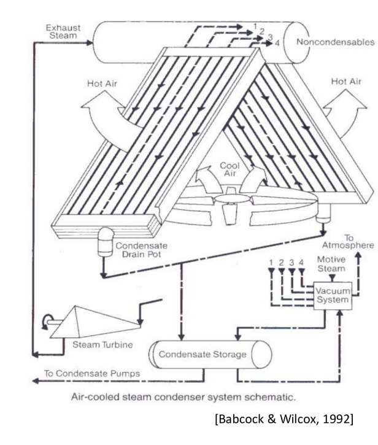

#ingeniería_energetica #central_eléctrica #termodinámica #partes_ciclo
Se trabaja a **presiones ⏬muy bajas**, por lo que la **temperatura de saturación ⏬ también es muy baja** (ej. 30 grados)
![[../assets/Tema 3 Centrales Térmicas 2023-02-06 09.18.42.excalidraw]]
Hace falta que el refrigerante esté a menor temperatura.
## Torre de refrigeración
> [!danger] Very important #card
> es una de las preguntas que te piden

![[../assets/Tema 3 Centrales Térmicas 2023-02-06 09.22.36.excalidraw]]

## Aerocondensadores
Refrigero con temperatura ambiente, el problema es que en verano podemos tener temperaturas muy altas, por lo que nos **obliga a subir la temperatura de salida** de los gases para que funcione.
