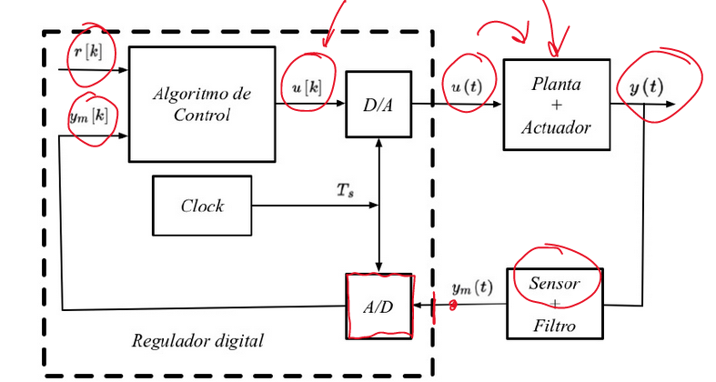
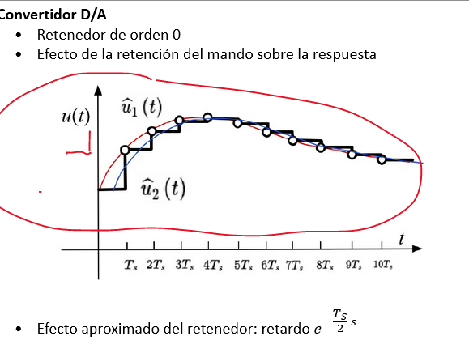

# Books
```dataview
table
  WHERE type = "book"
  AND contains(file.tags, "#Control_Avanzado") AND
  !contains(file.name, ".Desktop") 
  ```

## Contents:

 
-
 ### Muestreo
 Se realiza el muestro usando un controlador analógico digital, que muestrea el control cada $$T_s$$
	### Retenedor orden 0
	
	La práctica nos dice que la respuesta es muy parecido (no igual) a tener un mando continuo que pase por los puntos medios. De esta forma, se puede aproximar con un retardo:
	$$u(t) \approx u*e^{\frac {T_s}{2}*s}$$
	Esto se le llama [[Modelo Analógico Modificado]].
	Esto hace falta para periodo de muestreo mediano y es recomendable para [[Periodo de Muestro]] pequeño
	Por ello hay que tener cuidado con el [[Aliasing]]
 La reconstrucción de una señal analógica digitalmente se hace con un retenedor orden 0
 ### Problemas:
	Al no estar actualizado constnatemente se deteriora la respuesta ya que se añáde un retardo.
	No se puede calcular de forma exacta la derivada y integral del control PID
		- Se puede discretar la integral:
			- En adelanto (usando como altura el valor acutal del error)
			- en retraso (usando altura del anterior)
			- Trapezoidal (ponderación entre acutal y anterior) -> Puede dar problemas por ringing(oscilaciones a frecuencia de Niquist. Cuando se usa acción diferencial con alto nivel de filtrado.
		- Precisión de cálculos. Ya no mucho ya que los procesadores actuales son muy rápidos.
		-