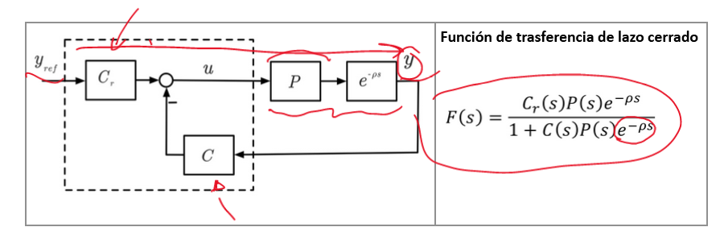
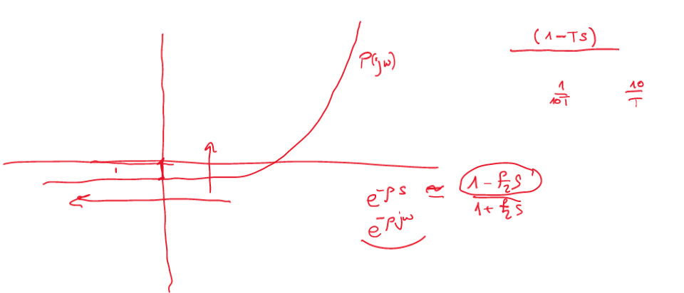
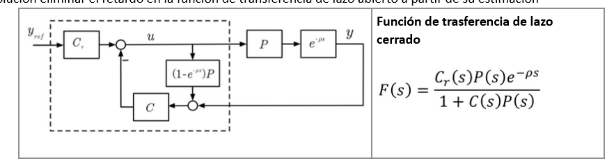
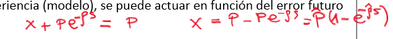
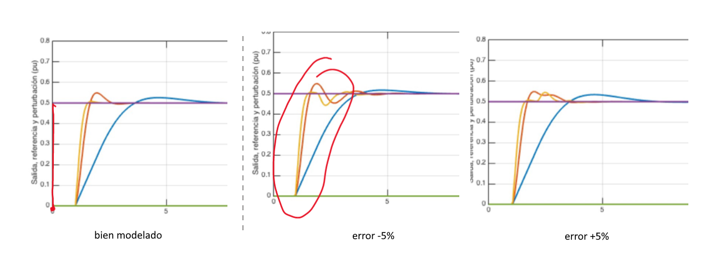
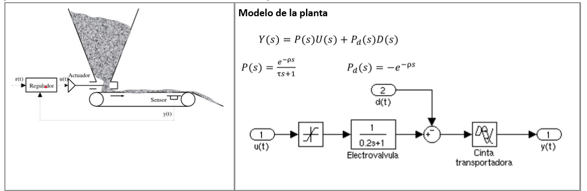
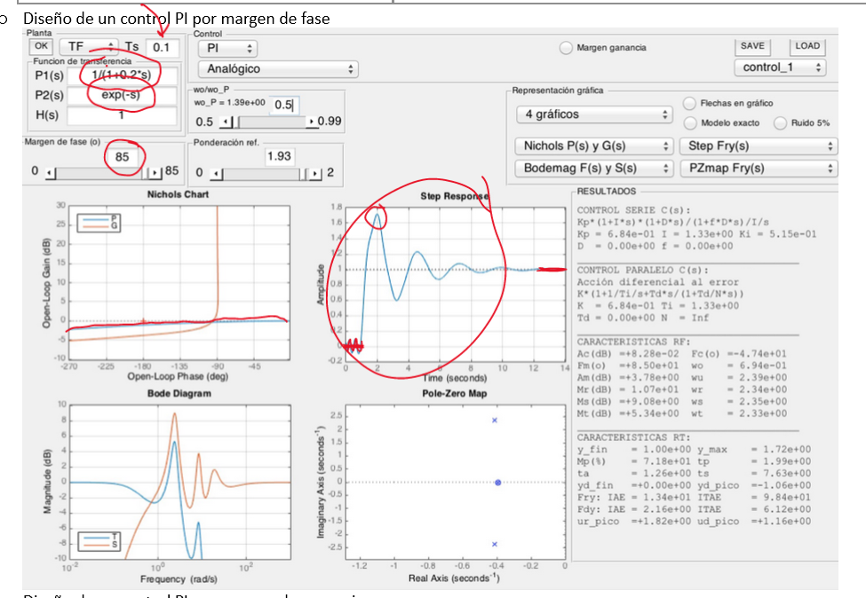
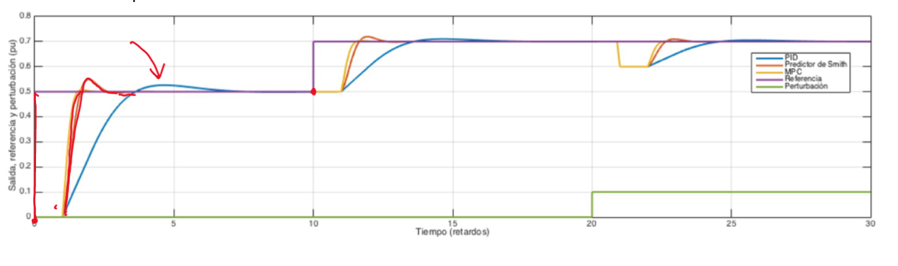

#Control_Avanzado #control

En un PID normal tenemos el siguiente diagrama:

El $e$ del denominador genera infinitos polos y empeora mucho la respuesta.
Nuestro objetivo es eliminar este retardo del denominador para así eliminar la horizontalidad del diagrama de Black del lazo abierto

Para ello se usa el:
# Predictor de Smith

Para arreglar el retardo añadimos al control una capacidad predictiva. En la ducha, si sabemos cómo se comporta nuestra ducha podemos ajustar fácilmente la temp.

Modificamos la planta del control

Al añadir este nuevo camino eliminamos el retardo de la F de transferencia en lazo cerrado.

> [!tip] Los gorritos, es decirlas predicciones afectan mucho al resultado.

La suma de los dos caminos u y la entrada de C es P
La P que usamos para la realimentación es una predicción $\hat{P}$

## Error al estimar el retardo.

## Simulador

> [!danger] HAY QUE  DISEÑAR EL CONTROL CON LA PREDICCIÓN de la planta

[Carpeta Matlab](file://C:/SyncThing/LogSeqNotes/matlab)

> [!tip] Ojo usar el ==tipo== de Control PID que te piden

## Ejemplo
### Planta:

$P_1 =\frac {1}{0.2s+1}$
$P_2 = -e^{\phi s}$
## Control PID
### Por margen de fase

Como es muy horizontal, aunque el margen de fase está bien, el margen de ganancia es muy malo y la respuesta es muy mala.
### Por margen de ganancia

[!image.png](../assets/image_1674734549769_0.png)

Mucho mejor pero ==muy== lento.
### Predictor de Smith
Sería igual pero poniendo $P_2=1$
### Comparación

El MCU es el [[Control Predictivo]]