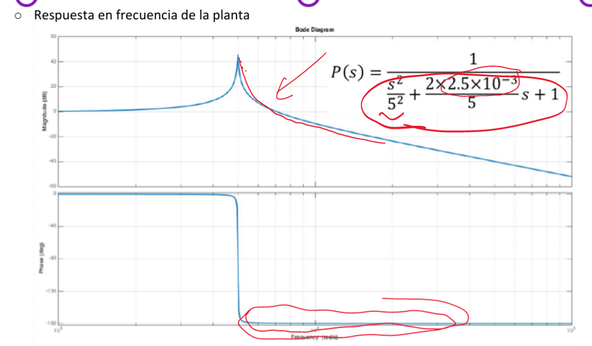
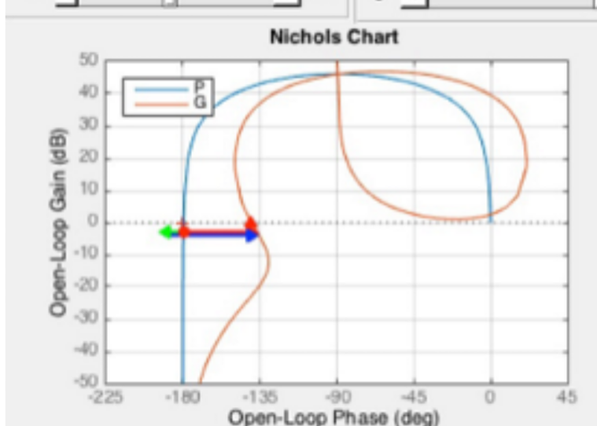
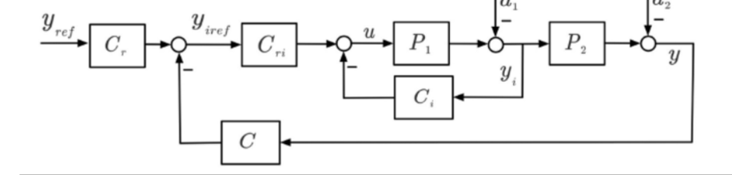
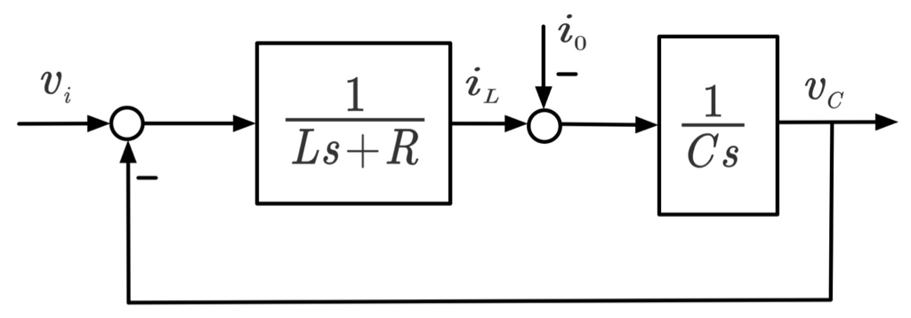
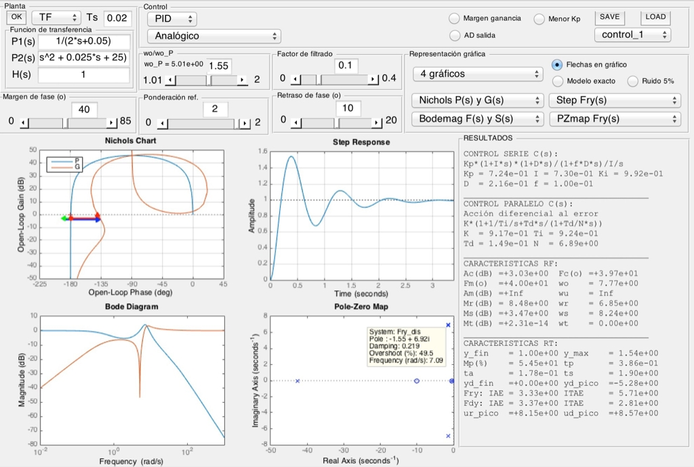
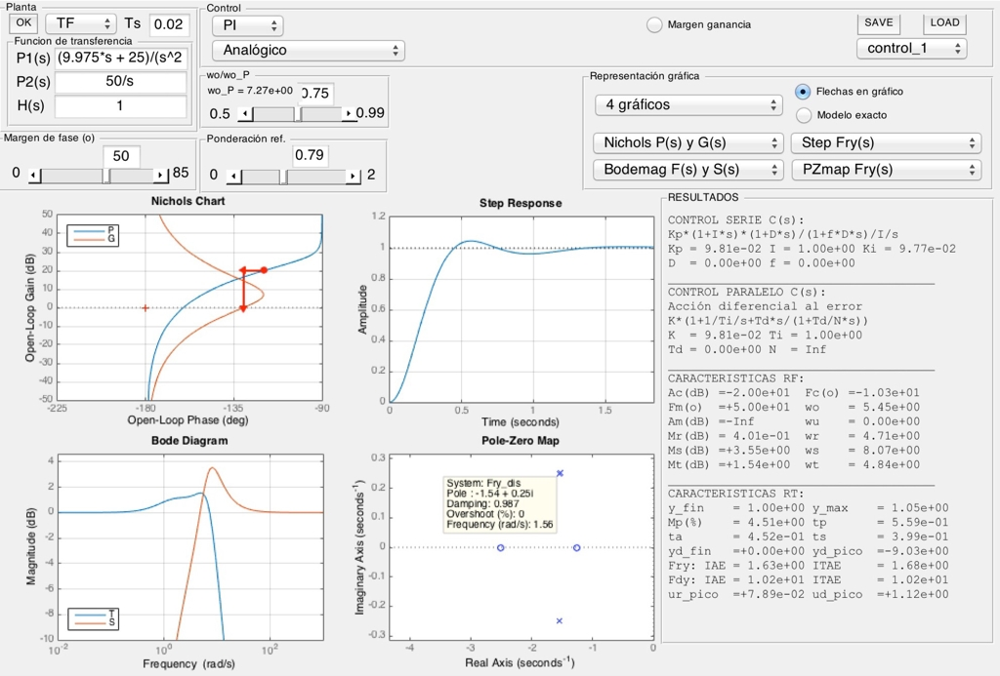
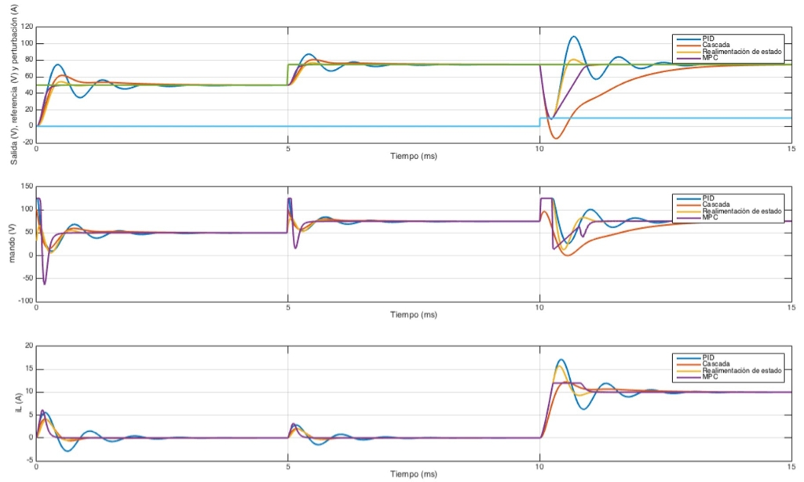

#Control_Avanzado #control
La usamos cuando la planta es muy inestable

# Planta inestable

**Diagrama de black vertical**

> [!info] Se suele usar para doble integración, accediendo a la velocidad.

## Planta con integral
Solemos usar como variable intermedia la integral de la salida, por ejemplo la integral de la velocidad, la distancia.

# Control en cascada

Se crean dos lazos 
## Lazo interno
Control muy rápido. 
> [!info] Si el lazo interno es mucho más rápido que el externo, podemos eliminar todo el boque ya que podemos decir $F_{interno} \approx 1$

## Ventajas
### Rechazo de las variables en el lazo interno
Las perturbaciones se rechazan mejor que en un PID normal ya que el lazo interno es más rápido.

# Ejemplos
## Planta

## Control PID

## Cascada

Se elimina prácticamente las dinamiscas de P1 por lo que es muy fácil de controller y queda mucho mejor el control.
## Comparativa
 

Se ve que el control en cascada es mucho más estable que el [[Control PID]] pero peor que el [control por realimentación de estado](Control%20por%20realimentación%20de%20estado.md) y el [[Control Predictivo]]

Vemos que al subir la corriente de carga, baja muchisimo la tensión ya que estamos limitando la corriente de la línea. Hay un bloque de saturación en la referencia del control interno.

