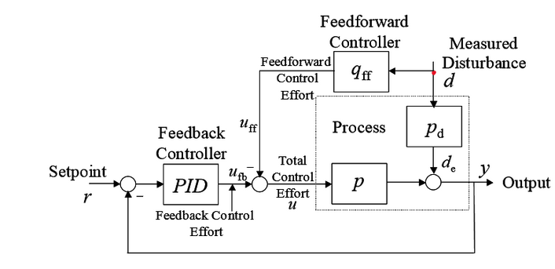
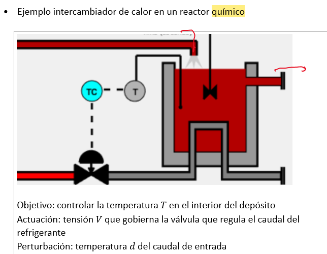
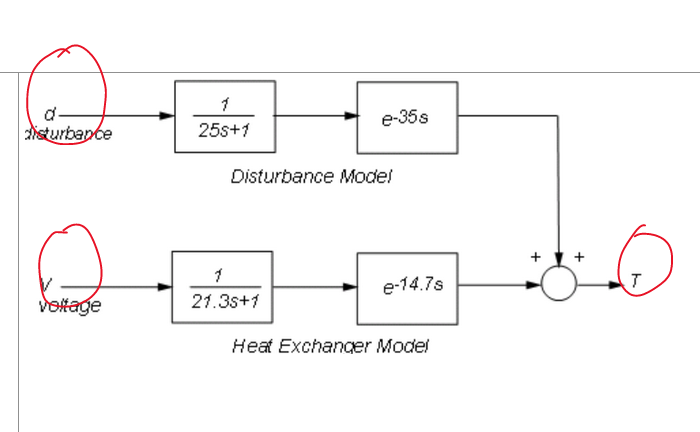
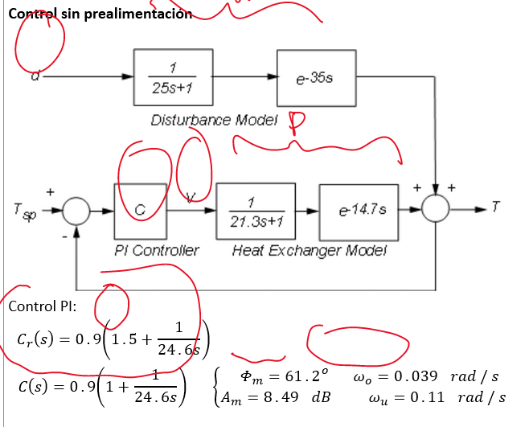
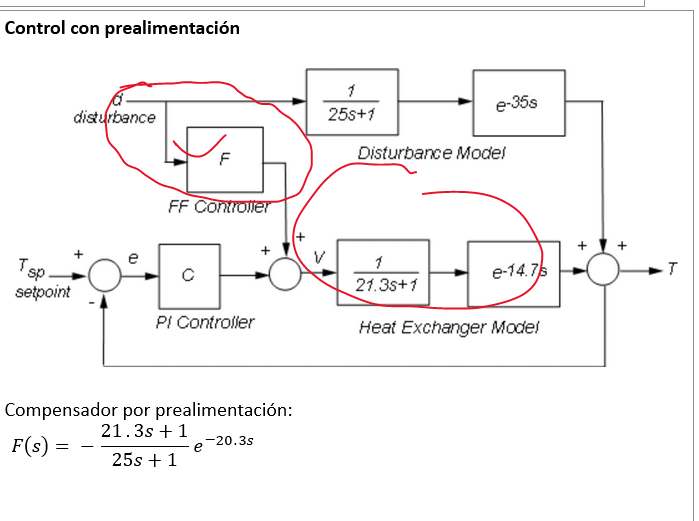
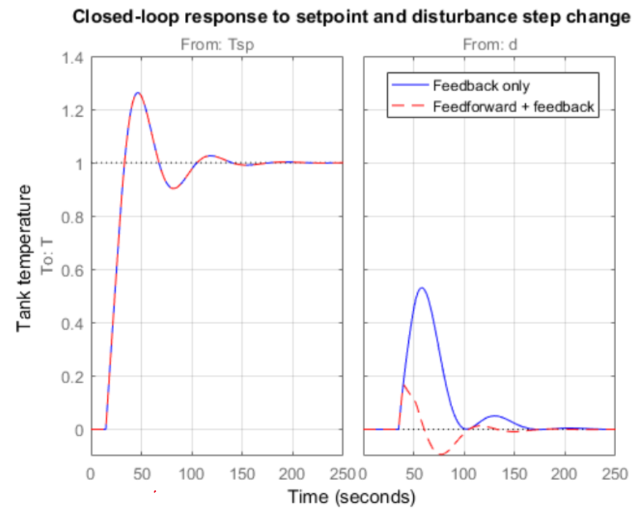

#Control_Avanzado #control
 
Un control PID puede conseguir filtrar una perturbation pero en el transitorio, debido a la inercia del sistema esta perturbación es apreciable.
{:height 351, :width 706}
ponemos un segundo control que ayuda a eliminar la perturbación del mando de esta forma se anula mejor su efecto.
Es un control PID normal, salvo por el bloque $$q_{ff}$$. Medimos la perturbación(obligatorio) y generamos otro mando.
El objetivo es que el camino de la perturbación hasta y sea igual en pd y qff para que se cancelen
$$ \hat{p_d}=q_{ff}\hat{p}$$
Ojo esto es una predicción (el gorro)
Por tanto
$$q_{ff} = \hat{p^{-1} }\hat{p_d}$$
## Casos que no se pueden
Hay veces que no se puede crear este control, ya que te sale q_ff con adelanto (no podemos ir al futuro)
Si al hacer la función de transferencia hay mas ceros que polos (la función de transferencia no es propia) -> Quitamos los ceros más lejanos, ya que son los que menos influyen (ojo con mantener la ganancia estática)
Planta inversamente estable (con cero positivo), por tanto al darle la vuelta sale inseatable -> quitamos el polo insetable
-
## Ejemplo

La reacción quimica es exogena (se acelera con la temperatura que va subiendo)
Controlamos la temperatura que desestabiliza la reaccción con refrigerante  del cual controlamos el caudal.
Perturbacion concetración del reactivo A y su temperatura(nuestro ejemplo).
{:height 264, :width 485}
Planta de la perturbacíon y mando
#### Control PID tradicional:
{:height 362, :width 452}
#### Control con prealimentación
{:height 462, :width 669}
-35+14.7 = 20.3 seg de retraso
#### REspuesta

No afecta a referencia, pero si que baja mucho el efecto de la perturbación.
No es ideal ya que se ve la salida, Se ha puesto retraso de 25 para ver que pasa
Si se pusiese el retraso bien no se vería respuesta ante error.
