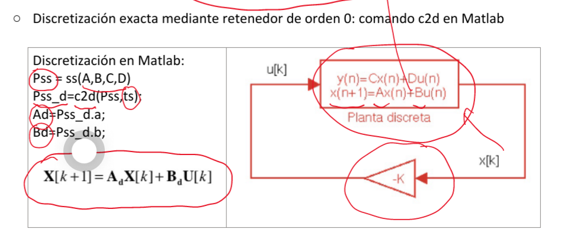
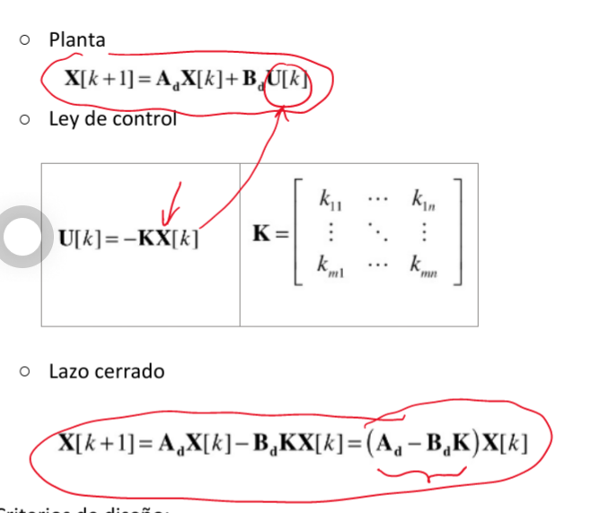
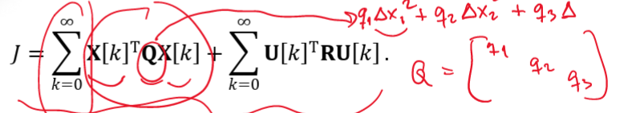
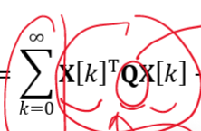
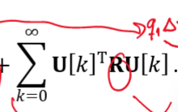

#Control_Avanzado  #control 
Realimentación estado > [Control PID en cascada](Control%20PID%20en%20cascada.md)> [Control PID](Control%20PID.md)
**Multivariable** 
# Areas de aplicación

- [[Plantas MIMO]] de **respuesta rápida**
- [[Plantas SISO]] **inestables** o con **resonancias** (ej segway)
# How it works
## Esquema básico
Se basa en el uso de un modelo de [Representación de Estado](Representación%20de%20Estado.md)


$\vec{U}$: Combinación lineal de [Variables de Aestado](Representación%20de%20Estado.md#Variables%20de%20estado) usando las matrices K y Kr
> [!info] Note: #card
> Nótese que muchas veces No existe **Kr** en el diagrama. Esto es porque la **referencia** es 0. O porque se no se ha separado la K poniéndola antes de la realimentación.
> 


### Matrices de  ganancias
Permiten colocar los polos del sistema donde nos hagan falta [Diseño](Control%20por%20realimentación%20de%20estado.md#Diseño)

> [!info] Indo #card
> Esta imagen está hecha para una [Linealización en el punto de operación](Realimentación%20de%20estado.md#Linealización%20en%20el%20punto%20de%20operación)


## Discretización
Fíjese que es un control en tiempo discreto, 

> [!warning] Importante #card
> las matrices ABCD de tiempo discreto son diferentes a las de tiempo continuo
> 

## Lazo cerrado



# Diseño

## Por asignación de autovalores
Sacamos los [[polos]] de la matriz de [Lazo cerrado](#Lazo%20cerrado)
No tiene sentido si las salidas tienen muchas interacciones y nos vamos a pelear entre nosotros. → Usaríamos [Regulador LQR](#Regulador%20LQR)
### Creamos el polinomio característico
Sabiendo que los polos de lazo cerrado se comportan así
$$|z\mathbf{I}-\mathbf{A}_{\mathrm{{d}}}+\mathbf{B}_{\mathrm{{d}}}\mathbf{K}|=\prod_{i=1}^{n}(z-\lambda_{i})$$Calculamos la  para conseguir la [Ubicación de los polos](polos.md#Ubicación%20de%20los%20polos) deseada.
> [!info] Info #card
> En el caso de un sistema de tercer orden:
> $$z^{3}+a_{2}(K)z^{2}+a_{1}(K)z+a_{0}(K)=(z-\lambda_{1})(z-\lambda_{2})(z-\lambda_{3})$$
> 


Se calcula la [Matrices de ganancias](#Matrices%20de%20ganancias) usando el comando place
```matlab
# Polos en lazo cerrado
polos_lc
# Polos en lazo cerrrado en tiempo discreto
polosd_lc = exp(polos_lc*ts)
Kcd Kcd=place (matAd , matBud , polosd_lc) ;
```
> [!danger] Very important #card
> Place no permite tener autovalores repetidos, por lo que si se da el caso aumentamos uno levemente.


## Regulador LQR
linear cuadratic regulator
En sistemas MIMO el objetivo es combatir las interacciones y priorizar el control de las salidas y el uso de los actuadores
Se usa un proceso iterativo 
### Funcion de coste   
La función de coste debe incluir dos términos:
-   Error de control de cada una de las salidas, incluido el efecto de las interacciones
-   Esfuerzo de control en cada uno de los actuadores
$$J=\sum_{k=0}^{\infty}\mathbf{X}[k]^{\mathsf{T}}\mathbf{Q}X[k]+\sum_{k=0}^{\infty}\mathbf{U}[k]^{\mathsf{T}}\mathbf{R}\mathbf{U}[k]\,.$$

> [!danger] Very important #card
> Q y R se suelen poner como matrices diagonales, asignando valores elevados a aquellas  variables que se deseen minimizar más rápidamente.

#### Q
Peso de las variables

> [!info] Info #card
> los pesos de $Q$ controlan como queremos que funcionen las dinámicas de las variables de control
#### R
Esfuerzo de actuación:

como de agresivos son los actuadores
#### P_n
Término adicional de coste para  
el **error de regulación al final** de dicho horizonte.
En ciertas aplicaciones, donde el tiempo invertido en alcanzar el punto de operación es crítico,  se suele utilizar una función de coste con horizonte finito y un término adicional de coste para  el error de regulación al final de dicho horizonte
### Matlab
```matlab
%%Regulador LQR
% Pesos
Q = diag([0.5 2 0.1 5]);
R = diag ([0.025 0.1]);
% Calculo de la matriz K del control
[Kd,Pn,polosd_lqr] = dlqr(matAd,matBd,Q,R);
% Polos los polos a equivalentes en tiempo continuo
polosc_lqr = 1/ts * log(polosd_lqr);
damp(poly(polosc_lqr))
```
