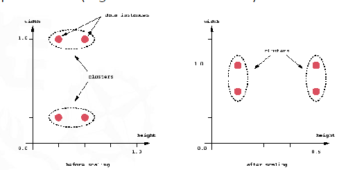

#machine_learning #datasets 

### The problem of scaling
   Scaling can severly affect the perceived distance between points. This is a issue for many algorithms, especially those that use distance metrics. For example, the k-nearest neighbors algorithm will give different results depending on the scale of the data.
### Standarization
To fix this, we standardize the data. This means that we subtract the mean and divide by the standard deviation. This makes the data have a mean of 0 and a standard deviation of 1. Done for each column.
  
   $$x^* = \frac{x - \mu}{\sigma}$$

# 1. [[Data/Load Dataset]]
# 2. [[Data/Preprocessing]]


# R Code

Measure for variable importance how informative it is for 
```r
varImp(tree.fit,scale = FALSE)
plot(varImp(tree.fit,scale = FALSE))
```
