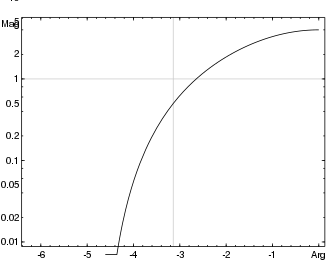

Se representa G(s), el control en [Lazo Abierto](Lazo%20Abierto.md) para valuar la **estabilidad y robustez** de un sistema en [[Lazo Cerrado]] $\frac{G(s)}{1+G(s)}$.

-180 -> [Criterio del reverso](Criterio%20del%20reverso.md)