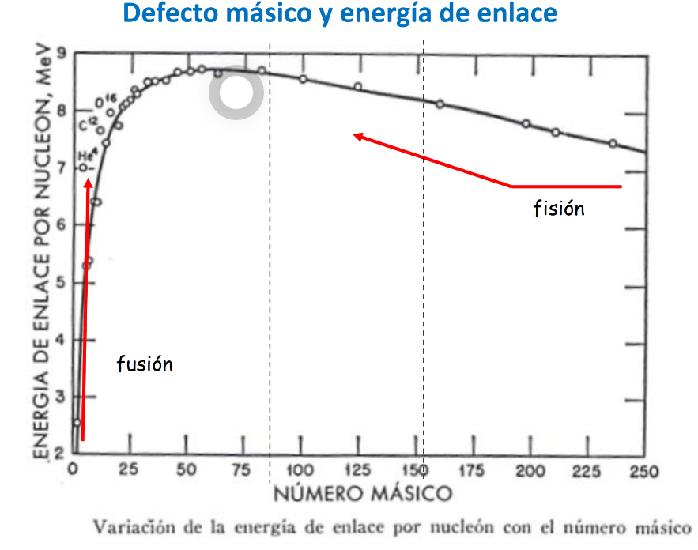

Energía que hay que aportar para romper/crear un vinculo entre nucleones.
⏫ Energía de enlace -> ⏫ Estabilidad del elemento

Se tiende a generar compuestos de mayor energía de enlace.

Tanto en la fusión como en la fisión se tiende a ir hacia un elemento con mayor energía de enlace.
