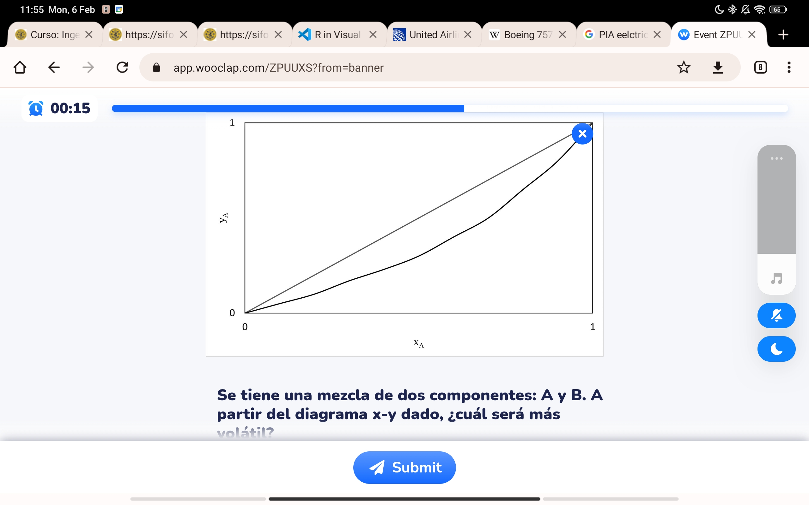
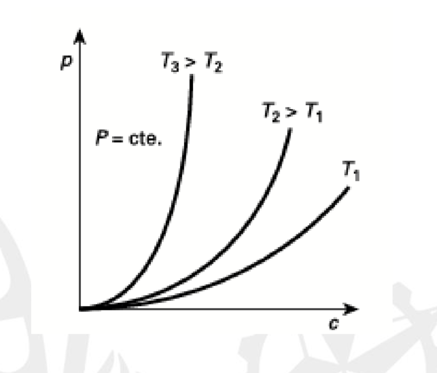
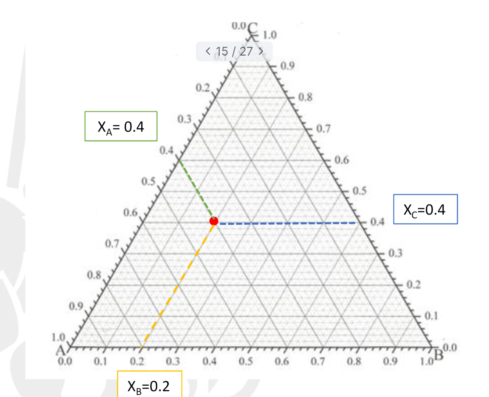

#quimica 

[Diapos](../assets/Tema%204-Equilibrio%20Químico_v1.pdf)
## Equilibrio físico
Estado de menor energía al que quiero estar.
### Estado monofase
Todo en la misma fase ej. todo gas el aire.
#### Equilibrio monofásico
## Multifase

### Equilibrio entre fases
Dos fases ej. líquido vapor. 
Queremos separar A y B.
![[../assets/Equilibrio Quimico 2023-02-01 11.29.48.excalidraw]]
Para poder separar un químico entre dos fases es necesario que cada fase tenga un coeficiente de reparto diferente.
$$k_{a}\neq k_{b}$$
#### Coeficiente de reparto

$$k_{i}=\frac{y_{i}}{x_{i}}$$
$k_{i}$: nos dice que proporción del químico va a cada fase.
$x_{i}$ Fracción molar del componente i en fase x
$y_{i}$: Fracción molar del componente i en la fase y.

> [!info] Se sacan mediante ensayos o correlaciones termodinámicas usando la fugacidad → la tendencia que tiene un componente de cambiar de fase
##### Gases idelales
![[presión de vapor]]

#### Selectividad o volatilidad relativa

$$a_{ij}= \frac{k_{a}}{k_{b}}\neq 1$$

> [!info]  Buscamos que $α$ sea mucho mayor que 1 ( o mucho menor)

Es decir, que los coeficientes de reparto sean muy diferentes. (Mucho de uno en un estado y mucho del otro en el otro estado).
# Diagramas de equilibrio

![[../assets/Equilibrio Quimico 2023-02-06 11.37.45.excalidraw]]
Si hay menos gas que liquido es menos volatil.
En este caso 
## Regla de la palanca
La dimensión de la horizontal en el diagrama es proporcional a la masa total.
Es **inversamente** proporcional al porcentaje.
El brazo hasta la zona líquida es proporcional a la cantidad de gas.

# Equibrio liquido
> [!info] Info #card
> A mayor temperatura menor solubilidad

## Diagrama ternario
[Extracción](Las%20operaciones%20unitarias#Extracción)

Para leer un componente vemos los ejes que sean paralelos al lado contrario.
> [!info] Info #card
> Cuanto más cerca del vertice más porcentaje tiene de eso

A este diagrama se le puede añadir:
inicialmente tengo F(BC) y S(A). 
Y a la salida extracto y refino(F)
![[Extracción diagrama triangulo]]

