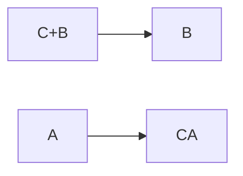
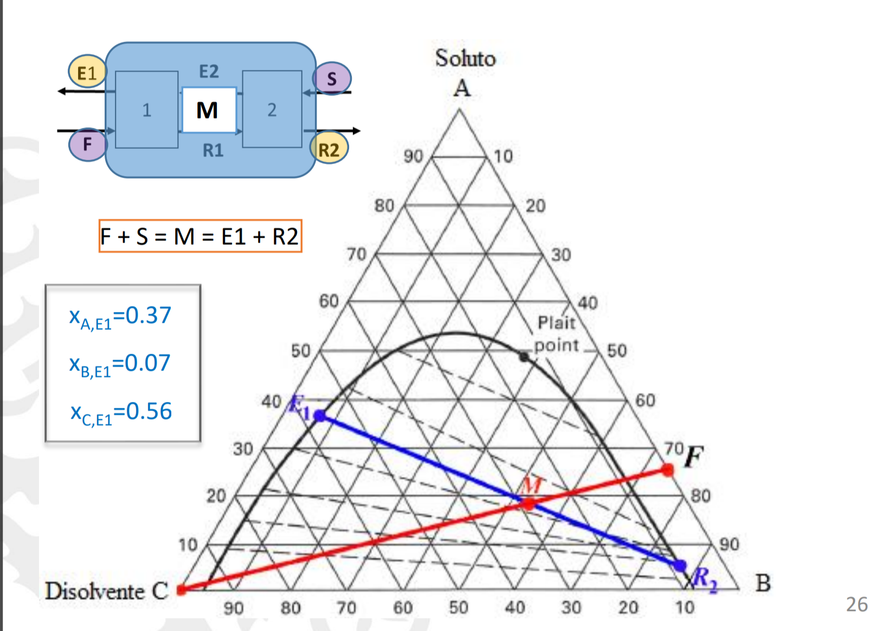
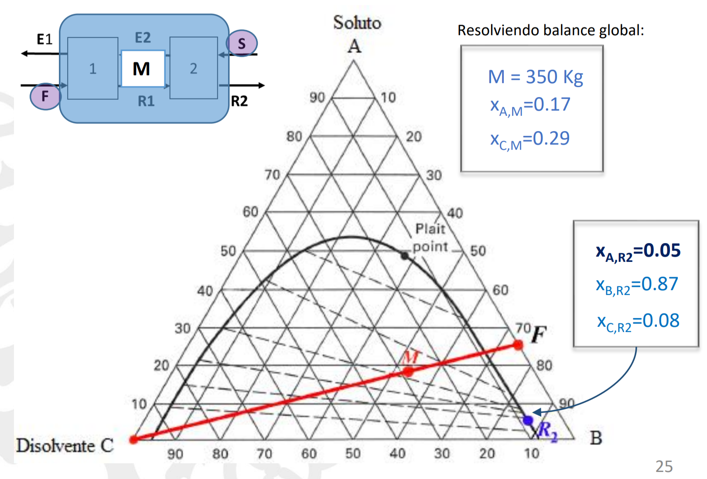

# Extracción
A la mezcla de dos líquidos **A**(soluto) y **B**(disolvente), qué juntos se llaman **alimentación**(F), añadimos C(**disolvente añadido**(S)) **agitamos** y C se va con A. B y A tienen que ser **inmiscibles** (que no se mezclan). Después se deja sedimentar cada gota de líquido.

A la salida de CA → Extracto (E).
A la parte con sobre todo B → Refino(R).

Se añade un líquido que solo es soluble con uno de los líquidos a separar. Es decir que solo se puede mezclar uno, que no se pueda disolver se llama inmiscible.

## Diagrama de flujo:
-> C     |       |-> B
A+B -> |      | -> C+A
![[../assets/Las operaciones unitarias 2023-02-08 11.17.47.excalidraw|200]]

 C es más denso que A y B
 
## Tipos
### Por etapas
#### Una etapa
Diagrama del proceso:
![[../assets/Las operaciones unitarias 2023-02-08 11.17.47.excalidraw|200]]
Balance másico
$$F+S=E+R=M$$ M=R+E
Balance de materia de A
$$ X_{AF}F+X_{AS}S=X_{AM}M
$$
$X_{AS}$= 0, ya que el disolvente nuevo se supone que no tiene A.

> [!warning] Importante #card
> El extracto E siempre es el cercano al S  y R cercano a F

La **composición** del refino se saca rápido usando la **posición** de cada uno.
Para sacar la **masa** de E y R usamos la **[[Regla de la palanca]]**

#### Varias etapas con disolvente nuevo
![[../assets/Las operaciones unitarias 2023-02-08 11.41.24.excalidraw]]
La primera etapa se hace igual que antes. Cambia la segunda etapa:
![[../assets/Las operaciones unitarias 2023-02-08 11.44.23.excalidraw]]
> [!info] Info #card
> Fijese que cada etapa R2 es más puro solo B
#### Múltiples etapas contra corriente
Como tenemos el gradiente de concentración a lo largo es más eficiente que una sola etapa.
> ![[../assets/Extracción 2023-02-13 11.51.21.excalidraw]]
$R_{N-1}+E_{N+1}=E_{N} +R_{N}$
Puto de operación(P) -> Nos da la relación entre todas las corrientes.
Como planteo el problema
1. colocamos los puntos iniciales F y S
2. Colocamos la R final
3. U
> [!info] Note: #card
> Las diferencias entre los caudales es siempre la misma.

Triangulo:

 
# Preguntas teoría
## Cual es la más soluble?
🟩 Verde
⏬ area de curva -> ⏫ solubilidad
⏫ temp -> ⏫ solubilidad

![[../assets/Extracción 2023-02-20 11.58.41.excalidraw]]
## Que disolvente es más eficaz?
C por descendente . El refino te queda con menos A
![[../assets/Extracción 2023-02-20 12.01.46.excalidraw]]
## Disolvente máximo y mínimo que se puede usar
Tiene que pasar por la curva.
La M tiene que estar en la curva
M cerca de C -> Máximo
M cerca de F -> mínimo

# Problemas
## 1

## 2
**Mediante una extracción en una sola etapa y partiendo de 200 Kg de una mezcla que contiene un 30% de etilenglicol (soluto) en agua, se desea obtener un refinado que contenga un 20% de 
etilenglicol. El disolvente utilizado para la extracción es furfural puro. Se desea conocer qué cantidad de 
disolvente habría que utilizar y qué cantidad de refinado se obtendrá. Utilizar el diagrama de equilibrio ternario Etilenglicol-Agua-Furfural para resolver el problema.** 
F =200 kg $X_{a}ˆ{F}$= 0.3 $X_{c}ˆS$= 1 $X_{a}ˆR$ = 0.2
S? R?
Vamos al diagrama
[Extracción diagrama triangulo](Extracción%20diagrama%20triangulo.md)
Situamos F y S(puro así que esquina) 
Unimos puntos 
R tiene 20% y está en la barrera cerca de R
Sacamos recta de reparto de R → intersección es M contrario es E.
## 3
**Mediante una extracción en una sola etapa y partiendo de 200 kg de una mezcla que contiene un 30 % de etilenglicol (soluto) en agua, se desea obtener un refinado que contenga un 20 % de etilenglicol. El disolvente usado para la extracción es furfural puro. Se desea conocer qué cantidad de disolvente habría que usar y qué cantidad de refinado se obtendrá. Emplear el diagrama de equilibrio ternario Etilenglicol-Agua-Furfural para resolver el problema.** 

## 4 
**Mediante una extracción en una sola etapa y partiendo de 200 Kg de una mezcla que contiene un 30% de etilenglicol (soluto) en agua, se desea obtener un refinado que contenga un 20% de etilenglicol. El disolvente utilizado para la extracción es furfural puro. Se desea conocer qué cantidad de disolvente habría que utilizar y qué cantidad de refinado se obtendrá. Utilizar el diagrama de equilibrio ternario Etilenglicol-Agua-Furfural para resolver el problema.**

## inter 22

**En una industria se obtienen dos corrientes diferentes (F1 y F2) formadas por mezcla de Ácido Acético y Éter isopropílico. Ambas corrientes tienen un caudal de 200 kg/h. La corriente 1 (F1) tiene un 50% de Ácido Acético y la corriente 2 (F2) tiene un 15%. Se desea eliminar el Ácido Acético del Éter Isopropílico de ambas corrientes para poder volver a utilizar esté ultimo lo más limpio posible.**
F1 = 200kg Xaf1 =0.5
F2 = 200kg Xaf2 =0.15

### a)
(2 PUNTOS) Para llevar a cabo la separación se utiliza una extracción líquido-líquido en 2 etapas. 
La corriente 1 (F1) se introduce en la primera etapa y, para optimizar la extracción, la corriente 2 (F2) más diluida, se introduce en la etapa 2. Cómo disolvente se utiliza en cada una de las etapas 100 kg/h de agua pura. En el esquema adjunto se resumen el proceso.
![[../assets/Extracción 2023-02-20 11.41.28.excalidraw]]

Sacamos el primer [Extracción diagrama triangulo](Extracción%20diagrama%20triangulo.md)
![[../assets/Extracción 2023-02-20 11.46.38.excalidraw]]