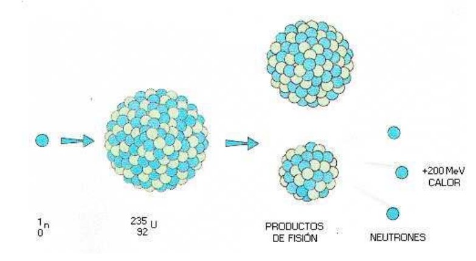
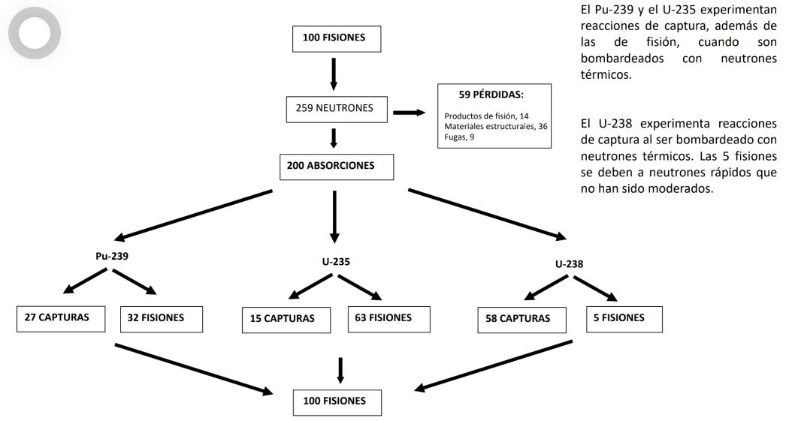

Por tanto: U-235 + 235 x 7,6 → PF1 + PF2 +235 x 8,5
Es decir, la fisión de un núcleo de U-235 libera aproximadamente 210 
# Eficiencia energética
MeV200 MeV/núcleo x 1,602 x 10-13 J/MeV = 3,2 x 10-11 J/fisión
3,2 x 10-11 J/fisión x 6,02 x 1023 átomos/mol = 1,9 x 1013 J/mol
1 g de U-235 producirá 1,9 x 1013 J/mol x 1 mol/235 g = 8,2 x 1010 J/g
El “poder calorífico” será de 8,2 x 104 MJ/10-3 kg = 82000 GJ/kg
**1 g U-235/día produce 949966 W = 1 MW**

# Reacciones en cadena

No todo lo que hay en el reactor es U235 por lo que puede que estos neutrones no impacten con U 235 sino con otro compuesto.

