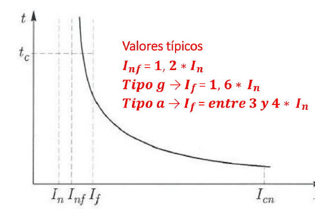
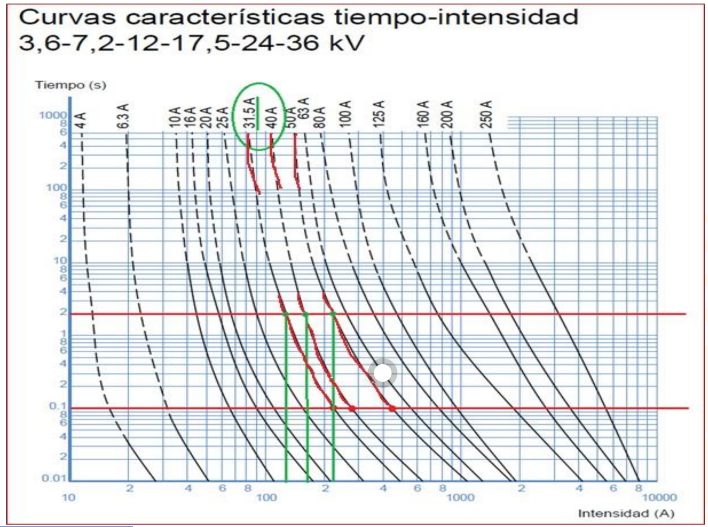
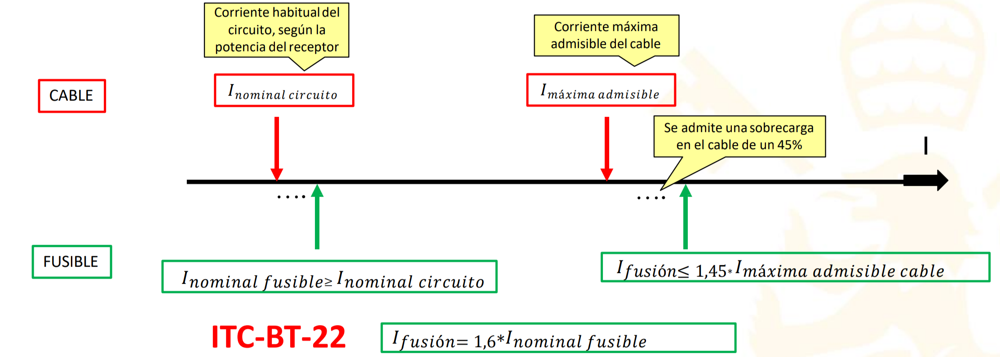

Hilo que se rompe. Cuello de botella en el cable para que se funda antes.
> [!warning] Importante #card
>  Cuidado! En circuitos trifásicos se puede romper solo una fase y producir desequilibrios entre fases

Si la falta supera el poder de corte($I_{cc}$) el fusible aún roto se forma un arco eléctrico.
En BT se venden de hasta 1 kA.

$I_{nf}$ → Intensidad máxima que puede soportar indefinidamente el fusible.
$I_{cn}$ -> Intensidad máxima que puede cortar el fusible antes de arco

# Nomenclatura
16AaM 
	a: acompañamiento(protección redundante nunca sola)
	g: general
a y g → proteger contra **sobrecargas**
a → protege también contra cortocircuitos
	G: general
	M:	
> [!info] Info #card
> Los motores y ascensores que tienen picos de corriente por encima de la nominal en el arranque, no se pueden proteger con un fusible
# Criterio de selección

## Fusibles MT para protección de transformadores MT/BT
Criterios de selección:  
• Soportar, sin fundirse intempestivamente, la cresta de corriente  
• Soportar la corriente en servicio continuo y las eventuales sobrecargas  
• Cortar las corrientes de defecto que puedan ocurrir en los bornes del secundario del trafo
![[../assets/Fusible 2023-02-24 23.41.46.excalidraw]]
> [!warning] Importante #card
> Comprobamos que se cumplen las condicones en verde 

## Fusibles BT para protección de cables
Criterios de selección:  
• Soportar, sin fundirse, la corriente nominal del circuito, calculada a partir de la  
potencia del receptor  
• Cortar las corrientes de defecto superiores a la intensidad máxima del cable,  
admitiendo como máximo una sobrecarga transitoria del 45%



[PIA Automáticos](PIA%20Automáticos.md)

Calcular fusible para el trafo para porteger [Cortocircuito](Cortocircuito.md)
![[../assets/Fusible 2023-02-10 11.26.04.excalidraw]]
```math
In_alta= 630/(sqrt(3)*20) #A
```
[Proteger Transformadores](#Proteger%20Transformadores) ->  If(0.1s)= In_alta 12= 218 A

Si hay un corto en baja, el fusible lo vé escalado por el trafo. Por tanto las corrientes son más bajas

```math
Zb= pow(400,2)/(630 *1000) # omhnio
xcc = 6%*Zb #ohmn
Uff = 400
Uf = 400/sqrt(3)
Icc_III_BT= Uf/xcc #A
Icc_I_BT = Icc_III_BT/3
Icc_III_AT = Icc_I_BT *sqrt(3)* 400/20000
Icc_I_AT = Icc_III_AT/3
```
por tanto:
busco trafo
![[../assets/Fusible 2023-02-10 11.50.46.excalidraw]]
Nos limita el corte bifásico ya que salta con menos corriente
> [!info] Note: #card
> ![[../assets/Fusible 2023-02-10 11.37.33.excalidraw]]
> Un corto en una fase en BT se se como un corto Fase-Fase en alta tensión
> 
> BT corto MONO -> AT corto TRI


## fusibles en el cuadro de BT
Para cualquier calibre elegido, se debe cumplir que su capacidad máxima de ruptura  
es superior a la corriente de cortocircuito en barras del cuadro de baja tensión (CBT).  
El cable de BT de unión entre el Transformador y el CBT se puede despreciar  
Los fusibles pueden llegar a tener poder de corte máximo de unos 120 kA

Para la protección contra sobrecargas, se deberá interrumpir toda intensidad de sobrecarga permanente en los conductores de un circuito, antes de que provoque un Calentamiento perjudicial en el aislamiento de los mismos (**måximo 90 C**). La protección
contra sobrecargas estarå asegurada cuando se cumpla la siguiente regla, segün UNE
20460:


## EL CUADRO DE BAJA TENSIÓN DEL [Centro de transformación](Centro%20de%20transformación.md)

En cuanto a los cortocircuitos, las condiciones que se deben cumplir son:  
- Su poder de corte será mayor, en el punto donde están instalados, que el valor de la  
intensidad de cortocircuito prevista.  
- Toda intensidad de cortocircuito, que suceda en cualquier punto de la red, debe  
interrumpirse en un tiempo inferior a aquel que llevaría al conductor a alcanzar su  
temperatura límite (250ºC).
