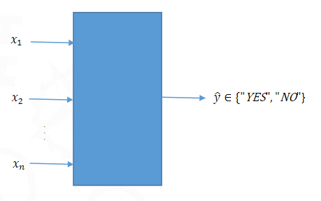

## Hard Classification
There are two classes. The output variable is binary.
	We measure the performance of the model using MSE (Mean Squared Error).
	$$MSE = \frac{1}{n} \sum_{i=1}^{n} (y_i - \hat{y}_i)^2$$
	