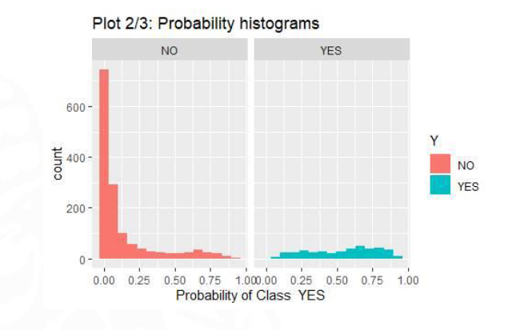

# Histograms
 
 When the model is working properly we expect this kind of histogram.
-
 
 We can see that the YES is pretty flat, so the model CANT predict correctly the yes.
 This might me because the YES completly overlaps of the NO class. We need to add more variables
 