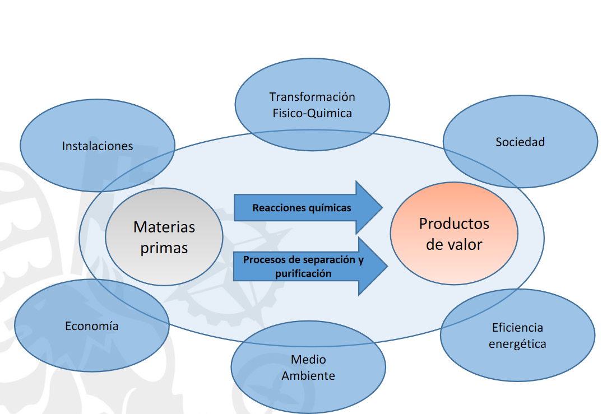

icon::  🧪
semester:: 2 
year:: 1
program:: MII
-

 [[ÉTAPAS DE LOS PROCESOS QUÍMICOS INDUSTRIALES]]
 [[Las operaciones unitarias]]
[[Equilibrio Quimico]]

[[Produccion de Amonio]]

 Eva Paz Jiménez eva.paz@comillas.edu (D-119)
 
 
 
-
 {:height 539, :width 778}
-
 Reacciones quimicas: Ing Quimicos
 Separacion y purificacion: Mayoria del tiempo y dinero
-
 [[ÉTAPAS DE LOS PROCESOS QUÍMICOS INDUSTRIALES]]
 [[Las operaciones unitarias]]
-