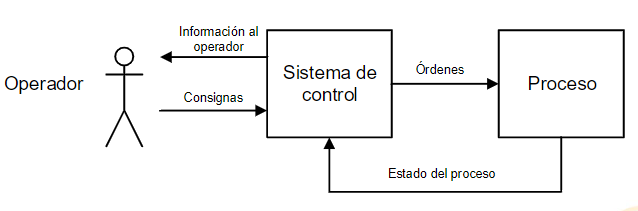
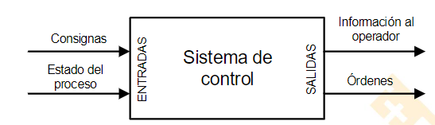

#Automatizacion - 
 ((63c7a214-aa11-4535-845c-0ec62f62c3a4)) -> SEGURIDAD
 ## Sistema industrial
 {:height 163, :width 471}
 El operador tiene que ser capaz de actuar con facilidad.
 PARADA de emergencia
 {:height 136, :width 448}
 Salida del control son entradas del proceso y viceversa.
 ## Sensores
-
 ## Accionamientos
 Motor
 ## HMI
-
 ## Seta de emergencia
 ((63c7aa5b-a4d5-4ab1-bd1e-99ea437f881a))
 Medidas pasivas y activas de emergencia.
 ## Unidades de control
	### Cableada
	Siempre la hay. Son sin programación. Relé.
	### Programada
	PLC
	Existen tambien redes de PLC manejadas por SCADA en centros de control
-