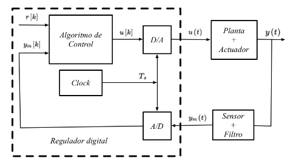

- ## References
 
-
-
 
 {{embed [[]]}}
 In the following diagram, parts inside the dashed rectangle occur on discrete time. This can be easily noted because the signals depend on [k] and no on [t].
 {{embed [[Discrete Time]]}}
-