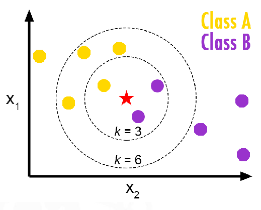

#machine_learning #classification #regression #supervised_learning
# K-Nearest Neighbors
Find the predefined number of training samples(K) closest to the new point, and predict the label from these training samples.
 
 For k= 3 the point is Class B
 For k = 6 the point is Class A
> [!tip] The higher K the the smoother (less complex) the model (The prediction is more global)

> [!danger] Very important
> ⏬K -> [Overfitting](Overfitting.md) 
> ⏫ K -> [Underfitting](Underfitting.md)
> 
Careful with [[Bias-variance trade-off]]
# Why to use it

|  ✅PROS                                                                                                                                                                                                                                                                                                                                                                                                                                                                                                                                                                                                                                                                                                                                                                                                                                                                                                                                                                                                                                                                                                                                                                                                                                                                                                                                                                                                                                                                                                                                                                                                                                                                                                                                                                                                                                                                                                                                                                                                                                                                                                                                                                                                                                                                                                                                                                                                                                                                                                                                                                                                                                                                                                                                                                                                                                                                                                                                                                                                                                                                                                                                                                                    |  ❌CONS                                                                                                                                                                                                                                                                                                                                                                                                                                                                                                                                                                                                                                                                                                                                                                                                                                                                                                                                                                                                                                                                                                                                                                                                                                                                                                                                                                                                                                                                                                                                                                                                                                                                                                                                                                                                                                                                                                                                                                                                                                                                                                                                                                                                                                                                                                                                                                                     |
|:------------------------------------------------------------------------------------------------------------------------------------------------------------------------------------------------------------------------------------------------------------------------------------------------------------------------------------------------------------------------------------------------------------------------------------------------------------------------------------------------------------------------------------------------------------------------------------------------------------------------------------------------------------------------------------------------------------------------------------------------------------------------------------------------------------------------------------------------------------------------------------------------------------------------------------------------------------------------------------------------------------------------------------------------------------------------------------------------------------------------------------------------------------------------------------------------------------------------------------------------------------------------------------------------------------------------------------------------------------------------------------------------------------------------------------------------------------------------------------------------------------------------------------------------------------------------------------------------------------------------------------------------------------------------------------------------------------------------------------------------------------------------------------------------------------------------------------------------------------------------------------------------------------------------------------------------------------------------------------------------------------------------------------------------------------------------------------------------------------------------------------------------------------------------------------------------------------------------------------------------------------------------------------------------------------------------------------------------------------------------------------------------------------------------------------------------------------------------------------------------------------------------------------------------------------------------------------------------------------------------------------------------------------------------------------------------------------------------------------------------------------------------------------------------------------------------------------------------------------------------------------------------------------------------------------------------------------------------------------------------------------------------------------------------------------------------------------------------------------------------------------------------------------------------------------------|:-------------------------------------------------------------------------------------------------------------------------------------------------------------------------------------------------------------------------------------------------------------------------------------------------------------------------------------------------------------------------------------------------------------------------------------------------------------------------------------------------------------------------------------------------------------------------------------------------------------------------------------------------------------------------------------------------------------------------------------------------------------------------------------------------------------------------------------------------------------------------------------------------------------------------------------------------------------------------------------------------------------------------------------------------------------------------------------------------------------------------------------------------------------------------------------------------------------------------------------------------------------------------------------------------------------------------------------------------------------------------------------------------------------------------------------------------------------------------------------------------------------------------------------------------------------------------------------------------------------------------------------------------------------------------------------------------------------------------------------------------------------------------------------------------------------------------------------------------------------------------------------------------------------------------------------------------------------------------------------------------------------------------------------------------------------------------------------------------------------------------------------------------------------------------------------------------------------------------------------------------------------------------------------------------------------------------------------------------------------------------------------------|
|  Simplicity (simple idea+1 hyperparameter)                                                                                                                                                                                                                                                                                                                                                                                                                                                                                                                                                                                                                                                                                                                                                                                                                                                                                                                                                                                                                                                                                                                                                                                                                                                                                                                                                                                                                                                                                                                                                                                                                                                                                                                                                                                                                                                                                                                                                                                                                                                                                                                                                                                                                                                                                                                                                                                                                                                                                                                                                                                                                                                                                                                                                                                                                                                                                                                                                                                                                                                                                                                                                |  low (the curse of dimensionality)                                                                                                                                                                                                                                                                                                                                                                                                                                                                                                                                                                                                                                                                                                                                                                                                                                                                                                                                                                                                                                                                                                                                                                                                                                                                                                                                                                                                                                                                                                                                                                                                                                                                                                                                                                                                                                                                                                                                                                                                                                                                                                                                                                                                                                                                                                                                                         |
|  Less prone to [Overfitting](Overfitting.md)                                                                                                                                                                                                                                                                                                                                                                                                                                                                                                                                                                                                                                                                                                                                                                                                                                                                                                                                                                                                                                                                                                                                                                                                                                                                                                                                                                                                                                                                                                                                                                                                                                                                                                                                                                                                                                                                                                                                                                                                                                                                                                                                                                                                                                                                                                                                                                                                                                                                                                                                                                                                                                                                                                                                                                                                                                                                                                                                                                                                                                                                                                                                                     |     K-NN needs homogeneous features                                                                                                                                                                                                                                                                                                                                                                                                                                                                                                                                                                                                                                                                                                                                                                                                                                                                                                                                                                                                                                                                                                                                                                                                                                                                                                                                                                                                                                                                                                                                                                                                                                                                                                                                                                                                                                                                                                                                                                                                                                                                                                                                                                                                                                                                                                                                                        |
| <span class="markedContent" id="page339R_mcid18"><span style="left: calc(var(--scale-factor)*68.71px); top: calc(var(--scale-factor)*169.49px); font-size: calc(var(--scale-factor)*10.56px); font-family: sans-serif; transform: scaleX(0.894954);" role="presentation" dir="ltr">No Training Step</span></span><span class="markedContent" id="page339R_mcid19"><span style="left: calc(var(--scale-factor)*139.28px); top: calc(var(--scale-factor)*169.49px); font-size: calc(var(--scale-factor)*10.56px); font-family: sans-serif;" role="presentation" dir="ltr"> </span><span style="left: calc(var(--scale-factor)*141.70px); top: calc(var(--scale-factor)*169.49px); font-size: calc(var(--scale-factor)*10.56px); font-family: sans-serif;" role="presentation" dir="ltr">(</span></span><span class="markedContent" id="page339R_mcid20"><span style="left: calc(var(--scale-factor)*144.94px); top: calc(var(--scale-factor)*169.49px); font-size: calc(var(--scale-factor)*10.56px); font-family: sans-serif; transform: scaleX(0.908071);" role="presentation" dir="ltr">simply tags new data</span></span><span class="markedContent" id="page339R_mcid21"><span style="left: calc(var(--scale-factor)*234.48px); top: calc(var(--scale-factor)*169.49px); font-size: calc(var(--scale-factor)*10.56px); font-family: sans-serif;" role="presentation" dir="ltr"> </span><span style="left: calc(var(--scale-factor)*236.76px); top: calc(var(--scale-factor)*169.49px); font-size: calc(var(--scale-factor)*10.56px); font-family: sans-serif; transform: scaleX(0.884341);" role="presentation" dir="ltr">based</span></span><span class="markedContent" id="page339R_mcid22"><span style="left: calc(var(--scale-factor)*262.20px); top: calc(var(--scale-factor)*169.49px); font-size: calc(var(--scale-factor)*10.56px); font-family: sans-serif;" role="presentation" dir="ltr"> </span><span style="left: calc(var(--scale-factor)*264.48px); top: calc(var(--scale-factor)*169.49px); font-size: calc(var(--scale-factor)*10.56px); font-family: sans-serif; transform: scaleX(0.942034);" role="presentation" dir="ltr">on</span></span><span class="markedContent" id="page339R_mcid23"><br role="presentation"><span style="left: calc(var(--scale-factor)*68.71px); top: calc(var(--scale-factor)*185.91px); font-size: calc(var(--scale-factor)*10.58px); font-family: sans-serif; transform: scaleX(0.924676);" role="presentation" dir="ltr">historical data</span></span><span class="markedContent" id="page339R_mcid24"><span style="left: calc(var(--scale-factor)*129.10px); top: calc(var(--scale-factor)*185.91px); font-size: calc(var(--scale-factor)*10.58px); font-family: sans-serif;" role="presentation" dir="ltr">)</span></span>                                                                                                                                                                                                                                                                                                                                                                                                          | <span class="markedContent" id="page339R_mcid59"><span style="left: calc(var(--scale-factor)*306.18px); top: calc(var(--scale-factor)*169.49px); font-size: calc(var(--scale-factor)*10.56px); font-family: sans-serif;" role="presentation" dir="ltr"></span><span style="left: calc(var(--scale-factor)*317.86px); top: calc(var(--scale-factor)*169.49px); font-size: calc(var(--scale-factor)*10.56px); font-family: sans-serif; transform: scaleX(0.941562);" role="presentation" dir="ltr">Optimal</span></span><span class="markedContent" id="page339R_mcid60"><span style="left: calc(var(--scale-factor)*352.12px); top: calc(var(--scale-factor)*169.49px); font-size: calc(var(--scale-factor)*10.56px); font-family: sans-serif;" role="presentation" dir="ltr"> </span><span style="left: calc(var(--scale-factor)*354.34px); top: calc(var(--scale-factor)*169.49px); font-size: calc(var(--scale-factor)*10.56px); font-family: sans-serif; transform: scaleX(0.947415);" role="presentation" dir="ltr">number</span></span><span class="markedContent" id="page339R_mcid61"><span style="left: calc(var(--scale-factor)*388.26px); top: calc(var(--scale-factor)*169.49px); font-size: calc(var(--scale-factor)*10.56px); font-family: sans-serif;" role="presentation" dir="ltr"> </span><span style="left: calc(var(--scale-factor)*390.48px); top: calc(var(--scale-factor)*169.49px); font-size: calc(var(--scale-factor)*10.56px); font-family: sans-serif; transform: scaleX(0.992304);" role="presentation" dir="ltr">of</span></span><span class="markedContent" id="page339R_mcid62"><span style="left: calc(var(--scale-factor)*399.22px); top: calc(var(--scale-factor)*169.49px); font-size: calc(var(--scale-factor)*10.56px); font-family: sans-serif;" role="presentation" dir="ltr"> </span><span style="left: calc(var(--scale-factor)*401.64px); top: calc(var(--scale-factor)*169.49px); font-size: calc(var(--scale-factor)*10.56px); font-family: sans-serif; transform: scaleX(0.916735);" role="presentation" dir="ltr">neighbors</span></span><span class="markedContent" id="page339R_mcid63"><span style="left: calc(var(--scale-factor)*444.12px); top: calc(var(--scale-factor)*169.49px); font-size: calc(var(--scale-factor)*10.56px); font-family: sans-serif;" role="presentation" dir="ltr">?</span></span>                              |
| <span class="markedContent" id="page339R_mcid26"><span style="left: calc(var(--scale-factor)*68.71px); top: calc(var(--scale-factor)*202.28px); font-size: calc(var(--scale-factor)*10.56px); font-family: sans-serif;" role="presentation" dir="ltr">E</span></span><span class="markedContent" id="page339R_mcid27"><span style="left: calc(var(--scale-factor)*73.87px); top: calc(var(--scale-factor)*202.28px); font-size: calc(var(--scale-factor)*10.56px); font-family: sans-serif; transform: scaleX(0.89995);" role="presentation" dir="ltr">volves</span></span><span class="markedContent" id="page339R_mcid28"><span style="left: calc(var(--scale-factor)*100.80px); top: calc(var(--scale-factor)*202.28px); font-size: calc(var(--scale-factor)*10.56px); font-family: sans-serif;" role="presentation" dir="ltr"> </span><span style="left: calc(var(--scale-factor)*102.91px); top: calc(var(--scale-factor)*202.28px); font-size: calc(var(--scale-factor)*10.56px); font-family: sans-serif;" role="presentation" dir="ltr">(</span></span><span class="markedContent" id="page339R_mcid29"><span style="left: calc(var(--scale-factor)*106.15px); top: calc(var(--scale-factor)*202.28px); font-size: calc(var(--scale-factor)*10.56px); font-family: sans-serif; transform: scaleX(0.906462);" role="presentation" dir="ltr">adapts as we collect new data</span></span><span class="markedContent" id="page339R_mcid30"><span style="left: calc(var(--scale-factor)*233.88px); top: calc(var(--scale-factor)*202.28px); font-size: calc(var(--scale-factor)*10.56px); font-family: sans-serif;" role="presentation" dir="ltr">)</span></span>                                                                                                                                                                                                                                                                                                                                                                                                                                                                                                                                                                                                                                                                                                                                                                                                                                                                                                                                                                                                                                                                                                                                                                                                                                                                                                                                                                                                                                                                                                                      | <span class="markedContent" id="page339R_mcid72"><span style="left: calc(var(--scale-factor)*446.88px); top: calc(var(--scale-factor)*185.91px); font-size: calc(var(--scale-factor)*10.58px); font-family: sans-serif; transform: scaleX(0.916309);" role="presentation" dir="ltr">Imbalanced</span></span><span class="markedContent" id="page339R_mcid73"><span style="left: calc(var(--scale-factor)*496.49px); top: calc(var(--scale-factor)*185.91px); font-size: calc(var(--scale-factor)*10.58px); font-family: sans-serif;" role="presentation" dir="ltr"> </span><span style="left: calc(var(--scale-factor)*498.62px); top: calc(var(--scale-factor)*185.91px); font-size: calc(var(--scale-factor)*10.58px); font-family: sans-serif; transform: scaleX(0.927704);" role="presentation" dir="ltr">data</span></span>                                                                                                                                                                                                                                                                                                                                                                                                                                                                                                                                                                                                                                                                                                                                                                                                                                                                                                                                                                                                                                                                                                                                                                                                                                                                                                                                                                                                                                                                                                                                                           |
| <span class="markedContent" id="page339R_mcid32"><span style="left: calc(var(--scale-factor)*68.71px); top: calc(var(--scale-factor)*218.72px); font-size: calc(var(--scale-factor)*10.56px); font-family: sans-serif;" role="presentation" dir="ltr">E</span></span><span class="markedContent" id="page339R_mcid33"><span style="left: calc(var(--scale-factor)*73.87px); top: calc(var(--scale-factor)*218.72px); font-size: calc(var(--scale-factor)*10.56px); font-family: sans-serif; transform: scaleX(0.846713);" role="presentation" dir="ltr">asy</span></span><span class="markedContent" id="page339R_mcid34"><span style="left: calc(var(--scale-factor)*87.78px); top: calc(var(--scale-factor)*218.72px); font-size: calc(var(--scale-factor)*10.56px); font-family: sans-serif;" role="presentation" dir="ltr"> </span><span style="left: calc(var(--scale-factor)*90.07px); top: calc(var(--scale-factor)*218.72px); font-size: calc(var(--scale-factor)*10.56px); font-family: sans-serif; transform: scaleX(0.962131);" role="presentation" dir="ltr">to implement</span></span><span class="markedContent" id="page339R_mcid35"><span style="left: calc(var(--scale-factor)*148.24px); top: calc(var(--scale-factor)*218.72px); font-size: calc(var(--scale-factor)*10.56px); font-family: sans-serif;" role="presentation" dir="ltr"> </span><span style="left: calc(var(--scale-factor)*152.74px); top: calc(var(--scale-factor)*218.72px); font-size: calc(var(--scale-factor)*10.56px); font-family: sans-serif; transform: scaleX(0.912836);" role="presentation" dir="ltr">even</span></span><span class="markedContent" id="page339R_mcid36"><span style="left: calc(var(--scale-factor)*173.64px); top: calc(var(--scale-factor)*218.72px); font-size: calc(var(--scale-factor)*10.56px); font-family: sans-serif;" role="presentation" dir="ltr"> </span><span style="left: calc(var(--scale-factor)*175.90px); top: calc(var(--scale-factor)*218.72px); font-size: calc(var(--scale-factor)*10.56px); font-family: sans-serif; transform: scaleX(1.01177);" role="presentation" dir="ltr">for</span></span><span class="markedContent" id="page339R_mcid37"><span style="left: calc(var(--scale-factor)*188.37px); top: calc(var(--scale-factor)*218.72px); font-size: calc(var(--scale-factor)*10.56px); font-family: sans-serif;" role="presentation" dir="ltr"> </span><span style="left: calc(var(--scale-factor)*190.66px); top: calc(var(--scale-factor)*218.72px); font-size: calc(var(--scale-factor)*10.56px); font-family: sans-serif; transform: scaleX(0.912526);" role="presentation" dir="ltr">multiclass</span></span><span class="markedContent" id="page339R_mcid38"><span style="left: calc(var(--scale-factor)*232.95px); top: calc(var(--scale-factor)*218.72px); font-size: calc(var(--scale-factor)*10.56px); font-family: sans-serif;" role="presentation" dir="ltr"> </span><span style="left: calc(var(--scale-factor)*235.32px); top: calc(var(--scale-factor)*218.72px); font-size: calc(var(--scale-factor)*10.56px); font-family: sans-serif; transform: scaleX(0.918078);" role="presentation" dir="ltr">models</span></span> | <span class="markedContent" id="page339R_mcid75"><span style="left: calc(var(--scale-factor)*317.86px); top: calc(var(--scale-factor)*202.28px); font-size: calc(var(--scale-factor)*10.56px); font-family: sans-serif; transform: scaleX(0.935164);" role="presentation" dir="ltr">Very</span></span><span class="markedContent" id="page339R_mcid76"><span style="left: calc(var(--scale-factor)*337.62px); top: calc(var(--scale-factor)*202.28px); font-size: calc(var(--scale-factor)*10.56px); font-family: sans-serif;" role="presentation" dir="ltr"> </span><span style="left: calc(var(--scale-factor)*339.82px); top: calc(var(--scale-factor)*202.28px); font-size: calc(var(--scale-factor)*10.56px); font-family: sans-serif; transform: scaleX(0.907983);" role="presentation" dir="ltr">sensitive</span></span><span class="markedContent" id="page339R_mcid77"><span style="left: calc(var(--scale-factor)*377.12px); top: calc(var(--scale-factor)*202.28px); font-size: calc(var(--scale-factor)*10.56px); font-family: sans-serif;" role="presentation" dir="ltr"> </span><span style="left: calc(var(--scale-factor)*379.56px); top: calc(var(--scale-factor)*202.28px); font-size: calc(var(--scale-factor)*10.56px); font-family: sans-serif; transform: scaleX(1.02685);" role="presentation" dir="ltr">to</span></span><span class="markedContent" id="page339R_mcid78"><span style="left: calc(var(--scale-factor)*388.61px); top: calc(var(--scale-factor)*202.28px); font-size: calc(var(--scale-factor)*10.56px); font-family: sans-serif;" role="presentation" dir="ltr"> </span><span style="left: calc(var(--scale-factor)*390.84px); top: calc(var(--scale-factor)*202.28px); font-size: calc(var(--scale-factor)*10.56px); font-family: sans-serif; transform: scaleX(0.952935);" role="presentation" dir="ltr">outliers</span></span>                                                                                                                                                                                                                                                                                                                                                                                                                                                                                                                   |
| <span class="markedContent" id="page339R_mcid40"><span style="left: calc(var(--scale-factor)*68.71px); top: calc(var(--scale-factor)*235.04px); font-size: calc(var(--scale-factor)*10.56px); font-family: sans-serif; transform: scaleX(0.891032);" role="presentation" dir="ltr">Can be used both for Classification and Regression</span></span>                                                                                                                                                                                                                                                                                                                                                                                                                                                                                                                                                                                                                                                                                                                                                                                                                                                                                                                                                                                                                                                                                                                                                                                                                                                                                                                                                                                                                                                                                                                                                                                                                                                                                                                                                                                                                                                                                                                                                                                                                                                                                                                                                                                                                                                                                                                                                                                                                                                                                                                                                                                                                                                                                                                                                                                                                                       | <span class="markedContent" id="page339R_mcid91"><span style="left: calc(var(--scale-factor)*317.86px); top: calc(var(--scale-factor)*235.04px); font-size: calc(var(--scale-factor)*10.56px); font-family: sans-serif; transform: scaleX(0.882011);" role="presentation" dir="ltr">NA</span></span><span class="markedContent" id="page339R_mcid92"><span style="left: calc(var(--scale-factor)*330.80px); top: calc(var(--scale-factor)*235.04px); font-size: calc(var(--scale-factor)*10.56px); font-family: sans-serif;" role="presentation" dir="ltr"> </span><span style="left: calc(var(--scale-factor)*333.10px); top: calc(var(--scale-factor)*235.04px); font-size: calc(var(--scale-factor)*10.56px); font-family: sans-serif; transform: scaleX(0.980251);" role="presentation" dir="ltr">treatment</span></span>                                                                                                                                                                                                                                                                                                                                                                                                                                                                                                                                                                                                                                                                                                                                                                                                                                                                                                                                                                                                                                                                                                                                                                                                                                                                                                                                                                                                                                                                                                                                                              |  
# Code
```r
# Train knn model model.

# Knn contains 1 tuning parameter k (number of neigbors). Three options:
#  - Train with a fixed parameter: tuneGrid = data.frame(k = 5),
#  - Try with a range of values specified in tuneGrid: tuneGrid = data.frame(k = seq(2,120,4)),
#  - Caret chooses 10 values: tuneLength = 10,

k_grid <- seq(3, 120, 4)

knn.fit = train(form = Y ~ X1 + X2, #formula for specifying inputs and outputs.
                data = fTR,   #Training dataset 
                method = "knn",
                preProcess = c("center","scale"),
                #tuneGrid = data.frame(k = 5),
                tuneGrid = data.frame(k = k_grid),
                #tuneLength = 10,
                trControl = ctrl, 
                metric = "Accuracy")

knn.fit # Information about the settings

ggplot(knn.fit) # Plot the summary metric as a function of the tuning parameter

knn.fit$finalModel # Information about final model trained
```
