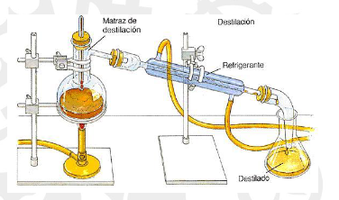
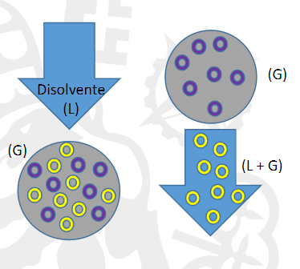
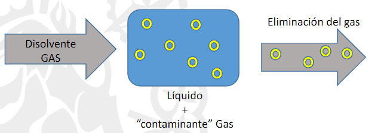
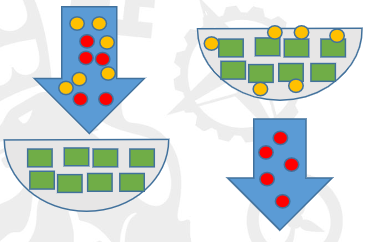
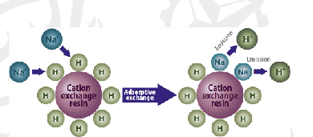
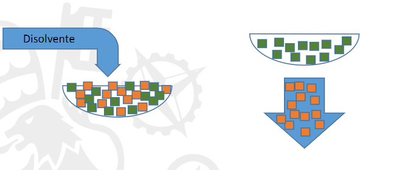
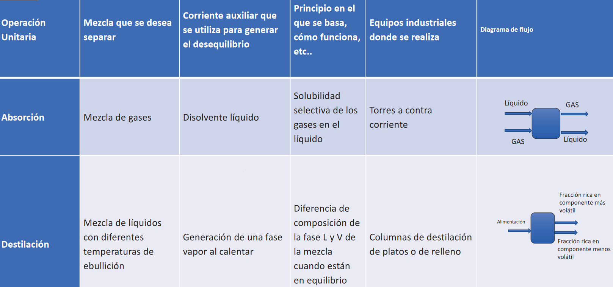

[Tema 3_22-23.pdf](../assets/Tema_3_22-23_1674469170469_0.pdf)

> [!tip] Se pregunta en tipo test! ()

## Fundamentos de operaciones
 Que significa transformar o cambiar la materia?Cambiar:
	Materia (separación o reacción)
	Energia (enfriar )
	Movimiento (velocidad o dirección) filtrado de sedimentos
	((63ce601e-7aab-4e52-a8f3-5cf17cc4ac6b))
	Se tiende siempre al equilibrio -> creo un gradietne hacie la propiedad qu busco para llegar al nuevo equilibrio
 Como enfriar? pongo otra cosa fria al lado y creo un gradiente de temperatura
 como cambio a otro compuesto? agrego otro qúimico para acabar creado otro compueto
 Osmosis -> gradiente de concentración para conseguir igualar la concentración a ambos lados
 ##
 ## Qué hay que estudiar para entender el funcionamiento de las operaciones básicas en ingeniería química?
 ((63ce61d2-73cf-4ed6-838f-998192dcb7b1))
-
## Operaciones básicas
### Clasificación
	por mecanismo controlante
		- transporte de materia
		- transporte de energia
		- transporte de momento
	por fases
		- L-L
		- G-L
		- G-S
		- l-S
		-
	((63ce6329-802f-4417-916f-67d41abf6664))
### Transferencia de materia
### Destilación
Operacion unitaria para producir la separación de dos liquidops volatiles basadas en su punto de ebullición.
	Que es la mezcla que quiero separar? Dos liquidos volatiles con diferentes ptos de ebullición
	Como lo hago? Me baso en el **Equilibrio liquido vapor**
		- Diagrama de bloques del proceso
		- A(L) ____
		  ->             | -> A(L) ,A(v)+B
		- B(L)         | -> B(L) +A
		
#### Destilación Simple
 
			- Izquierda pobre en componente volatil
			- Derecha rica en componente volatil
			- A nivel de **laboratorio**
#### Columnas de destilación (Rectificación)
			- 
			- Se hacen como que pequñas destilaciones.
			- Segun subimos mas puro el volatil y mas bajo más puro el no volatil
			- **Diagramas T- concentración**
			
## Absorción
ojo no adsorción
ej. Separar contaminantes
Mezcla de gases que uso un líquido para separarla.

		- A escala industrial -> Torres de pulverizacion(se pulveriza el líquido), de platos, o de relleno
	**Gases de comustión** -> Agua disuelve CO2, SO2 NOx...
 # Desorción (stripping)
 Lo contrario que absorción. ==Separo gas del liquido== en el que está disuelto.
 
 El stripping NO es calentar.
> [!tip] Pregunta de test: La solubilidad de los gases en los líquidos desciende con la temperatura (contrario que sólidos)
 Se añade otro gas.
 -> Liquido con gas disuelto |     | -> G +G
 .                                             |     |
 -> Gas disolvente                 |     | -> L
 # Adorsción
 Se ==adhiere== el consaminante(liquido o gas) a la superficie de un sólido.
 
 -> Liquido |                             |
 con soluto| discos de sólido |
 .                  |                            | -> liquido
 Suelen haber 2 en paralelo para que una se limpie mientras la otra trabaja.
 Para los contaminantes.
## Intercambio Ionico
Los sólidos (resinas) tienen carga con catriones y anionnes y atraen los iones disueltos.
	
# Lixiviación
Liquido-sólido
	Se separa una mezcla de sólidos, donde uno de los sólidos se disuelve en el líquido.
	
	Ej el azúcar se extrae de la remolacha con agua caliente o el café.

# Extracción

# Transmisión de calor:
## Evaporación
 # Transferencia de materia y calor:
## Humidificación
	d
## Secado
	a
## Cristalización
Concentración de saturación ([]sat) -> f(Tº)
	$\Delta  T -> \Delta Concentración$
	La sal no se deteriora con la temperatura.
	-> S+L | |->L

> [!tip] Funciona enfriando, entra aire frío  y sale caliente
> 
## Liofilización
Eliminar el agua de un sólido.
Se diferencia de secado en que la temperatura es más baja.
En presiones muy bajas. Primero se congela y luego se sublima(de sólido a vapor) el agua.
	
> [!info]+
> 
> 
> 

>[!tips] Orden según temp de más a menos evaporación-> secadp -> liofilización
	
# TRANSPORTE DE CANTIDAD DE MOVIMIENTO
## Filtración
	a
## Sedimentación - Centrifugación
	a
## Centrifugación ciclónica
	Se usan ciclones para separar partículas del aire. Se chocan entre sí y las paredes,pierden energía y caen
## Flotación
 # Resumen
 
![[../Excalidraw/Drawing 2023-01-30 11.36.06.excalidraw]]

## Purgado
Al realizar la realimentación del proceso, se tiende a acumular algunos químicos.
Se  puerga el catalizador y el inerte y productos (si no han sido separados antes). Se pierde un poco de reactivo pero no se busca.

> [!important] Si un reactivo se usa dentro del lazo cerrado no se acumula y no se purga

> [!important] Si un catalizador/ inerte/producto abandona el proceso en algun sitio, no hace falta purgarlo.

> [!note] Un reactivo se comporta como inerte si al realimentar no es reactivo dentro del lazo cerrado. Por tanto hay que purgarlo

![[../assets/Las operaciones unitarias 2023-01-30 21.54.53.excalidraw]]

# Problemas

## Problema 2
![[../assets/Las operaciones unitarias 2023-02-01 10.28.32.excalidraw]]
## Problema 3
![[../assets/Las operaciones unitarias 2023-02-01 10.49.36.excalidraw]]