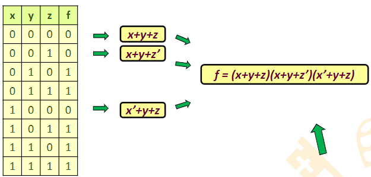
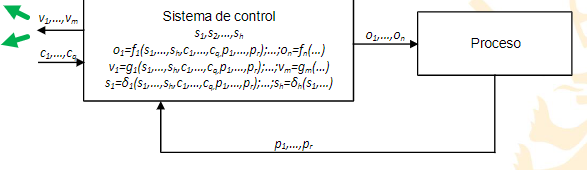

#Automatizacion - 
 
 Hay dos formas, tabla de verdad, y función lógica.
 ## Ejemplo
 ==Un piloto se enciende cuando sólo dos interruptores de los tres interruptores están cerrados:==
 i1 e i2 cerrados e i3 abierto → 𝑖1𝑖2𝑖3′
 igual con las otras combinacionnes
 𝑓 = 𝑖1𝑖2𝑖3′ + 𝑖1 𝑖2′𝑖3 + 𝑖1′𝑖2𝑖3
> [!danger] ojo, intentar romper nuestra expresión
-
 ## Expresiones lógicas canónicas
	### Suma de productos canónica
		- Sumamos los términos que tengan 1 en la salida
		- 
	### Producto de sumas canónicas
	Multiplicamos cuando la salida es 0
	
 # Simplificación de Karnaugh
	para menos de 6 variables
	Con los 1:
		- Nos quedamos con los terminos que son constantes
		- ((63cf89f1-069e-4c1e-af79-9afd3b62f91e))
		-
		-
		-
	-
 ## Funciones de observación
 Son las que muestran el estado actual de la máquina. Pilotos, leds, info a SCADA...
 
 Son las variables tipo V
-