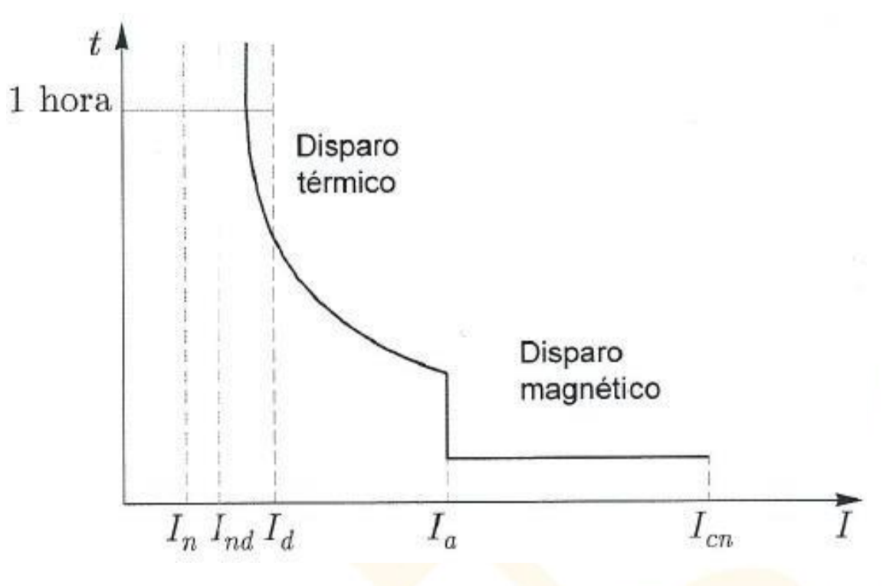

---
aliases: Interruptor automático
---
#instalciones_electricas 
# PIA Automáticos
Interruptor automático (magneto-térmico)

## Variables importantes
- $U_{n}I_{n}$ 
- $Hz$ (para el magneto)
- $U_{m}$
- curva de disparo
- $Icc$ (poder de corte)
- N.º de polos. (monofásico o trifásico)

## Curva de disparo

$I_{nd}$ → intensidad de no disparo
$I_{d}$ →intensidad de disparo
$I_{cn}$ -> intensidad de corte nominal
### Tipos
B→ Ia → 3-5 In → instalaciones muy largas con cargas resistivas. Cargador de coche eléctrico
C → Ia → 5-10 In  → Instalaciones mixtas T respuesta medio Uso doméstico
D → Ia → 10-20 In → En industria. Intensidades elevadas en arranque y parada(ej motores y ascensores)
Z -> Intensidades pequeñas pero muy prolongadas en el tiempo.

> [!info] Info #card
> Los individuales se dimensionan usando el máximo del intervalo y el general el mínimo. Se intenta que el general no salte nunca por una sola carga. 

# Selectividad
Ante una condición de defecto en cualquier punto de la instalación, solo es eliminada por el dispositivo de protección situado **inmediatamente aguas** arriba del defecto, de forma que no se vean afectados el resto de circuitos.
## Selectividad total

## Selectividad parcial 
