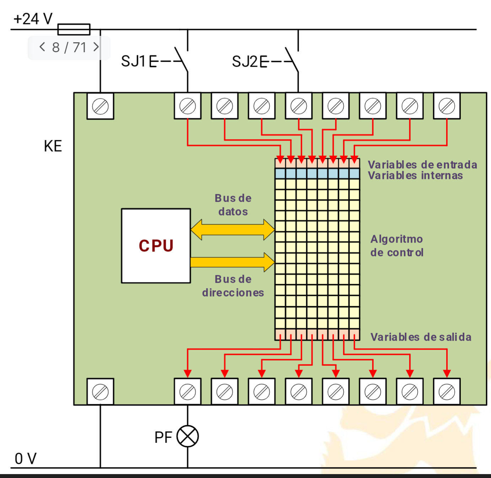
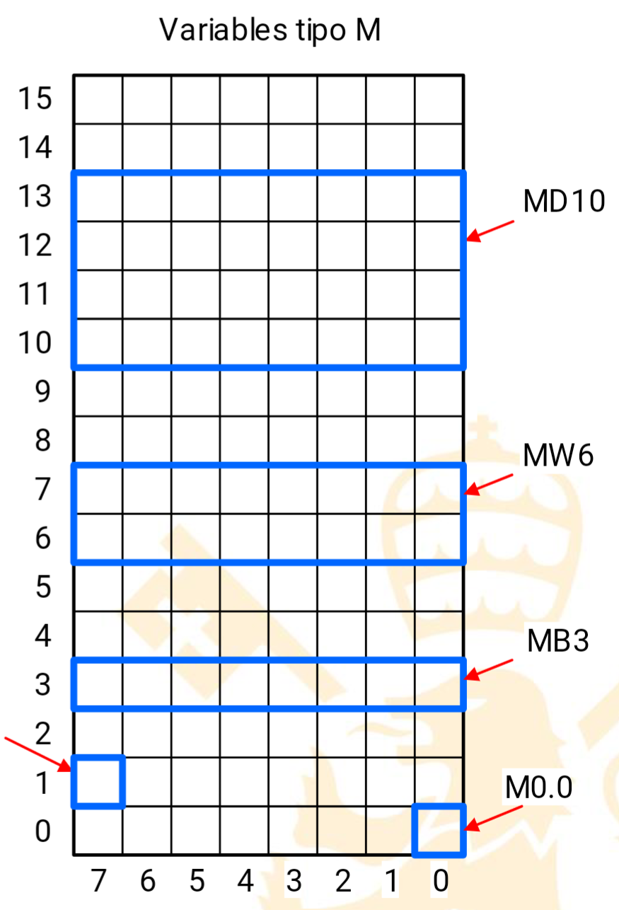

#Automatizacion
[Diapos](../assets/AI_4_Tecnologías_PLC_2023v1.pdf)
# PLC
> [!info] Info #card
> Los PLC son de nombre **KE**, K porque procesa señales y e porque es digital (F relé analógico)

## Entradas
(Parte de arriba)
8 Entradas analógicas y digitales -> I0..I7
0 -> [-30,5]V.
1 -> [11,30]V.

## Salidas
(Parte de abajo)
8 Salidas analógicas y digitales -> Q0..Q7
> [!info] Info #card
> Q como un contactor

UART y ethernet
# Tasa de actualización

> [!warning] Importante #card
>  se pregunta mucho en los examenes

Se actualiza a un periodo fijo $T_{s}$ (típico 1-5 ms). No hay problema de que nos quedemos sin tiempo haciendo cuentas.
Se leen todas las entradas y con estos datos, en el siguiente ciclo, **actualizan todas las salidas a la vez** cada ciclo.
> [!warning] Importante #card
> Las entradas tienen de media un retraso de medio periodo de muestro y de máximo un periodo de muestreo

# Direcciones de memoria
Se trata de unas tablas de **8 bits de ancho**(1 byte). Se marca como dirección de memoria precediéndola con un ‘%’
Hay tres tipos:
- Entrada → I0.0..I0.7,I1,0..I1.7…
- Salida → Q
- Memoria interna → M (marca)
## memoria interna
Hay cuatro tipos de variables
- Double 32 bits → ej MD10
- Word 16 bits → MW6 (filas 6 y 7)
- Byte 8 bits →MB2
- Bit → M3.3
> [!info] Empezamos a contar para el nombre desde abajo.
 

> [!warning] Se pueden crear variables solapadas, y esto puede provocar que borremos datos de otra variable sin quererlo.

# Idiomas de programación
Existen 5 lenguajes. Se usan todos salvo las instrucciones que está en desuso.

## [[Diagrama de contactos]]
## [[Bloques Funcionales]]
## [[Lista de Instrucciones]]

