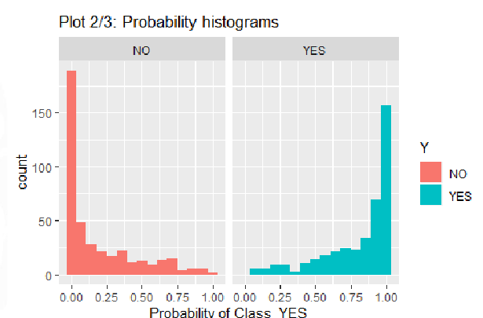
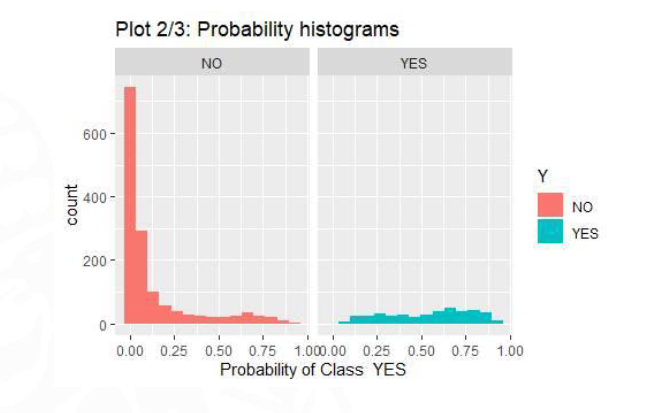
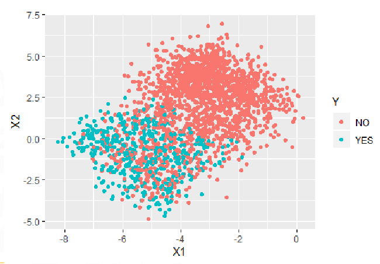

#machine_learning #model_performance 
 

 When the model is working properly, we expect this kind of histogram.

-

 

 We can see that the YES is pretty flat, so the model CANT predict correctly the yes.

 This might me because the YES completely overlaps of the NO class. We need to add more variables
 
> [!info] Info #card
> Este es el dataset que se ha usado para la segunda gráfica
> 

# Code
Its plot **2/3**
## Train
```r
PlotClassPerformance(fTR_eval$Y, # Real observations
  fTR_eval$LRprob, # predicted probabilities
  selClass = "YES"
) # Class to be analyzed
```

## Test
```r
PlotClassPerformance(fTS_eval$Y, # Real observations
  fTS_eval$LRprob, # predicted probabilities
  selClass = "YES"
) # Class to be analyzed)
```
