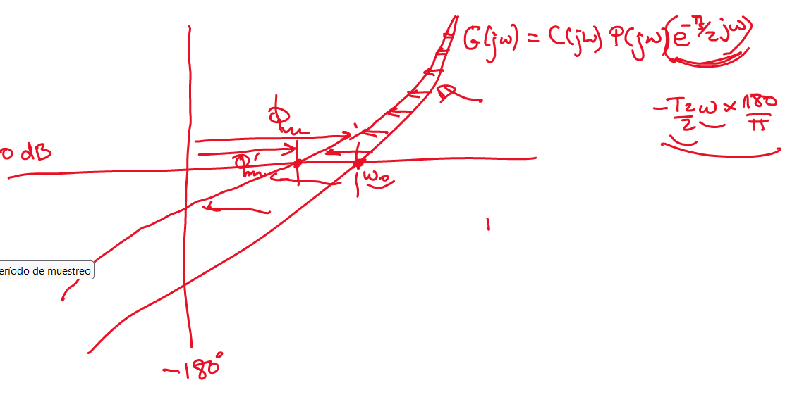
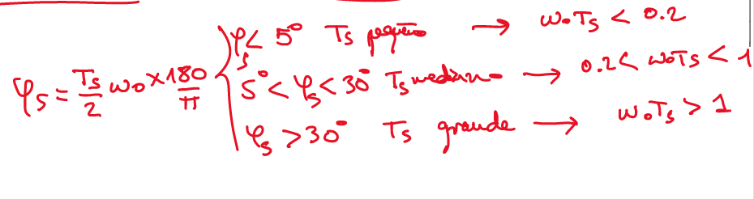
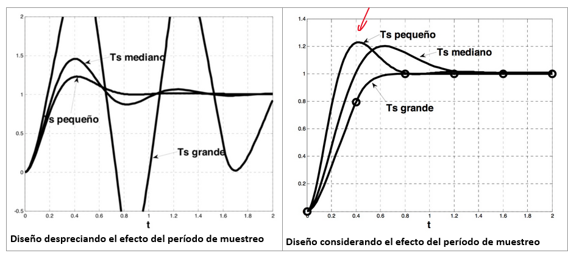

- ## Como diferenciar entre periodo de muestros
 Al añadir el retardo del [[Modelo Analógico Modificado]], se puede ver que en la gráfica de Black:
 
 A frecuencias bajas, se nota poco el efecto, pero a mayor frecuencia mayor difrernecia.
 La pulsación de cruce no se ve afectada, por ello, la rapidez no se ne afectada y el $$T_s$$ es práctiamnte igual.
 El efecto del retardo, es decir, cuanto afecta a la pulsación de cruce, nos dice el tipo de periodo de muestro que es.
 
-
 
	assets://C:/SyncThing/LogSeqNotes/assets/image_1674561960128_0.png
 Se pueden seguir generando controles aunque su respuesta depende de que esté bien diseñádo el control
 ## Pequeño
-
 ## Mediano
-
 ## Grande
 Si se tiene