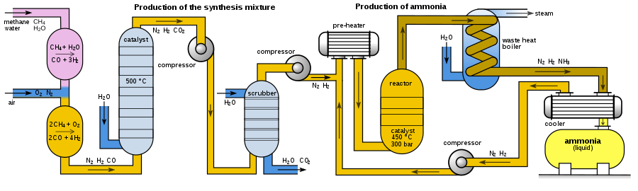

## Tipos de abono químicos

  

> La industria de los fertilizantes transforma el abono quimico en tres tipos de fertilizantes: nitrógeno (amoniaco), fósforo y potasio.

  

![[Pasted image 20230216145821.png]]

  

### Fertilizantes nitrogenados:

  

- grupo mas numeroso e importante

- materias primas nitrogeno (aire) e hidrogeno (gas natural/metano)

  

Si se mezcla a altas temperaturas forma amoniaco NH3 y se oxida en oxido nitrico HNO3 que da lugar a los fertiizantes:

  

- nitrato de amonio AN

- urea al mezclarse con CO2

- Nitrato amonico de urea = AN + CO2 + H2O

  

### Fertilizantes fosforados:

- procede de la roca fosforica
- fosfato mas acido sulfurico H2SO4 se transforma en fosfato monoamonico o diamonico
### Fertilizantes de base potasio:
- proviene de la roca potasica = carbonato de potasio mas sales de potasio
- concentracion de potasa -> cloruro potasico -> MOP (muriato de potasio), nitrato de potasio (KN) y Sulfato de Potasio (SOP)
## Principales desafios de cada tecnologia
### Base nitrogenada. Producción de amoniaco:
#### Metodo Haber-Bosch:
> En quimica, el ***proceso de Haber-Bosch*** es la reacción del $N_2$ y del $H_2$ gaseoso para la obtencion de Amoniaco.
> $N_2(g)+3H_2->2NH_3+\Delta H+...$

Las materias primas empleadas en este proceso son:
- *aire* como fuente de $N_2$ (78,1%)
- *metano* $CH_4$ y *agua* $H_2O$ como fuentes de $H_2$

  

![[900px-Haber-Bosch-es.svg 1.png]]

  

##### Etapas del metodo de Haber-Bosch:

1. Para producir hidrogeno puro ($N_2$) el *metano* reacciona con *vapor de agua* en un proceso que se denomina *reformado por vapor*. En este proceso y mediante un catalizador de *niquel oxido-alumina* (catalizador de alumina) se reforma para dar *monoxido de carbono* e *hidrogeno puro*.

  

$CH_4(g)+H_2O(g)>CO(g)+H_2(g)$

  

2.  En la segunda etapa el metano que no ha reaccionado en el *reformador primario* (reacción incompleta) se ha de volver a romper para reducir al minimo para maximizar los compuestos inertes y minimizar los activos en las siguientes etapas. Para ello se introduce ya el fuljo de *aire*. El $O_2$ del aire reacciona con el metano para generar mas $H_2$ y mas *monoxido de carbono*.

  

$2CH_4(g)+O_2(g)>2CO(g)+4H_2(g)$

  

3. En la tercera etapa el *monoxido de carbono* se oxida para pasar a *dioxido de carbono*. Esto se hace por que la mezcla de $CO$ con amoniaco provoca un compuesto que tapona el sistema.

  

$CO(g)+H_2O(g)>CO_2(g)+H_2(g)$

  

4.  El $CO_2$ es un compuesto mas facil de retirar de la mezcla por un simple proceso de ***absorción*** en el cual se hace pasar aire por la mezcla de gases para extraer el $CO_2$.

5. Debido a que las condiciones de reacción del *metodo Haber* requieren altas temperaturas y presiones (300 bar y 450ºC), se pasa por una *bomba de gas* (compresor) para aumentar la presión y por un *calentador* para la temperatura.

6. Una vez a la temperatura y presión adecuadas se pasa al *reactor* donde mediante unos *catalizadores heterogeneos* (solidos) se *hidrogeniza* el $N_2$. Los catalistas son muchos, entre los cuales: *oxido de aluminio, oxido de potasio y oxido de calcio*.

  

 $N_2(g)+3H_2->2NH_3+\Delta H+...$

  

8. Los gases restantes se *reforman* en un *condensador* con refirgeración por $H_2O$ tras el cual el ***Amoniaco*** se condensa y precipita en unos contenedores, mientras que el $N_2$ y $H_2$ resultantes se realimentan para ahorrar materia.