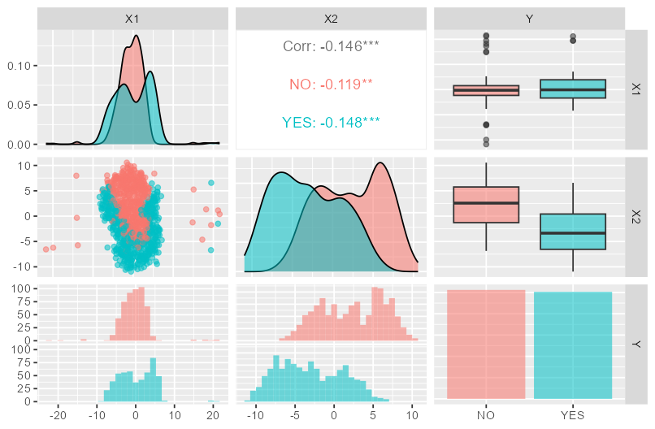
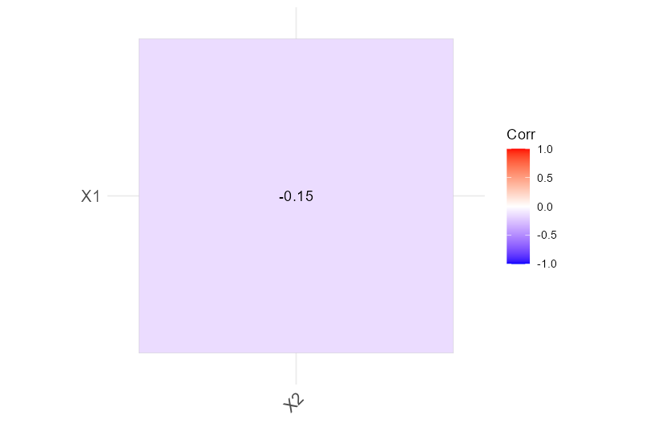
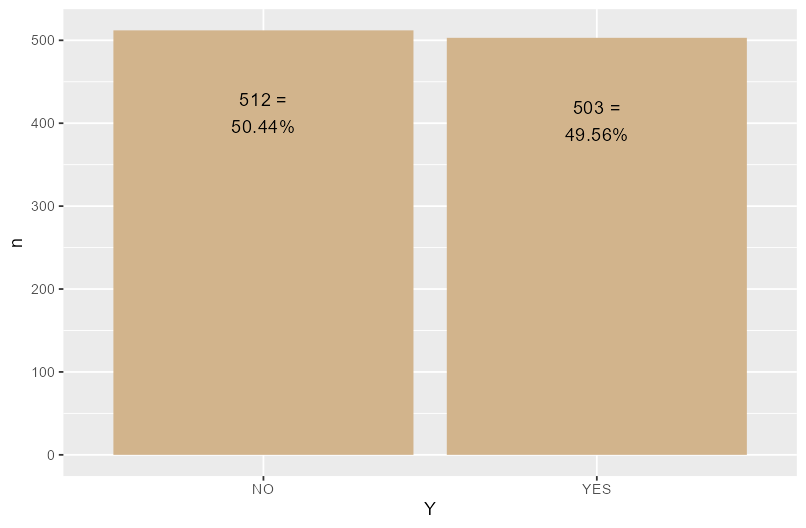

#machine_learning
-
# R for Data Science
 ## Pairplot
  
  It is a very useful tool to visualize the relationship between variables. It is a combination of scatterplot, histogram and density plot.
  We need to be careful when we use it because it can be very confusing when we have a lot of variables.
  
  ```r
  fdata %>%
  GGally::ggpairs(aes(color = Y, alpha=0.3 ))
  ```
 
## Correlation

if we only have two variables the correlation plot is just one square/value.

```{r}
fdata %>%
select(where(is_bare_numeric)) %>%
cor %>%
ggcorrplot::ggcorrplot(corr = ., type="lower",
 method = "square", lab=TRUE)
```
 
## Check for class imbalance

If there is many more observations of one class than the other, we need to be careful when we train our model. We can use the following code to check for class imbalance.

```{r}
fdata %>%
rename(Y = outVar) %>%
count(Y) %>%
rename_with(.cols = Y, .fn = ~outVar)
```

Output:

```
# A tibble: 2 × 2
Y         n
<fct> <int>
1 NO      512
2 YES     503
```
## A plot to check the balance in the output variable

```{r}
fdata %>%
count(Y) %>%
mutate(percent = paste0(n, " =\n", signif(100 * n/sum(n), 4), "%")) %>%
ggplot(aes(x = Y, y = n)) +
geom_col(fill = "tan") +
geom_text(aes(label = percent), nudge_y = -100, size=4)

```
 
-
 # Data Preprocessing
 Step 1 : Import the data-set
 Step 2 : Check out the missing values
 Step 3 : Plot the data and check out for outliers
 Step 4 : Encode the categorical variables (strings are not factors!)
 Step 5 : Analyze the continuous variables (feature selection)
 Step 6 : Check out for Class Imbalances
 Step 7: Split the data-set into Training, Validation and Test Sets
 ## Separation into training and test set
  
  We need to separate our data into a training and test set. We will use the training set to train our model and the test set to test the performance of our model.
  The test set will only be used once, at the end of the project, to test the performance of our model.
  
  ```{r}
  set.seed(2023)
  outCol <- grep(outVar, names(fdata))
  
  trainIndex <- createDataPartition(fdata[ , outCol] %>% pull,      [[output]] variable.
                                  p = 0.8,      [[split]] probability for training
                                  list = FALSE, [[Avoid]] output as a list
                                  times = 1)    [[only]] one partition
  fTR <- fdata %>%
  slice(trainIndex)
  
  fTS <- fdata %>%
  slice(-trainIndex)
  
  ```
 fdata[ , outCol] %>% pull gets the output variable as a vector.
 p = 0.8 means that 80% of the data will be used for training and 20% for testing.
 list = FALSE means that the output will not be a list, but a vector.
 times = 1 means that we only want one partition.
  
  We can see that the proportion of the output variable is the same in the training and test set. It is stratified sampling. This is important because we want to have the same proportion of the output variable in the training and test set.
## Outlier removal

It might be a good idea to get rid of outliers in the training set. This is because we want to train our model on the most representative data. We can use the following code to remove outliers.

```{r}
removeOutliers <- TRUE
if(removeOutliers){


# Function to locate outlier limits for a vector.
locate_outliers <- function(x){
outLow  <-  quantile(x, probs = 0.25, na.rm=TRUE) - 1.5 * IQR(x, na.rm = TRUE)
outHigh <-  quantile(x, probs = 0.75, na.rm=TRUE) + 1.5 * IQR(x, na.rm = TRUE)
return(c(low = outLow, high = outHigh))
}

#
(outLimits <- fTR %>%
summarise(across(.cols = where(is_bare_numeric), .names = "{.col}",
         .fns = locate_outliers)))

fTR <- fTR %>%
filter(between(X1, outLimits$X1[1], outLimits$X1[2]))

# Visualize outliers in the training set
fTR %>%
select(where(is_bare_numeric)) %>%  # Only pure numeric
pivot_longer(cols = everything(), names_to = "variable") %>%
ggplot(aes(x = value)) +
geom_boxplot() + ylim(-0.6, 0.6) + # manual proportion adjustment
facet_wrap(~ variable, scales = "free", ncol = 2)

} # End  of Outliers Removal

# Save the training and test set to avoid problems with the random seed.
write_csv(fTR, "SimData_preprocessed_fTR.csv")
write_csv(fTS, "SimData_preprocessed_fTS.csv")
```