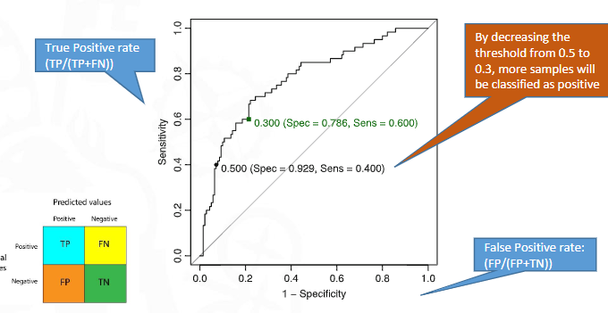

#machine_learning #model_performance 

True positive rate([Sensitivity Recall](Confusion%20matrix.md#Sensitivity%20Recall)) versus the false positive rate([FPR False Positive Rate](Confusion%20matrix.md#FPR%20False%20Positive%20Rate)) at various **probability thresholds**, ranging from 0 to 1. 
> [!info] Note: #card
> It's just a summary of [Confusion matrix](Confusion%20matrix.md) for different probabilities.

 

> [!warning] Importante #card
> Generally, the closer a point to the top-left the better. But can change depending on how you value Sensitivity and FPR

# AUC
AUC stands for “Area under the ROC Curve.”
It is equivalent to the probability that a randomly chosen positive instance is  
ranked higher than a randomly chosen negative instance.
n ideal ROC curve will hug the top-left corner, so the larger the AUC, the better  
the classifier (0 ≤ AUC ≤ 1) 
Random guess→ UC = 0.5 on the test set.
> [!important] When **comparing models**, The higher the area under the graph, the better the model

# Code

```r
library(ROCR)
suppressMessages({
  rocObj_LR <- roc(response = fTR_eval$Y, fTR_eval$LRprob$YES)
  # rocObj_LR2 <- roc(response = fTR_eval$Y, fTR_eval$LRprob2$YES)
  # ocObj_knn <- roc(response = fTR_eval$Y, fTR_eval$knn_prob$YES)
})


ggroc(list(LR = rocObj_LR #, LR2 = rocObj_LR2, knn = rocObj_knn
		  )) +
  geom_abline(slope = 1, intercept = 1) +
  labs(
    title = "ROC Curves for Training Set",
    x = "Specificity", y = "Sensitivity"
  )
```