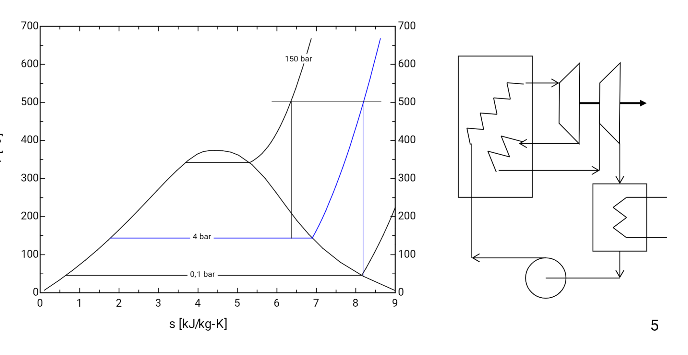

- Hacer una segunda etapa de calentamiento **hasta la misma temperatura** tras la primera turbina hasta otra turbina.
	- Se aporta un poco más de calor
	- Se aumenta el área de la curva.
	
# Ciclos subcríticos
Solo se hace un recalentamiento (dos picos)
# Ciclo supercrítico
La primera  **isobara no tiene parte horizontal** 
Se hacen varios recalentamientos.