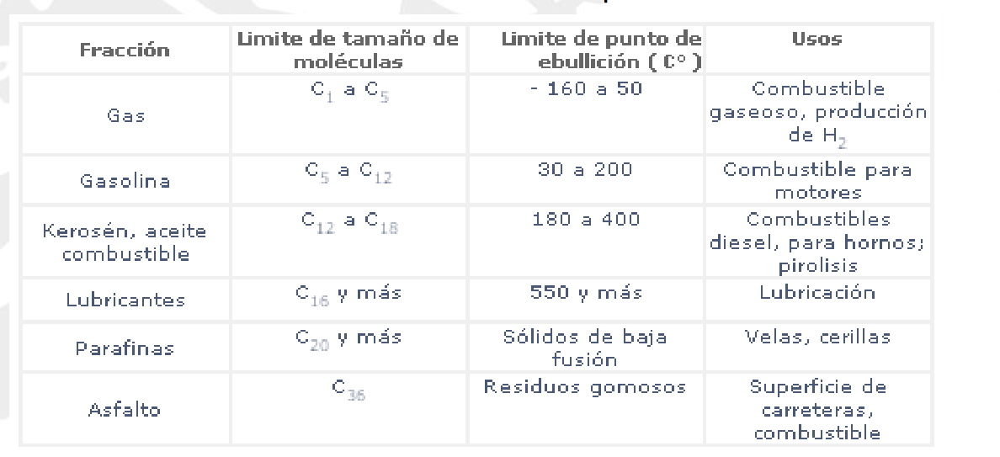
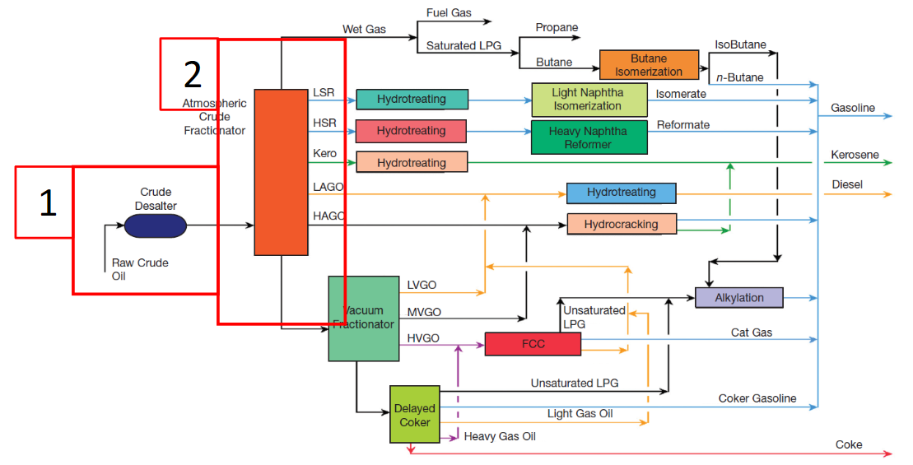
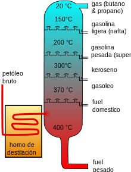

- 
 ## Proceso de refinado
 
 ## Destilacion
 Separación de compuestos segun su volatilidad(temp ebullicion).
 Menor punto bajo, mayor punto arriba.
 ## 1. y 2 Destiladoura de crudo
 
 Hay platos en niveles para favorecer la separación, se forman corrientes circulares.
 A mas alto más pequeña la cadena CH
 El fuel pesado son los residuos que no se han repartido.
 A más de 40 grados se pruduce el crackeo termico de las cadenas
 Se le llama destiladora atmosferica
 ## 3. Concentracion de gases
-
 ## 4. Unidad de vacío
 La unidad de vacio se usa para purificar las grandes cadenas.
 Destiladora a vacio -> Al disminuir la presion disminuye las tamperatura de ebullicion.
 Son mucho mas pequeñas que las de vacio
-
 ## 5. Unidad de coquzacion retardada
 Se crea coque(carburante barato parecido al carbon)
-
 ## 6. Crackeo Catalitico (FCC)
 Se meten cadenas largas en reactor con catalizador para crear cadenas menores más valiosas.
 Despues hace falta poner otra destiladora
 ## 7. HidroCrackeo
 Se crackeo usando hidrogeno para evitar dobles enlaces.
 ## 8. Isomerizacion del butano
 Mismo numero de atomos pero difreente disposición de la estructura.
 El octanaje mide la capcidad antidetonante (referida al etano)
 Se cambia la estructura
 ## 10. Hidrotratamiento
 Limpieza de las cadenas sutituyendo S y otros contaminates sustituyendo por Hidrogeno.