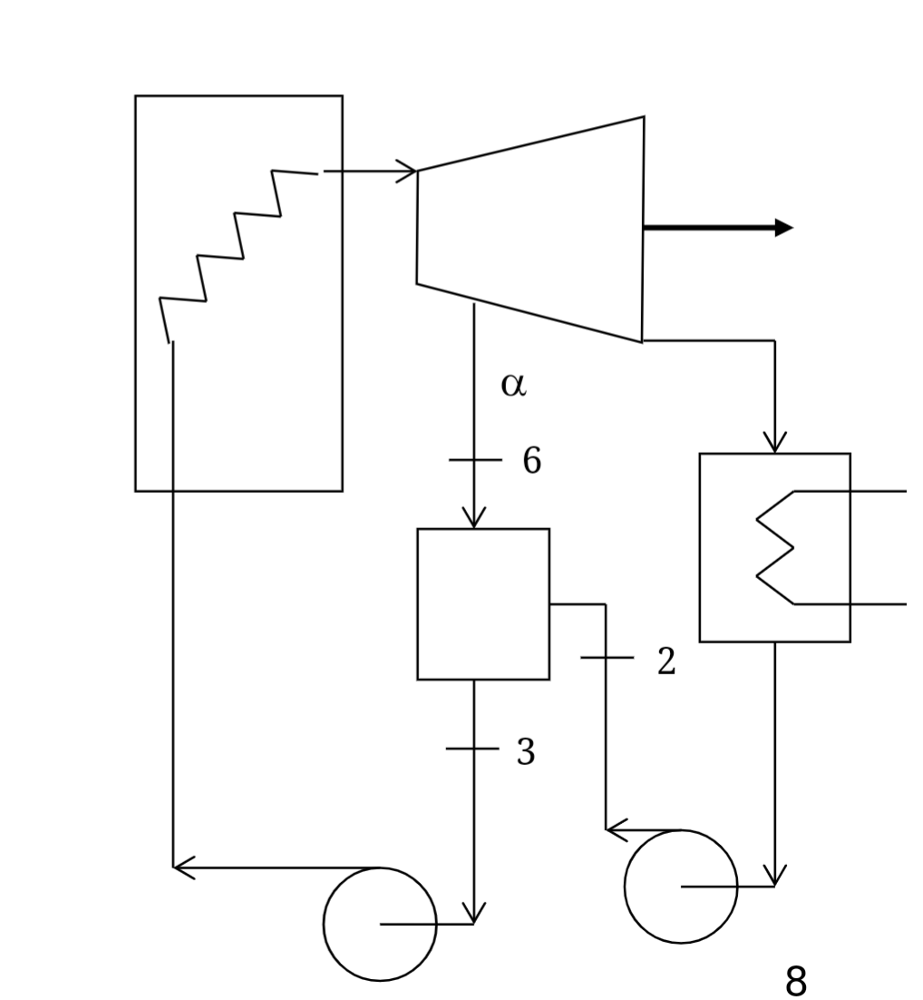
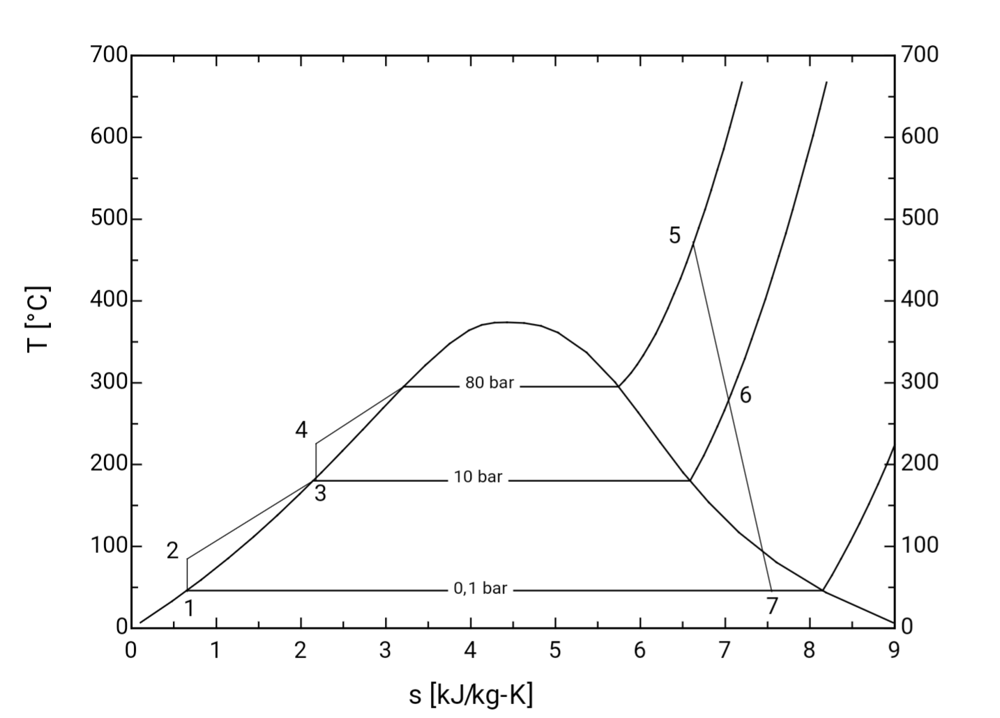
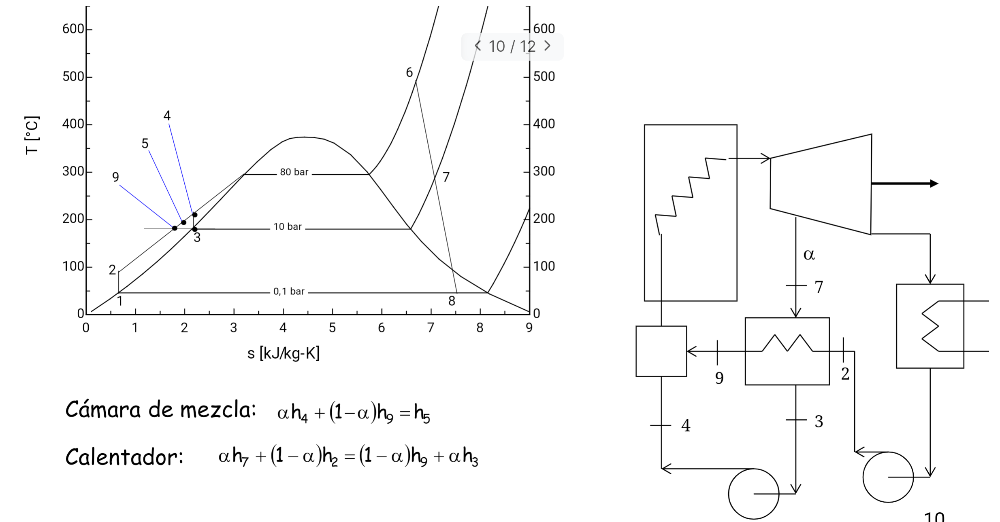
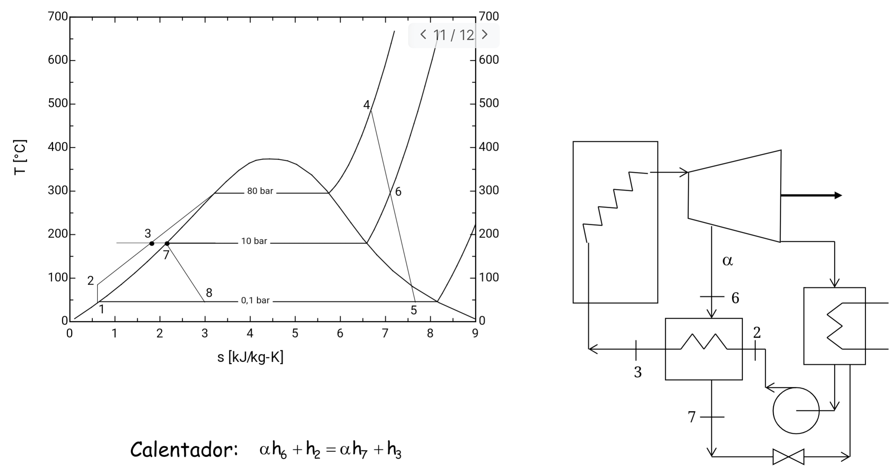

Parte de temperatura del calentador se consigue usando un % $\alpha$ del vapor de la primera turbina.

En el calentador
$$
\alpha h_{6}+(1-\alpha)h_{2} =h_{3}
$$
### Calentador abierto
Los gases se mezclan en la cámara
### Calentador cerrado
#### Hacia delante
Se juntan el fluido después de hacer el intercambio de calor.

#### hacia detrás

