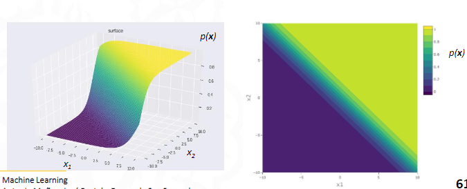
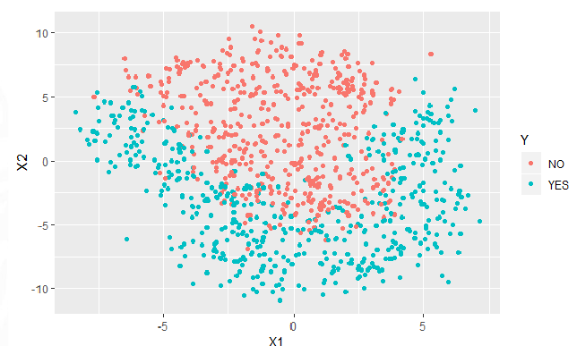

#machine_learning #regression 
> [!info] Note: #card
> Differs from [Classification](Classification.md) in that the output variables are continuous

> [!info] Note: #card
> Used to forecast / estimate response

Given a[[ training set]] of data containing **observations** (also called features) and their associated **continuous output values**(targets).
![[../assets/Regression 2023-02-15 14.25.31.excalidraw]]


## Model optimization
- Signifiance of the model -> How well they predict
- Significance of estimated coeff -> 
- Analysis of residuals -> If e has part of data
[[Model error]]


# Factor variables
Represented with dummy variables 
```r 
lm6_mtrx %>% 
  as_tibble() %>% 
  select(starts_with("x2")) %>%
  bind_cols(x2_level = fdata6$x2) %>% 
  filter(!duplicated(.))
```


Parallel lines ⇾ no [Variable interaction](Variable%20interaction.md) for factor


Interaction of factor


> [!warning] Importante #card
> We want the Box-plot of factor variables to look the same ≈

> [!warning] Importante #card
> If we see many veritcal lines we are treating factor as continuous
>  


- # Logistic regression
  
  It is based in the Sigmoid function:
  $$ p(x) = \frac{e^{w_0 + w_1 x}}{1 + e^{w_0 + w_1 x}} $$
  The $w_1$ is the slope and $w_0$ is the intercept.
  
  After a bit of algebra, we can get the following equation:'
  $$ \frac{p(x)}{1 - p(x)} = e^{w_0 + w_1 x} $$
  
  THis is called the odds ratio. The odds ratio is the probability of the event happening divided by the probability of the event not happening. The odds ratio is a measure of the strength of the relationship between the independent variable and the dependent variable.
  
  The regression coefficient is the log of the odds ratio. The regression coefficient is the slope of the line. The intercept is the log of the odds ratio when the independent variable is 0.
	> [!bug]  Need to rewrite this
	##
	## Multile logistic regression
	With a linear model, a space will be divided by a hyperplane.
	
	> [!tip] Linear regression can only be used if the data can be clearly separated by a line
	
	In this case we cant apply linear regression without transforming the space.
	-
	## R code
-
 ```r
  [[Training]]
  modelFit <- glm(Y ~ X1 + X2, [[Formula]] specifying the output (Y) and inputs (X1,X2)
  data = fdata_train, [[Select]] training dataset
  family = binomial) #'binomial' is used for logistic regression  
  ```
### Predictions
```{r}
[[Prediction]]
ProbEst <- predict(modelFit, [[Fitted]] model
newdata = fdata_val, [[Predict]] validation set
type = "response") [[glm]] does not predict the class. It gives the
[[probability]] of the event
```
