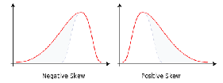

#machine_learning #datasets #r_language 
Data can be skewed. This means that the data is not normally distributed.

   $$ Skewness = E \left[ \left( \frac{X - \mu}{\sigma} \right)^3 \right] $$
# Solution
To correct the Skewness, we apply the [[Box Cox transformation]].

 
