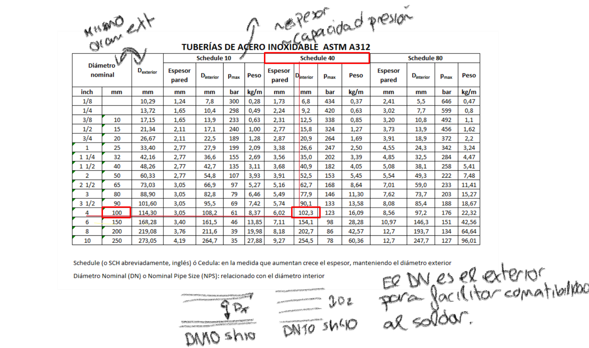
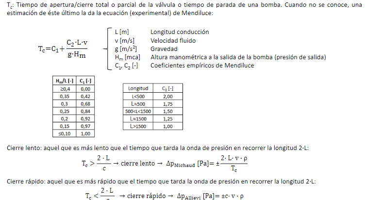
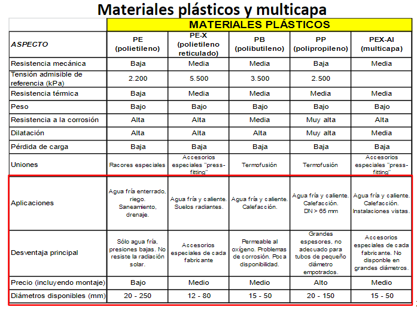
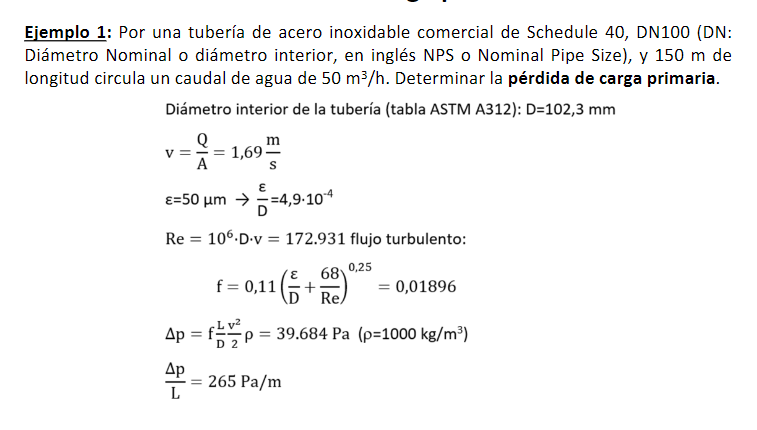
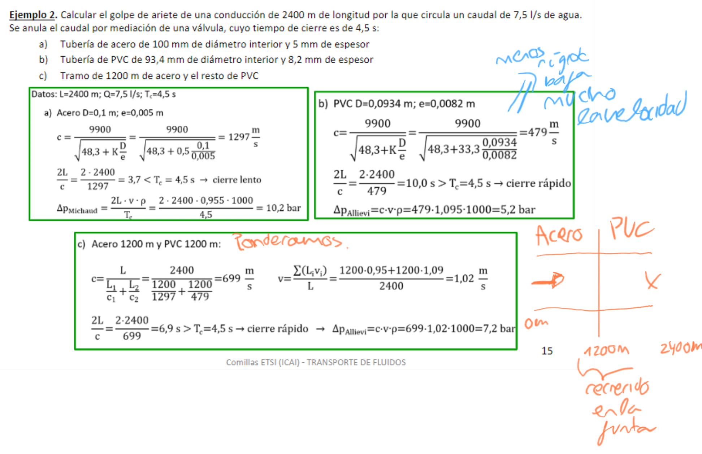
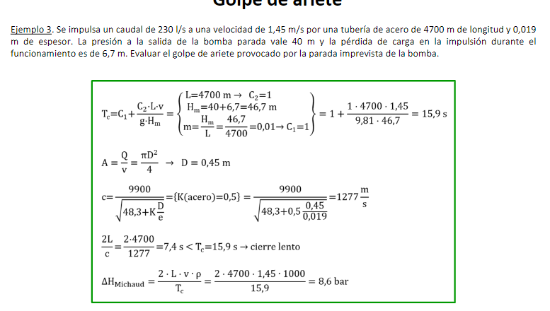

- 
-
 Tuberias de gas, agua, climatización, aguas flub, proteccion contra incendios(rojo)
 ((63ca5efd-51bf-46ca-bcf4-31c6b4d6e086))
 ### Parametros a dimensionar
	Diametro
	Espesor pared
	Sujetado
	Dilatación termica
 ## Bernoulli
 ((63ca5fb0-2e88-425c-a451-acbe5ca3a51f))
-
 ## Perdida primaria de carga
 Segun va por tuberia pierde por fricción
 ((63ca5fe4-cb72-4af5-b4f9-ab9577270ad3))
 Re ->
 ### Reinolds
 Se puede **aporximar** con las sigientes formulas para preproyectos
 ((63ca6088-f2a2-4c62-8877-2a81aeb2cb3f))
-
 ## Colebrook (para turbulento)
 Tambien hay diagrama de moody para representarla. Para calcular la **fricción** para perdida de carga
 ((63ca610e-b887-4181-a208-1f6c0bf5e4ee))
 Se usa sobre todo la última
 ## (para laminar)
 Ni lo ponemos ya que el 99% de las veces es turbulento.
-
 ## Perdidas secundarias
 En codos y uniones, Hay que cambiarla velocidad | sentido lentamente para evitar perdidas de carga.
 ((63ca652a-7b1c-4612-9d86-39f6d34ff59e))
 hm es la longitud equivalente de perdida primaria del secundario
 ## Diametro tuberia
 {:height 493, :width 664}
 ((63ca665d-ef02-40ee-834f-d0c96944b9af))
> [!danger] Cae en el examen siempre las vel max
 PARA LIQUIDOS OJO
 ## Golpe de ariete
 Subida rápida de presión por bajada brusca de velocidad-caudal. NO es solo una subida sino una onda.
 Puede suceder tanto al cerrar como al abrir una valvula, o al arrancar bomba. Lo peor en la práctica son los cierres y paradas.
 Teoricamente es simetrico sobre presion y depresion pero sobrepresion suele ser mayor en la práctica.
	La sobrepresión provoca -> reventadas de tubería
	La depresión provoca -> colapso en tubería (se arruga toda)
	El máximo golpe de arriete tiene lugar en el elemento que provoca
 ((63ca6b47-9ee3-4cf3-9c44-c2af0aca9243))
 El efecto depende de:
 Celeridad -> como de rápido se propaga la onda. depende del fluido y la rigidez de las paredes de la tuberia.
 ((63ca6e1b-d601-428b-b7fb-55b81a499847))
 Tiempo de cierre de valvula / apagado de bomba : Tiempo de parada del fluido
 {:height 420, :width 754}
 Allievi es el valor de saturación de michaud
 # Proyecto de una isntalación
  Diseño hidrahulico -> diametrointerior velocidad perdidad de carga
	## Seleccióm de materiales
	   * Resistencia mecánica
	  * Tenacidad : deforma antes de romperse
	  *  Resistencia corrosión
	  * Metodos de unión
	  * Disponibilidad
	  ((63d397db-2460-4c22-9aad-dbd5b0cd3e26))
	  Básicamente **Metales y plásticos**
	### Metales
	  
	  Resistencia mecánicas y resis temp.
	  ((63d399ae-6beb-4e85-b56a-dbdf8af2f031))
	  Acero Top Tier. > Cobre (antibacteriano) > Acero galvanizado(con zinc anticorrosión) >  Acero negro (al carbón no es fundición)
	  Pérdida de carga por la rugosidad del material
	  Cobre para refrigeración (se dobla fácil)
	  Acero galvanizado no se puede soldar.
	> [!tip] No se puede usar aluminio y plomo para agua potable
	### LATER Plásticos
	  Resitencia corrosión y barato. Se dilatan mucho y flexibles. Ligeros. Aislamiento eléctrico.
	  Fácil de montar. Hay carretes y podemos doblar.
	  Se usa tradicionalmente para agua fría pero ya se ha mejorado y se puede usar para suelo radiante.
	{:height 526, :width 697}
	-
 ## Diseño mecánico: fijaciones y slack
	## Espesor de tuber'ia
	  
	  $$e=\frac{p*D_{ext}}{2*S_E}=\Delta e$$
	  
 ## Ejemplo
 
-
-
 **11:52** [[quick capture]]: 
-
-
 {:height 432, :width 748}
-
-
-