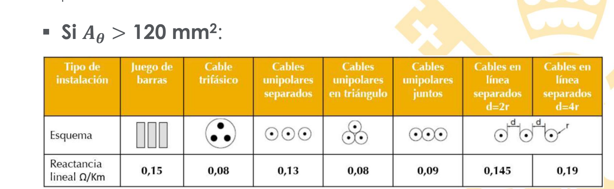

[[Instalaciones_Industriales]] [[II_Electricas]]
 [Tema 2._Redes_eléctricas_BT.pdf](../assets/Tema_2._Redes_eléctricas_BT_1674551148652_0.pdf)

## Caída de tensión
 diferencia de tensión entre dos partes de un circuito(en %).
 Por reglamento estan acotadas: (ITC-BT-19) 2.2.2
 Se expresa en % de la  tensión nominal 
### Calientamiento
 Efecto Joule. A mayor temp mayor resistencia.
#### Efecto pelicular
Depende de la  frecuencia en Hz
	$$ R_{AC}>>R_{DC}$$
	
Por el efecto skin (resistencia en alterna es mayor en alterna que en continua) Alrededor de un 10%
	$$X_L= \frac{1}{2}\left( 1+4*ln\left( \frac{D}{R} \right) \right) 10ˆ{-7} \left[ \frac{H}{m} \right]$$
	Si no hay datos $X_L=0.08 \frac{\ohm}{km}$.

> [!info] Para lineas de media tensión (lineas aereas (ej rurales) -> $L=0.4 (\ohm)/(km)$)

 Como máximo maximisimo 100 grados
 Suelen operar entre 70 y 90
## Efecto inductivo
 Los conductores tienen autoinducción que provoca pérdidas.
 Aunque entre conductores aislados hay un efecto capacotivo.
 La carga define cual prevalece. Si muy cargadas prevalece inductivo.
### Resistividad (p)
 $$R_{DC}=p_{20}\frac{l [m]}{S[mm^{2}]}$$$$p_{\theta}  = p_{20} *(1 + \alpha (\theta -20))$$

La resistividad se dá por estandar en DC a 20 grados. Para 
## Tipos de cable 
 Armadura -> rigidez.
 Pantalla -> Pone a tierra.
 Cubierta -> el color marca la utilidad (rojo o negro para resistencia al sol), antiincendios.
### Cable tetrapolar
 4 hilos, RST neutro Todos dentro de un solo aislante
### Cable unipolar
Cada hilo tiene su propio aislante
## Sección optima
### 1. Criterio de Caida de tensión
$V2= V_{2} \angle{0}$
$V_{1} = V_{1} \angle d$
$$S=\frac{\sqrt{ 3 } p L I \cos \phi}{\Delta U U} $$
Tal que

![[../Excalidraw/Drawing 2023-01-30 11.00.28.excalidraw]]

### 2. Revisamos con ITC BT 19

### 3. Criterio Térmico
 
> [!tip] Title
> El metal del cable debe de estar entre 70-90. No se funda aislamiento y que el recubrimiento pueda disipar calor.

 Que hay que tener en cuenta:
  * Numero de cables.
  * Localización (exterior, en zanja, canaleta...)
  * Temperatura ambiente
  
> [!danger] Correcciones
>Hay que hacer correcciones de la tabla de ITC BT 19 si las condiciones son difreentes a los de la tabla

#### Correción por profundidad ITC BT 07 (pag 153)
Se trata un factor de minoracion -> I / f
#### Correción por resistividad térmica del terreno. (pag 151)

#### Correción por exposición al sol ITC BT 06 
#### Correción por temperatura  ITC BT 19 

## (Extra) Criterio Económico
Mininizamos la seccón de cable necesaria
$$C_{t}=C_{i}+C_{p}$$
$$C_{i}= C_{f}+ C_{v}*S$$

$$S= \sqrt{ \frac{3*p*L*Iˆ2*t* \lambda}{K_{v}} }$$

  Puede ser rentable que una sección mas ancha, aun teniendo mas coste de inversión dadas las pérdidas $C_{p}$ puede salir rentable para reducirlas.

Seccion minima de fase y neutro neesarios para alimentar una grua.
La linea transcurre en el interior de una bandeja interior  perforada.
La linea es de cobre, con aislamiento XLPE unipolar.
$P_{n}=44.5 kW$
$V=400V$ $\cos\phi=0.85$

$I_{n}=\frac{P_{n}}{\sqrt{ 3 }V* \cos\phi}*1.5=113.35A$

> [!tip] Como es un motor hay que irse a la ITC BT 47 y como es de 44.5 AC por 1.5.  

Una vez calculada la intensidad, hay que irse al ITC-BT-19.
En la pag 274 se puede ver que se trata de un  método de instalación F.
Dado que solo tenemos fase neutro(unipolar) hay que irse a la columna de 2x XLPE.

> [!info] La columna 2x equivale a fase netro , 3x fase-fase

De esta columna la primera que nos sirve es 146 con sección $25 mmˆ{2}$

Por tanto: 4x25mmˆ2 (cuatro cables)

#### Problema 2
Cable de aluminio. Receptor I(monofásico) de 15KW $\cos \phi =0.35$
Enterrado bajo tubo. 
$p=1.5 \left[ K*\left( \frac{m}{W} \right) \right]$ resistividad del terreno
$T_{amb}=25$  .    $p=1.5 m$ profundidad

$I_{n}= \frac{P_{n}}{230V*\cos \phi}= 76,73A$
Está enterrado en el suelo dentro de un tubo, por lo que es D1.
Nuestro cable está a más profundo y tiene diferente resistividad
Corrección de profundidad: Tubo a 1.5m -> 0.95
Correción de conductividad: En tubo  ->
$I_{\mathrm{Re}al} =\frac{76.73}{0.95}$

![[../assets/Tema 2 Redes en BT 2023-01-31 10.20.23.excalidraw]]

$S= \frac{\sqrt{ 3 } lI\cos \phi}{C \nabla V *V }= \frac{\sqrt{ 3 } 105m I\cos \phi}{C \nabla V *V }$
##### Enfriadora
$I_{enf}= \frac{92,59}{\sqrt{ 3 }*400V}=133.64A$
##### Motor
$I_{motor}= \frac{67.5kW}{\sqrt{ 3 }400V 0.9}=108.25A$
hay que aplicar el factor de seguridad del motor de 1.5 para calcular su sección.

$S= \frac{\sqrt{ 3 } 105m*  302.47A* 0.9}{58*0.03*400V}= 13.63mmˆ2 \to 16mmˆ2(Para )$

##### Parte comun

$\sum I = \dots = 302.47 A$
$S= \frac{\sqrt{ 3 } 105m*  302.47A* 0.9}{58*0.03*400V}= 71.78mmˆ2$
Nos vamos a la tabla para ver las secciones de cable que hay y escogemos la siguiente a este valor por seguirdad
S= 95mmˆ2
