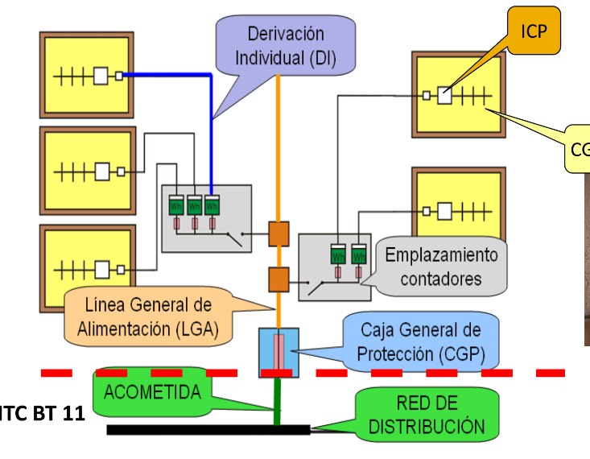
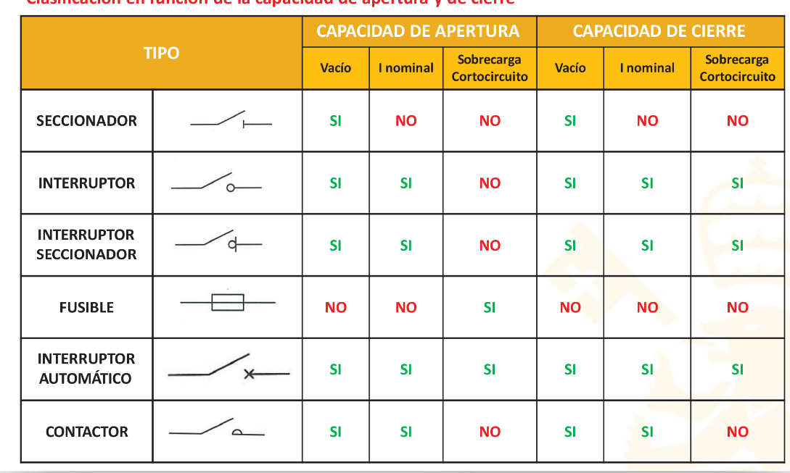

#instalciones_electricas #inst 
# Aparamenta
Equipo o elemento que ayuda a **maniobrar** una instalación. (Trafo, seccionador…)
Objetivo: operar sobre la red y en caso de falta(cortocircuito o sobrecarga), también tiene el objetivo de **evitar males mayores**.
Queremos proteger:
- Equipos
- Personas (sobre todo la derivación(fallos en aislamiento))
- Circuitos

De la caja de protección salen líneas hacia cada contador de la instalación.
## Variables importantes

- $U_n I_n$ Nominales
- $U_{m}$ ->tensión máxima que puede soportar un elemento hasta que se perfore su aislamiento.
- $I_{cc}$ ->(abrir) máxima corriente que podemos llevar en condiciones de corto trifásico. Por encima de este 
- Poder de corte y cierre
- T -> tiempo de actuación. Tiempo desde que se detecta hasta que se abre el circuito.
# Características generales

|                   TIPO   | ESQUEMA  | CAPACIDAD | DE        | APERTURA         | CAPACIDAD| DE | CIERRE                   |
| ----------------------- | ---- | --------- | --------- | ------------------------ | ----- | ------------ | ------------------------ |
|                         |    | Vacío     | I nominal | Sobrecarga Cortocircuito | Vacío | I nominal    | Sobrecarga Cortocircuito |
| [[SECCIONADOR]]             |      | SI        | NO        | NO                       | SI    | NO           | NO                       |
| [[interruptor]]             |     | SI        | SI        | NO                       | SI    | SI           | SI                       |
| INTERRUPTOR SECCIONADOR |     | SI        | SI        | NO                       | SI    | SI           | SI                       |
| [Fusible](Fusible.md)                 |      | NO        | NO        | SI                       | NO    | NO           | NO                       |
| [Interruptor automático](PIA%20Automáticos.md)  |     | SI        | SI        | SI                       | SI    | SI           | SI                       |
| CONTACTOR               |      | SI        | SI        | NO                       | SI    | SI           | NO                       |

## [Diferencial](Diferencial.md)

[[Cortocircuito]]
# CGMP
cuadro general de medida y protección
# ICP
interruptor general de potencia

# Problemas
![[../assets/T3 Instalaciones de baja tensión 2023-02-07 09.53.38.excalidraw]]

![[../assets/T3 Instalaciones de baja tensión 2023-02-07 10.03.12.excalidraw]]

