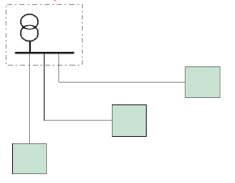
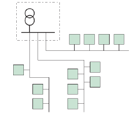
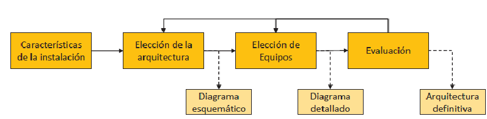
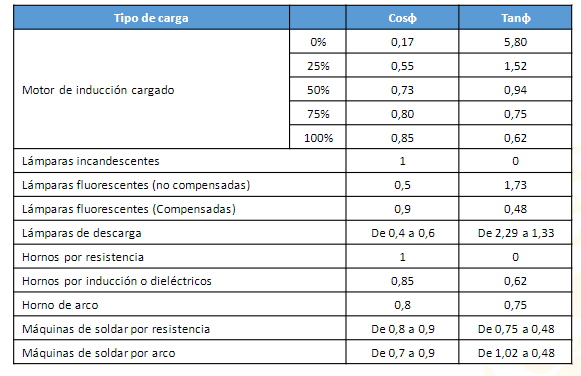
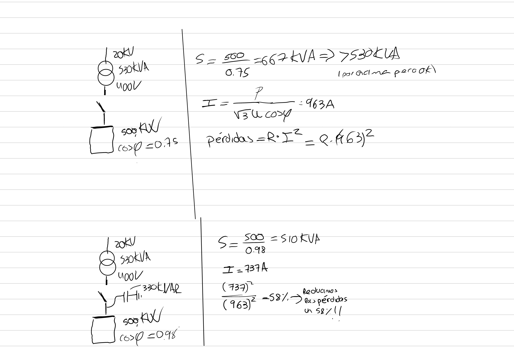

[[Instalaciones_Industriales]] [[II_Electricas]]

[Presentación Tema 5_PREV_CARG.pdf](../assets/Presentación_Tema_5_PREV_CARG_1674548240362_0.pdf)

## Previsión de cargas (ITC-BT-10) pag 185

> [!danger] Existen unos mínimos para las potencias

> [!info] 1-2-3 preguntas de examen

## Factor de utillización Fu/Cu/Ku

 La relación entre el consumo que va a necesitar el receptor (ej enchufe) y la potencia que es capaz de dar la instalción
 Solemos estar siempre muy por debajo

- Entre 0-1
- Individualmente a cada receptor -> diferente en cada receptor
- criterio del proyectista la estimación
 Las tomas conectadas en serie (regletas) depende de la primera toma
 Motores 0.75-1
 Luz -> 1
 Tomas de corriente ITC-BT-25
-

## Factor de simultaneidad Fs/Cs/Ks

- Entre 0-1
- Colectivo -> nos fijamos en el conjunto
- Criterio del cliente (el dice como lo va a utilizar) sino se puede usar el reglamento
 Relacion entre los receptores que están funcionando y la potencia total en conjunto.

 $$ P_{total}= SSGG (alumbrado, ascensores bombas calderas y AA y prev y cont incendios) + Garajes (alumbrado y ventilacion)+ viviendas + locales comerciales + IRVE(vehiculoelectrico)$$

## Viviendas

#### Electrificacion elevada (>9200 W)

- Obligatorio para casa de más de ___ m^2
- Si  > 14490W hace falta usar **trifasica**

#### Electrificación básica (>5750 W)

## SS GG

### Motores y bombas (p583) ITC-BT-47

Los motores, gruas y aparatos de **elevación** hace falta dimensionar su potencia
1.3(pag 587) para la potecia de arranque

 Bombas y motores de trabajo **1.25 SOLO EL DE MAYOR POTENCIA**  ==solo para el cálculo del conductor no para esto== (pag 584)
Si nos dan la relación esta prima sobre el resto
Si no nos dan la relación de Iarr/In (pag 587) para todos los motores

### Alumbrado

### Lampara de descarga (ITC-BT-44 3.1)

Todas las lámparas salvo los LEDS (ej fluorescente, incasdescente, halogeno)

- Potencia * 1.8

## Garajes

### Ventilación forzada

- ### Para garajes subterraneos

  - 20W/m^2

- ### Ventilación natural

  - Edificios de garajes
  - 10W/m^2

## Locales y oficinas

- 100W/m^2

- Mínimo  3450 W

## Industria

- 125W/m^2
- Minimo 10350 W 10.35KW

## IRVE (ITC-BT-52) pag 607

 Para uso comercial oficinas y viviendas **1/10** plazas
 Para industrias **1/40** plazas
 SPL = Sistema de proteccion de linea general de pe alimentación

- con SPL Fs=0.3
- Sin SPL Fs= 0.1 # Arquitectura de la instalación
 Layout de la instalación. LGA (ITC-BT-14) Linea general de alimentación.
 CT -> centro de transformación. Se pone de en la puerta ya que es muy pesadoo
 PCI, protección contra incendios
 CGBT-> Cuadro general de baja tensión. Barra de 400V con todas las protecciones, medidas...
 Del CGBT salen las lineas que llegan al CS
 Cuadro de seccionamiento -> Tienen los fusiblles de las lineas
 De los CS salen las lineas a las cargas.

La estructura de la red depende de muchos factores, aunque el primordial es el coste.

## Tipos de aquitectura

### Disposición centralizada

- Si las lineas son muy largas generan muchas pérdidas.
- 

### Disposición descentralizada

- Típica para la iluminación.
- Potenciasbajas en cada línea.
- 

### Diseño de arquitectura

 

# Factor de potencia y armónicos

 $\cos $  a mayor mejor. Siempre mayor que >=0.95.
 Ayda a redcir calbes,perdidas ...
 Tiene un problema. -> Las cargas son RL, pero para compensarla los condensadoras que colocamos tiene que estar lo m;as cerca posible de la carga. Se suelen conectar en las bornas de los motores y trafos(inductancia pura). ITC-BT-43
 ==Si nos pasamos, generamos subidas de tensión==
 

## Armonicos

 Se traducen en calor y dolor

## Problemas

 <!-- **10:23** [[quick capture]]: -->
<!-- **10:23** [[quick capture]]: -->
<!-- **10:24** [[quick capture]]: -->
 **10:31** [[quick capture]]:  
