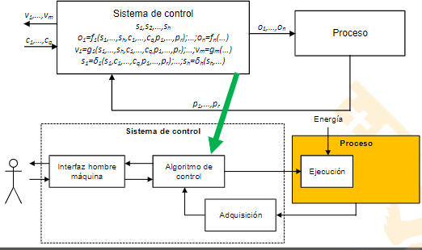
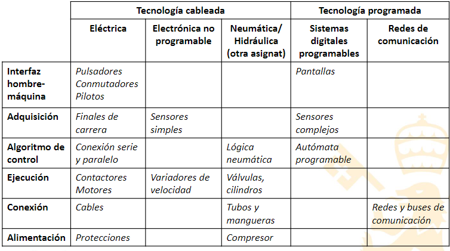
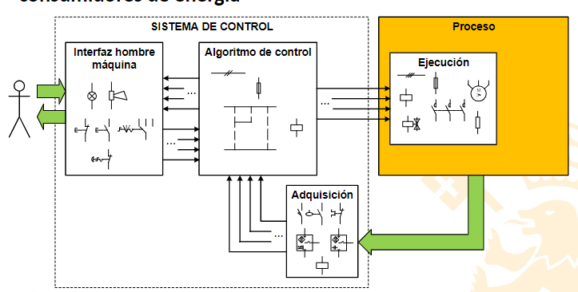
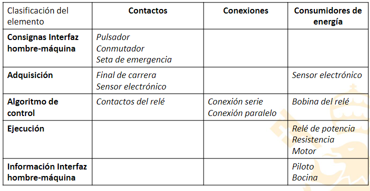
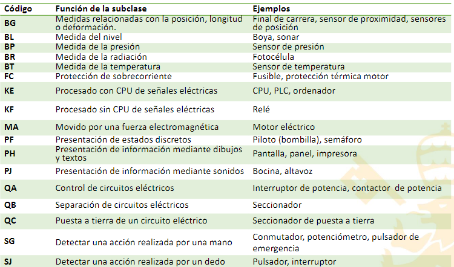
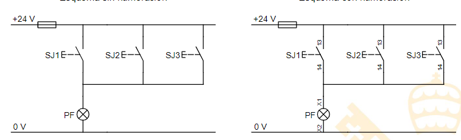
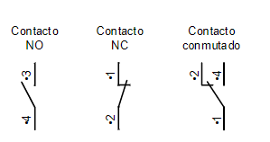

#Automatizacion 
[AI_Teo_3_Tecnologías_Cableada.pdf](../assets/AI_Teo_3_Tecnologías_Cableada_1672616316882_0.pdf)

# Basics
- Montar siempre la **ecuación** rápidamente antes
- **Actuadores** todos al final
- Si usas mucho una entrada en la lógica → **relé**
- Hacer **branching** todo lo que puedas, pero OJO solo se pueden recombinar en la salida (evita problemas, pero con cuidado se puede)
- Para cajas de controles en paralelo → NO Paralelo y NC serie.
- 
## Elementos básicos

|Protección térmica(FC| Switch normal| 

# Proceso de control
 Para implementar el proceso, hat que aprender a cablear el sistema.
 
# Resumen de tecnologías
 
 # Automatismo cableado
 Se implementa con tecnología cableada sobretodo eléctrica.
-
 
	
> [!warning]ning Cuidado con consumidores en el inter
## Relé
		- Repetidor lógico
		- Perfecto para governar potencia (relés de potencia o contactores)
		- Señal de control mucho menor que var
		- 
	

## Planos
Un plano puede tener o no los cables numerados dependiendo de la complejidad

> [!tip] Todos los consumidores de energía tiene que estar abajo. Para así evitar poner dos en serie
	
## Numeración de contactos
La cifra de la unidad **no es secuencial**, te dice el tipo de contacto que hay
	
	Menos significativa: función del
	contacto
	• Contacto NO: 3-4
	• Contacto NC: 1-2
	• Contacto conmutado: 1-2,4
	• Otras funciones:
	• Retardo: 5-6, 7-8
> [!bug]  Y bombillas

## Códigos de color
### Pulsadores
• 🟩VERDE identifica normalidad: función de arranque, puesta en marcha, inicio de ciclo
• ⬛NEGRO: función de paro, cualquier función si tiene rótulo identificativo (incluso arranque)
• 🔳BLANCO y GRIS tienen función similar a NEGRO
• 🟥🟨ROJO sobre fondo AMARILLO: identifica parada de emergencia
• 🟥bSe permite ROJO sin fondo amarillo para función de paro si no está cerca de parada de emergencia
### Pilotos
• 🔴ROJO: peligro o alarma
• 🟡AMARILLO: anomalía
• 🟢VERDE: funcionamiento normal
• 🔵AZUL: requerir acción del operador
