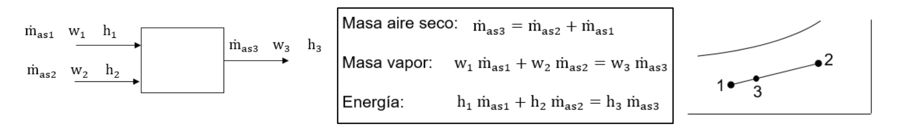
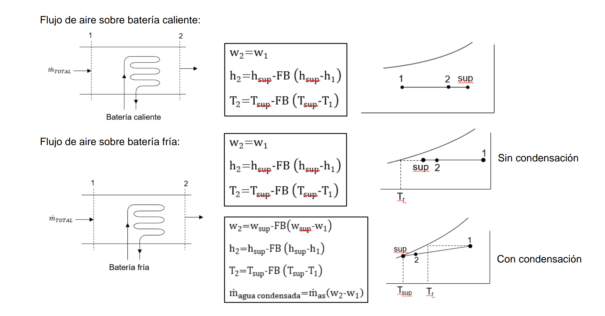
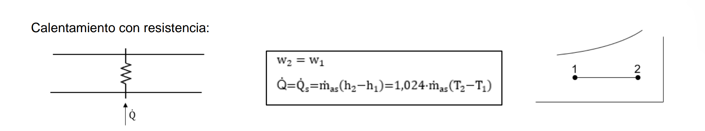
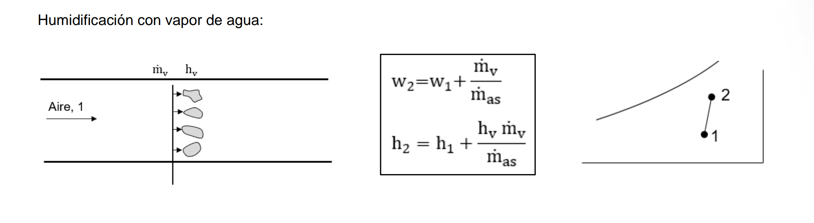
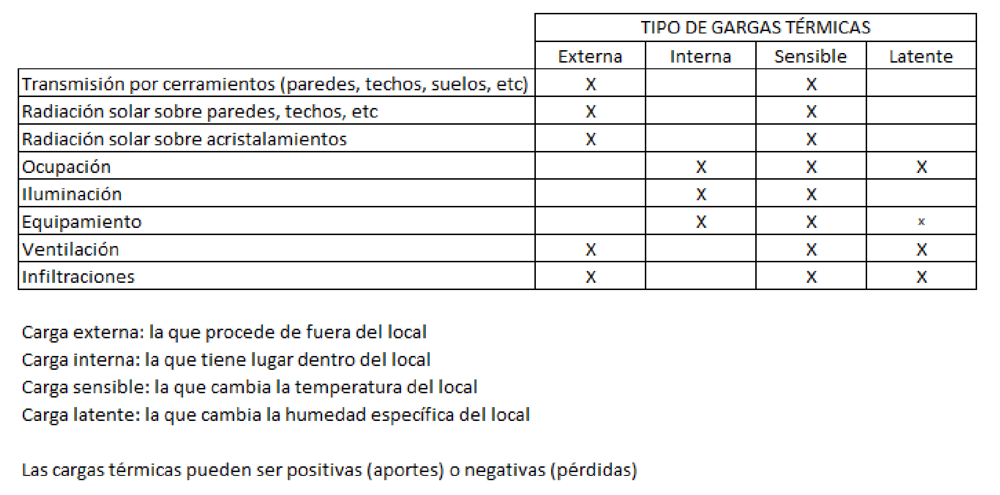

#Instalaciones_mecanicas

[Diapos](../assets/11_CLIMATIZACION%20Teoría%20rev_40%20(2).pdf)
![[../assets/Tema 11 Climatización 2023-02-21 09.16.22.excalidraw]]
# Varaibles psiconometricas
## Presión
Presión total [Pa] -> presion ambiente
Presion parcial seca
presion parcial humeda
$p_{t} = p_{seca}+p_{humeda}$
/draw
## Temperatura
Temperatura seca $T$-> la normal medida por un termometro
Temperatura de rocío $T_{r}$ -> Temperatura a la cual se empieza a formar condensación. 
Temperatura humeda $T_{h}$ -> Temperatura a la que se queda al empezar a vaporizar (botijo)

> [!NOTE] Title
> $T_{r}< T_{h}< T$

## Humedad
### Humedad específica 
$w \left[ \frac{kg_{v}}{kg_{as}} \right ]$ $\approx 10 \frac{g}{kg_{as}}$→ masa de vapor de agua por kg de aire seco
aire 1g/l | kg/mˆ3 agua 1000 g/l | kg/mˆ3
### Humedad relativa
$HR$ → % respecto a la cantidad máxima de vapor de agua que puede llevar el agua a esa temperatura(saturación).

> [!NOTE] Los edificios tienen mayor w por el sudor de la gente. Por lo que tiene más riesgo de condensación. Al entar al edificio con temp más alta se condensa.

## Entalpía
Ecuación de Bernoulli
$$\frac{p}{\rho g}+GT+z+\frac{vˆ2}{..} $$
  entalpía [j/kg]
  $$h = \frac{p}{\rho g}+GT$$

## Diagrama
X-> Temp
Y-> Humedad específica
Interscci'on en x con HR=100% -> Temperatura de rocio.
![[../assets/Tema 11 Climatización 2023-02-03 10.44.15.excalidraw]]

# Procesos elementales
## Proceso sensible
Se mueve en el diagrama en horizontal. Aumenta temp pero no w
## Proceso latente
Cambiar humedad (w) 
## mezcla de dos corrientes

## Flujo de aire sobre una superficie de distinta temperatura
Radiador (coche)= batería
Proceso sensible positivo

$$FB(Factor de bypass)= \frac{\dot{m_{as}}_{No Tratado}}{\dot{m_{as}}_{Total}}$$
Sup: aire que sale a temperatura de la superfie
T2: aire no tratado
> [!info] Note: #card
> la temperatura $T_{sup}$ tiene que ser mayor a la de rocío para que no se forme condensación 

## Resistencia electrica
Muy poco comun en los problemas.
No afecta a la humedad del aire w, solo horizontal

## Enfriamiento adiabatico
Añadimos humedad al aire con una ducha fría
Practicamente **entalpia cte** -> el proceso latente compensa al sensible

## Humidifacion con vapor de agua
Añadimos vapor (a presion amb 10 grados)

# Cargas térmicas
Las condiciones exteriores afectan mucho al diseño de la climatización.
Se diseña para las **condiciones extremas**  hasta un **percentil** del lugar donde se trabaja.
| Isntalación            | Verano | Invierno |
| ---------------------- | ------ | -------- |
| Hospitales, residencias, residencias de ancianos | 99.6%  | 0.4%     |
| Otros                  | 99%    | 1%       |

## Tipos
| Externa |     | Interna |     |
| ------- | --- | ------- | --- |
| Sensible        | No cambia HR    |   Latente      |  Cambia HR (genera vapor)      |

## Cargas principales
### Verano -calor
#### Sol
Cristal
Calienta el ladrillo -> conducción en pared
#### Personas
Calor y vapor
#### Iluminación
#### ordenadores
#### Cerramientos Interiores
Conducción desde otras habitaciones
### Invierno - Frio
#### Aire exterior
#### Cerramientos Interiores

# Sistema todo aire
	Sistema centralizado en el techo-> Fácil mantenimiento y bajo coste
![[../assets/Tema 11 Climatización 2023-02-17 10.47.39.excalidraw]]
Se puede añadir un recuperador de calor para que el aire que sale se use para aclimatar el aire $\dot{m}_{e}$ .
## Caudal constante
Presión variable
![[../assets/Tema 11 Climatización 2023-02-21 09.26.40.excalidraw]]
## Caudal variable VAV
Presión cte
![[../assets/Tema 11 Climatización 2023-02-21 09.28.58.excalidraw]]

## Fancoil
![[../assets/Tema 11 Climatización 2023-02-21 09.47.40.excalidraw]]
### Cuatro tubos
Puedes dar frío y calor a la vez.
### Dos tubos
Todo calor o todo frío