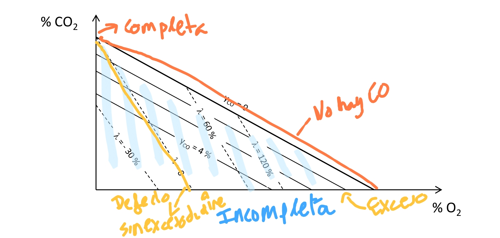
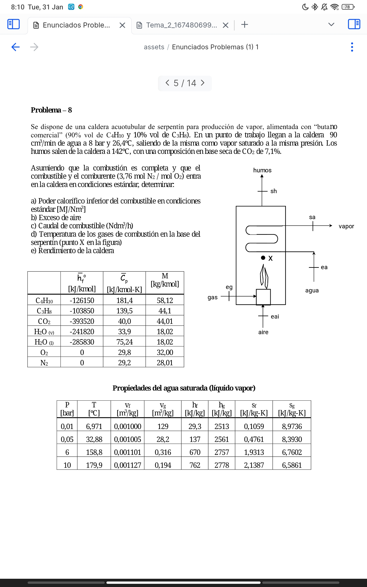

A# Tema 2 Combustión

#ingeniería_energetica
[Tema 2.pdf](../assets/Tema_2_1674806997627_0.pdf)
Los CCGT siguen teniendo una gran importancia en el mix español. Es más, actualmente la tecnología térmica, los CCGT son los que marcan el precio actualmente.
## Centrales térmicas 
Las centrales de carbón han perdido mucha importancia, pero siguen teniendo mucha importancia en países como China y Alemania(tras cerrar nuclear). 
En España el CCGT es el rey. 
 
Combustión → {Vapor y gases calientes a gran presión} → electricidad
^1675537150136

## Combustión
**[[#Comburente]](aire) + [[#Combustible]](hidrocarburos) → [#Productos].**
$$
C_{n}H_{m} + a (O_{2} + 3, 76*N_{2}) → b CO_{2} + c H_{2}O + d N_{2}
$$
Las relaciones molares entre los compuestos(a, b, c, d) se despejan ajustando el **número de elementos a ambos lados de la ecuación**.
$$
\begin{cases}
      C : n = b \\
H : m = 2 c\\
O : 2 a = 2 b + c\\
N : 2 · 3, 76 a = 2 d
    \end{cases} 

$$
### Combustible
Lo que se quema
#### Clasificación por fase
- Sólido → carbón
- Líquidos → Hidrocarburos CnHm
- Gaseosos → Gas natural, GLP
#### Clasificación por origen
- Fósil 
- No fósil  → biomasa
### Combustibles renovables
* Biogás (metano producido por digestión anaeróbica)
* Gas natural sintético (usando hidrogeno verde y CO₂ para producir CH4) 
* Bioetanol 
* Biodiésel 
* Gasolina sintética
### Comburente 
* **Aire**: 21 % de O2 y 79 % de N2. Cuidado con la formación de NOx por mal combustión 
> [!info] Info #card
> 21% oxygen + 79% N2 = 1 mol of O2 + 3.76 N2
* Oxígeno
### Producto
La proporción de los productos se puede dar en dos bases. Las cuales expresan la proporción molar de los productos.
#### Base húmeda
No se suele utilizar.
Incluye el agua en los cálculos de las [[#Fracción molar]]es.
#### Base seca.
[[#Fracción molar]] sin contar el agua
##### Fracción molar
Porcentaje de los moles en un lado de la ecuación.
## Tipos de combustión
- Completa: Rico en O2. Sobra O2
- Incompleta: No se ha acabado de oxidar. Poco oxígeno se ha creado COx
- Estequiométrica: Cantidad de comburente y combustible perfecta. **No hay O2** tras la reacción

# Balance másico de la combustión
> [!danger] Very important #card
> Se conserva la masa, no los moles (pero los )
^1675537651717

Ej:
$$C + O_{2} \to CO_{2}$$
1 mol C + 1 mol de O2 -> 1 mol CO2
1kg C + 1Kg de O2 -> 2 kg de CO2

## Relación aire-combustible 
$$AC= \frac{m_{aire}}{m_{comb}}$$

> [!info] Info #card
> $AC_{e}$ se refiere a la relación de aire combustible estequiométrica(minima combustión completa)
^1675537651722

> [!info] Info #card
>  Tambien se puede hacer con la relación molar

### Dosado

$$F= \frac{m_{comb}}{m_{aire}} $$
> [!info] Info #card
> Inversa de AC

## Exceso de aire $\lambda$ 

$\lambda = \frac{AC}{AC_e } -1$ 
### Dosado relativo $F_r$
$$F_{r}= \frac{F}{F_{e}}=\frac{1}{1+\lambda}$$

Por tanto: 
$\lambda$ >0  →Mezcla **pobre** (se usa más comburente(aire) del necesario)
> [!danger] Very important #card
>
No garantiza que la combustión sea completa, OJO 

$\lambda$ = 0 →Mezcla [estequiométrica](#Combustión%20estequiométrica): Cantidad de aire perfecta 
$\lambda < 0$ →Mezcla **rica** (en combustible) Se usa menos comburente del teórico.
> [!info] Info #card
> indica la cantidad de aire que sobra
> [!warning] Importante #card
> 

> [!warning] Importante #card
>  Puede ser tanto en completa c0omo incompleta!

## Temperatura de rocío
La temperatura de rocío de una mezcla de gases en la que uno (vapor) puede condensar es la de saturación de dicho vapor a la **presión parcial de este en la mezcla.** Si la temperatura de los productos es superior a la de rocío, el vapor no condensará, pero **si es inferior se iniciará la condensación**, reduciéndose la humedad específica de la mezcla y **manteniéndose la HR relativa al 100 %**.

Si el agua producida en la combustión sale condensada, esa se ha producido por debajo de su temperatura de rocío.
**La temperatura de rocío depende de la presión.**
$$P_v= y_{H2o}*P_{prod}$$
Donde:
- $p_{v}$ es la presión parcial del vapor. (parte de la presión causada por el vapor)
- $y_{H_{2}O}$ es la [[#Fracción molar]] del vapor.
- p_prod presión de los productos. (presión total/ real)

Sabiendo esto, aplicamos que la presión de rocío es la presión de saturación.
$$
T_{r}= T_{sat}(p_{v})
$$

## Combustión estequiométrica
**[[#Comburente]](aire) + [[#Combustible]](hidrocarburos) → [#Productos].**
$$
C_{n}H_{m} + \alpha (O_{2} + 3, 76*N_{2}) → \beta CO_{2} + \gamma H_{2}O +  δ N_{2}
$$
> [!info] Info #card
> se consume todo el O2

Las relaciones molares entre los compuestos(a, b, c, d) se despejan ajustando el **número de elementos a ambos lados de la ecuación**.
$$
\begin{cases}
      C : \beta = n \\
H : \alpha = n+\frac{m}{4}\\
O : \gamma = \frac{m}{2}\\
N : δ = 3.76\left( n+\frac{m}{4} \right)
    \end{cases} 
    $$
En base seca:
$y_{CO_{2}}= \frac{\beta}{\beta+δ}$  y $y_{N_{2}}=\frac{δ}{\beta+δ}$
## Combustión completa
Si se hace la combustión con un aire donde $\lambda\geq 0$ es decir, que no falte aire, y se hace a la **temperatura adiabática**.
$$
C_{n}H_{m} + (1+\lambda)\alpha (O_{2} + 3, 76*N_{2}) → \beta CO_{2} +(1+\lambda) \gamma H_{2}O + \lambda  δ N_{2}
$$
> [!info] Info #card
> sobra $\lambda \alpha O_{2}$  ya que es el [Exceso de aire $ lambda$](#Exceso%20de%20aire%20$%20lambda$)

## Combustión incompleta

Parte del beta del CO2 aparece como CO con beta2, loque causa tambien por balance que tengamos beta2 más de O2.
> [!info] Info #card
> Aparece $CO$ ya que no se oxida por completo todo el CO2. Puede pasar aun teneiendo suficiente O2 (tambien sobra) si la temp no es la adecuada

# Triángulo de la combustión

# Balance energético de la combustión

## Entalpía de formación
Calor absorbido en la formación de 1 kmol de un determinado compuesto en unas condiciones dadas a partir de sus componentes en su estado fundamental. (25 grados 1 bar).
Para las reacciones exotérmicas ⇾ negativo (criterio de aportar energía)

> [!info] Info #card
> La entalpía de formación de un elemento fundamental (o2, N2 ...) se considera nula
### Entalpía de formación del agua
En algunos compuestos, por ejemplo el agua,  aparecen dos valores, uno para gas y otro para líquido.
$\bar{h}_{f(l)}^{0}=\bar{h}_{f(g)}^{0}-\bar{h}_{f g}(T^{0})$

## Entalpía absoluta
[Entalpía de formación](#Entalpía%20de%20formación) en condiciones estándares + $\Delta h$por encima del estado estándar 
$\bar{h}(p,T)=\bar{h}_{f}^{0}+\Delta\bar{h}_{(p^{0},T^{0})\to(p,T)}=\bar{h}_{f}^{0}+\bar{h}(p,T)-\bar{h}(p_{~}^{0},T^{0})$
### Incremento de entalpia sobre condiciones estándar
$\Delta h=\hbar(p,T)-\hbar(p^{0},T^{0})$
En genérico:
$\Delta\bar{h}=\int_{T^{0}}^{T}\bar{C}_{p}(T)\ d T$
Si se supone gas perfecto (**lo más común**)
$\Delta\dot{h}=\bar{C}_{p}~(T-T^{0})$
Si no se sabe la Cp, se puede sacar:
$\bar{C}_{p}=\frac{\bar{h}(T_{p})-\bar{h}_{f}^{0}}{T_{p}-T^{0}}$
Donde p se refiere a los productos y 0 a las condiciones estándar.
> [!info] Info #card
> en condiciones normales, la entalpia absoluta es igual a la relativa
## Entalpía de combustión | Poder calorífico

Representa el calor absorbido en la **combustión completa** de 1 kmol de combustible cuando productos y reactivos en las condiciones estándar.
> [!info] Info #card
> Siempre son negativas para combustión ya que libera energía

El poder calorífico es el valor absoluto de la entalpia de combustión.
$$
\bar{PC}= \mid h_{comb}\mid =\sum_{p}{n_{p}}\bar{h}_{p}-\sum_{r}{n_{r}}\ \bar{h}_{r}
$$
En condiciones estándar:
$$
h_{comb}^0=\sum_{p}{n_{p}}\bar{h}_{f;p}^{0}-\sum_{r}{n_{r}}\ \bar{h}_{f;r}^{0}
$$
La entalpia usada para la combustión, es en total la usada para formar los productos más la ganada al romperse los reactivos. 

> [!warning] Importante #card
> $$\dot{n}_{c o m b}\;\sum_{r}n_{r}\:\bar{h}_{r}+\dot{ Q}=\dot{n}_{c o m b}\;\sum_{p}n_{p}\;\bar{h}_{p}$$
> Donde Q es el trabajo realizado(si se transmite calor o mueve un eje) y n es la proporción de cada elemento.
 
$\dot{Q}=\dot{n_{comb}}*h_{comb}$

### Poder calorífico superior PCS
Se ha dejado **TODA la energía posible** en la combustión.
Toda el agua resultante de la reacción está en estado líquido.

### Poder calorífico inferior PCI
Toda el agua resultante sale en forma de gas.
> [!info] Info #card
>  Es más costoso formar un gás que un liquido por lo que el PCI es menor

### Diferencia PCI PCS
Para $C_{n}H_{m}$ la diferencia viene dada por $\overline{{{P C J}}}^{C}-\overline{{{P C I}}}^{0}=\frac{m}{2}\ (\overline{{{h}}}_{\mathrm{f}}^{0}\,H_{2}O_{(v)}^{0}-\overline{{{h}}}_{\mathrm{f}}^{}\,H_{2}O_{(l)}^{})$.
El m/2 viene de que se usan 2 de H para formar el agua.  
> [!info] Info #card
> El extra de energía dado por el PCS se puede ver mirando la difreencia de entalpía de formación para el agua líquida y en forma de gás.
# Rendimiento

$$
\eta={\frac{\bar{W}}{\dot{m}_{c o m b}\;P C I}}
$$
## Rendimiento de una caldera

$$
\eta={\frac{\bar{W}}{\dot{m}_{c o m b}\;P C I}} = 1-\ {\frac{\Delta\dot{H}+\dot{m}_{c o m b}\ {\frac{\beta_{2}\,(h_{f i C O}^{0}-h_{f i C O_{2}}^{0})}{M_{c o m b}}}}{\dot{m}_{c o m b}\;P C I}}
$$
## Rendimiento en un motor

$$
\eta={\frac{\bar{W}}{\dot{m}_{c o m b}\;P C I}} = 1-\ {\frac{ \dot{Q_{sal}}+ \Delta\dot{H}+\dot{m}_{c o m b}\ {\frac{\beta_{2}\,(h_{f i C O}^{0}-h_{f i C O_{2}}^{0})}{M_{c o m b}}}}{\dot{m}_{c o m b}\;P C I}}
$$
## Problemas
[Enunciados](../assets/Enunciados%20Problemas%20(1)%201.pdf)
### Ejemplo 9.1 
Se trata de determinar la relación aire-combustible estequiométrica de un hidrocarburo CnHm.

### Problema 8

[[../assets/Tema 2%3A Combustión 2023-01-31 08.11.43.excalidraw]]

![![pages/#^Table2]]