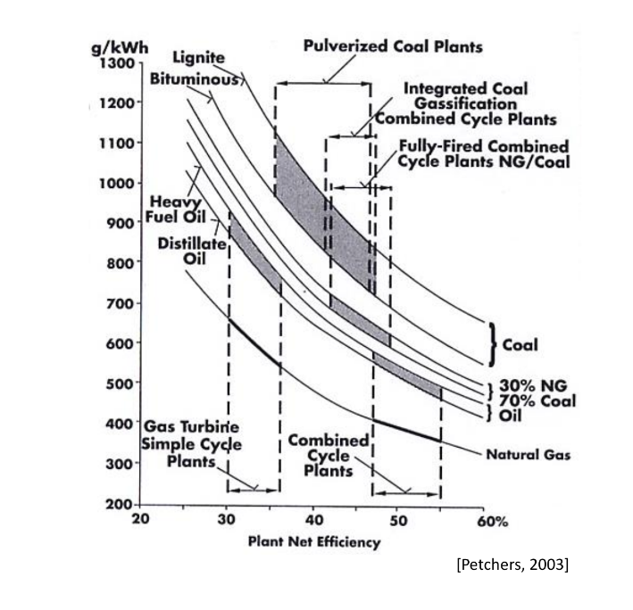
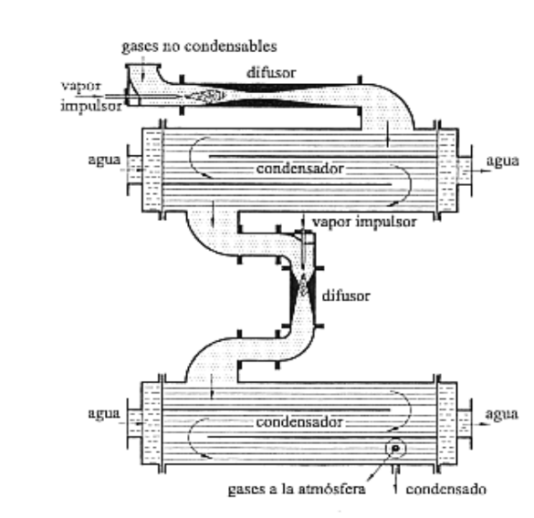
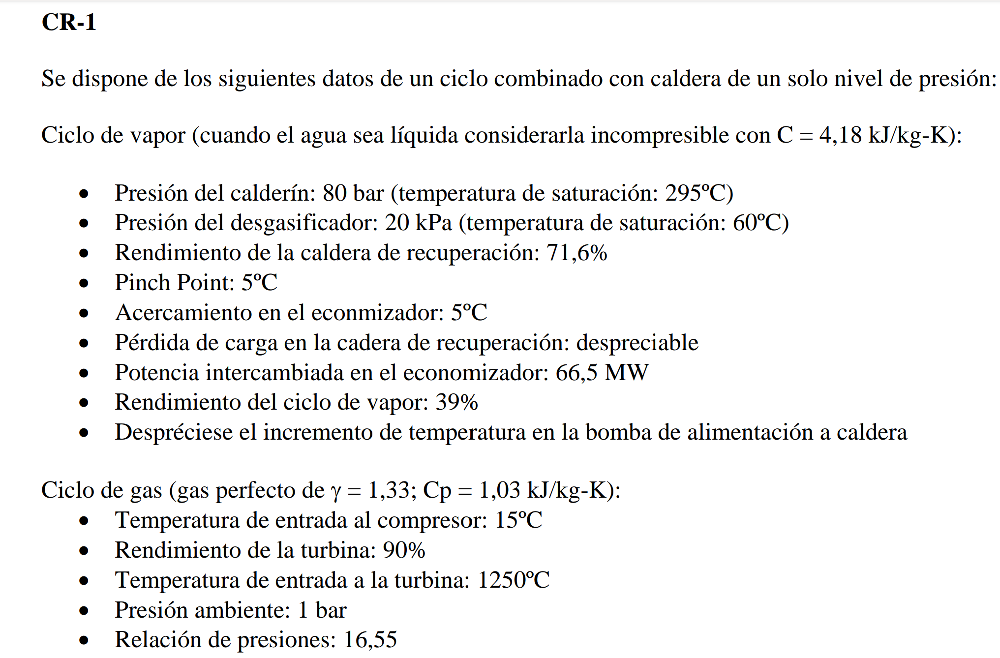
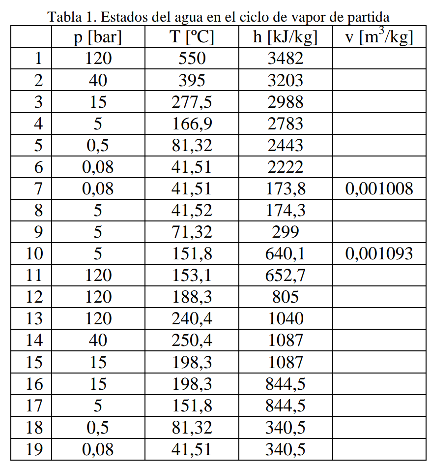

Objetivo del tema -> leer diagramas de centrales
[Tema 3](../assets/Tema%203.pdf)
[Problemas ](../assets/Problemas%20resueltos.pdf)

> [!info] Info #card
> Las centrales CCGT son las que tienen más rendimiento y menos emisiones.
# Tipos de Ciclos 
[[Ciclo Rankine]]
[[Ciclo Brayton]]
[[Ciclo Combinado]] -> Rankine con  Brayton en el evaporador
[[Gas ideal]]
# Partes de un ciclo
```dataview
table  
  WHERE contains(file.tags, "#ingeniería_energetica") AND
  contains(file.tags, "#partes_ciclo")AND
  !contains(file.name, ".Desktop") 
  ```

# Circuito de vacío
Elimina el oxígeno disuelto en el agua. Estamos trabajando por debajo de la presión atmosférica, por lo que puede entrar aire por juntas.
Se coloca a la **salida del condensador**, también precalienta el condensado(más eficiente caldera). Para alimentarlo, se usan gases a meida presión de la turbina.




# Captura de Co2
![[../assets/Tema 3 Centrales Térmicas 2023-02-20 09.32.09.excalidraw]]


# Ejercicios
## Ejercicio 1

![[../assets/Tema 3 Centrales Térmicas 2023-02-13 08.10.27.excalidraw]]


![[../assets/Tema 3 Centrales Térmicas 2023-02-13 08.18.14.excalidraw]]
### A) Gasto de vapor en la turbina$\dot{m_{v}}$
$\dot{Q_{eco}}= \dot{m_{T}}*C*\Delta T_{v_{2}v_{3}}$
$\dot{Q_{cond}}=\dot{m_{ge}}*C_{p}*\Delta T_{a_{6}a_{7}}$
Vamos al ciclo de la turbina para sacar a4
a4s usando insentrópico
$\frac{T_{a_{4s}}}{T_{3}}= (\frac{p_{a_{4}}}{p_{a_{3}}}ˆ\frac{1-\gamma_{})}{\gamma}\to T_{a_{4s}}= 562.45C$

$n_{T}=\frac{T_{a_{3}}-T_{a_{4}}}{T_{a_{3}}-Ta_{4s}}$
> [!info] Note: #card
> Los puntos s son los que saldría si [[isentrópico]] (entropía cte (linea vertical))

> [!info] Note: #card
> realmente es $mC\Delta T$ pero quitamos mC del numerador y denominador

Lo máximo que puede hacerme es devolverme a ambiente por lo que el rendimiento se calcula respecto a esta temp
$n_{CR}=71.6 \% =\frac{T_{a_{4}}-T_{a_{7}}}{T_{a_{4}}-T_{amb}} \to T_{a_{7}}=170.48 C$  

### B) Caldera de evaporación $\dot{m_{qe}}$

### C) Potencia disipada del condensador $\dot{Q_{cond}}$
Usamos el rendimiento del ciclo de vapor en su conjunto. 
Sabemos que la única energía que se intercambia con el exterior se hace en el condensador
$n_{CV}= \frac{\dot{W_{cv}}}{\dot{Q_{CR}}}=1-\frac{Q_{cond}}{Q_{CR}} \to \dot{ Q_{cond}}=122.78MW$
# Problema 9.2 T2
![[../assets/Tema 3 Centrales Térmicas 2023-02-13 09.04.31.excalidraw]]
$\dot{W}_{}=\dot{n}({W}_{T}-{W}_{c})$
> [!info] Note: #card
> $\dot{ n}$ se refiere al flujo de moles por segundo

En compresor
$\dot{W}_{c}= n_{air}C_{p_{air}}\Delta T_{2-1}$
En Turbina:
$\dot{W}_{T}= n_{Prod}C_{p_{Prod}}\Delta T_{3-4}$
## Rp1
### Enunciado
Estado inicial
![[../assets/Tema 3 Centrales Térmicas 2023-02-14 08.23.04.excalidraw]]
Con [Repowering por agua de alimentación](Repotenciación.md#Repowering%20por%20agua%20de%20alimentación) con prealimentación.
![[../assets/Tema 3 Centrales Térmicas 2023-02-14 08.25.30.excalidraw]]
### Gasto másico de vapor que entra en la turbina 
Balance de energías del ciclo de vapor
Hacemos sin brayton ya que tendríamos  dos m de incógnitas
$W_{CV}= 450 MWe = \dot{m_{v}}* (w_{tv}-w_{bv})$
$$w_{tv}= h_{1}-(\alpha_{1}h_{2}-\alpha_{2}h_{3}-\alpha_{3}h_{4}-\alpha_{4}h_{5}-(1-\alpha_{1}-\alpha_{2}-\alpha_{3}-\alpha_{4})h_{6})$$
Despejamos los alphas haciendo blaance energético en los precalentadores.
$(1-\alpha_{1}-\alpha_{2}-\alpha_{3})(h_{8}-h_{9}) +\alpha_{4}( h_{5}- h_{18})= 0$
....
$\alpha_1=0.1112$ $\alpha_{2}= 0.05$ $\alpha_{3}= 0.1$ $\alpha_{4}= 0.04829$
Calculamos la potencia usada en las bombas
$w_{bv}=(1- \alpha_{1} -\alpha_{2}-\alpha_{3})(h_{8}-h_{7})+ (h_{11}-h_{10})=12.93$

Con esto ya se puede despejar la mv


### Extracciones de vapor de la turbina para los precalentadores (desgasificador y precalentador  cerrado de baja presión)
Se hacen los balances de los precalentadores, pero con el esquema del ciclo combinado.
###  Potencia neta del ciclo de vapor 
> [!info] Note: #card
>Fíjese que cambia, ya que se cambia la configuración de los precalentadores y con ello las alphas. → al hacer el balance de entalpía en la turbina, sale diferente(mejor puesto que se ha hecho con menos restricciones) 
###  Calor aportado por el carbón 1p  
###  Potencia térmica intercambiada en la caldera de recuperación 1p  
###  Flujo másico de gases 1p  
###  Potencia neta del ciclo Brayton 1p  
###  Rendimiento del ciclo combinado.

## RP2
### Enunciado



### Gasto másico de vapor que entra en la turbina

Sabemos que se producen 500 MWe de energía que se producen haciendo un balance entre lo generado por las turbinas y lo consumido por las bombas.
> [!info] Note: #card
> OJO esto es sin la realimentación del ciclo Brayton

$W = 500 = \dot{m}_{v}(w_{tv}-w_{bombas})$
Hacemos balance de entalpía
**Trabajo de vapor**
$w_{TV}= h_{1}-\alpha_{1}-\alpha_{2}h_{3}-\alpha_{3}h_{4}-\alpha_{4}h_{5}-(1-\alpha_{1}-\alpha_{2}-\alpha_{3}-\alpha_{4})$
Tenemos que sacar todos los alpha:
Hacemos balance en todos los intercambiadores
$\alpha_{1} h_{2}+h_{12}=h_{13}+\alpha_{1}h_{14}$-> $\alpha_{1}=0.1112$
$\alpha_{2}h_{3}+h_{11}+\alpha_{1}h_{15}= h_{12}+(\alpha_{1}+\alpha_{2})$ -> $\alpha_{2}=0.05$
... -> $\alpha_{3}=0.1$, $\alpha_{4}=0.04329$

Ya con las alphas despejamos $w_{tv}= 1040 \frac{kJ}{kg}$
**Trabajo en bombas**
$w_{bombas}= (h_{8}-h_{7})*(1-\alpha_{1}-\alpha_{2}-\alpha_{3}-\alpha_{4}) + (h_{11}-h_{10})=12.93 \frac{kJ}{kg}$
**Trabajo total**
$W = 500 = \dot{m}_{v}(w_{tv}-w_{bombas}) \to \dot{m}_{v} = 486.6 \frac{kg}{s}$
> [!info] Note: #card
> y que pasa con la energía del condensador y caldera?
>  No importa, 

### Extracciones de vapor de la turbina para los precalentadores
En el enunciado dicen: Donde la fracción del agua de alimentación que atraviesa los dos precalentadores cerrados de mayor presión es el **70%** de la que impulsa la bomba.


### Potencia neta del ciclo de vapor
> [!info] Note: #card
> Toda la energía de ciclo brayton se consume No, se usa para generar energía  tambien
> 

Se hace igual que a) pero con las alphas del b). 

### Flujo másico de gases
Se ve cuanto ha subido la caldera de recuperación de Q. ese Q lo da el Brayton usando m masa.


### Potencia térmica aportada en la postcombustión

### Potencia neta del ciclo Brayton

### Rendimiento del ciclo combinado


$\eta_{cc}=\frac{W_{CG}+W_{CV}}{Q_{comb} +Q_{postcomb}}$