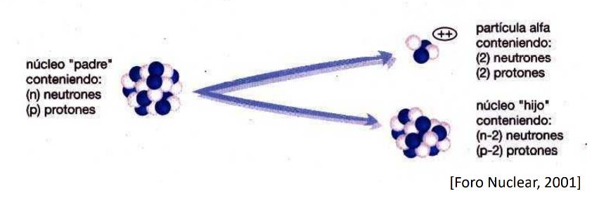
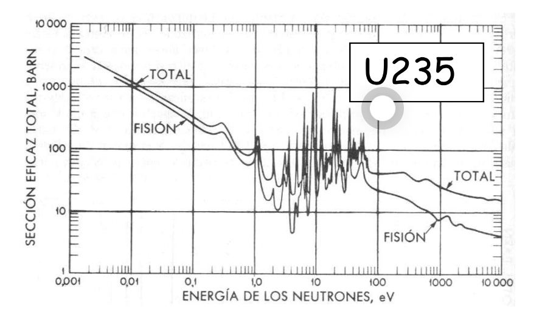

[Diapos](../assets/Tema%206.pdf)

# Radiación

⏫  [Número másico elevado](#Número%20másico%20elevado) -> ⏫ Radiación
## Número másico elevado
Muchos  neutrones
 (relación neutrón protón menor a la deseada(menos protones de los queridos))

## Natural
La masa real de un núcleo es siempre **menor** que la suma de sus nucleones constituyentes.
> [!info] Note: #card
> Este defecto de masa corresponde a la **energía de enlace**.

[[Energía de  enlace]]

# Particulas
## Alpha
Nucleo de helio -> 2 protones y 2 neutrones
![[../assets/Tema 6 Energia nuclear 2023-02-20 10.11.19.excalidraw]]
## Beta
### Beta Negativa
Se pierde un neutrón y se gana un protón. Se libera un **electrón** 
![[../assets/Tema 6 Energia nuclear 2023-02-20 10.07.56.excalidraw]]
### Beta Positiva
Se pierde un protón y se gana un neutrón.
![[../assets/Tema 6 Energia nuclear 2023-02-20 10.10.16.excalidraw]]
## Gamma
Se emite calor y energía. Se emiten fotones. ES PELIGROSA
La desintegración radiactiva viene acompañada de radiación  . Se trata de radiaciones electromagnéticas, similares a los rayos X. Su aparición es debida a que tras la transformación radiactiva el núcleo queda en un estado excitado, liberándose este exceso de energía mediante la emisión de fotones.

# Reacciones nucleares

Objetivo: Nucleón  
Proyectil: Neutrón
Impacta el proyectil en el objetivo y dependiendo de lo que pase hay diferentes tipos:

## Sección eficaz
probabilidad de que ocurra la operación.

A ⏫ Energía del netrón -> ⏫ probabilidad de reacción
## Dispersión
Impacta y sale rebotado(con menos energía cinética).
Se traspasa la energía del neutrón al nucleón.
### Elástico
Se le da más velocidad 
### Inelástica
Le da más energía interna
## Captura
Se captura el neutrón y pasa a ser parte del núcleo.
U 238 + neutrón - U239 + [Gamma](#Gamma) -> Np 239 +  [Beta Negativa](#Beta%20Negativa) -> Pu 239 + [Beta Negativa](#Beta%20Negativa)
## Fisión
El núcleo se **rompe** al impactar el proyectil.
Pasa con el U 233, U235(el famoso) y Pu 239

# Aplicaciones
[[Fisión nuclear]]