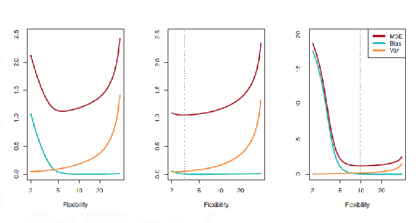

#machine_learning #model_performance 

![[Expected Test Error]]

 
 1. Intermidiante normal model
 2. Very Linear problem
  3. Highly non linear problem (High bias for simple models)

 To avoid a lucky test set we use Resampling to create multiple test sets to test
[[test set]]

[Cross Validation](Cross%20Validation.md)
[[P value]]

