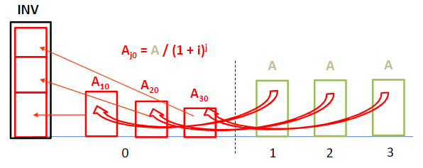
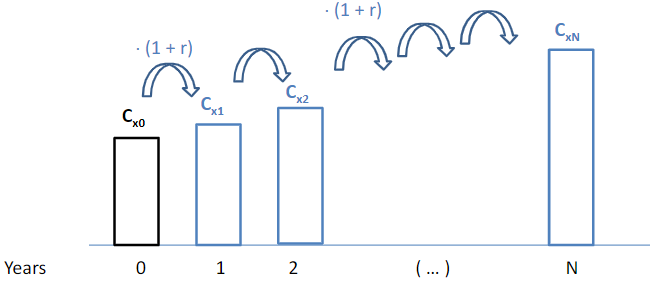
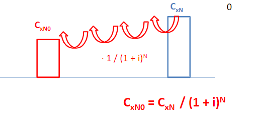

- ## Inversión
  id:: 63d2fb71-d2b8-453c-a7c4-393f3e4d9787
  Dinero que se pone al iniciar el proyecto. Este coste se tiene que recuperar con el tiempo durante la vida util del proyecto(N), a esto se le llama ((63d2fb72-101c-40d9-aa6c-f0133bcf7605))
 ## Amortización | CAPEX
  id:: 63d2fb72-101c-40d9-aa6c-f0133bcf7605
  Cantidad ==constante== a pagar anualmente para que al final de la vida del proyecto se haya restituido la ((63d2fb71-d2b8-453c-a7c4-393f3e4d9787)) y los ((63d2fc63-50fc-4352-87f6-5dec3fbd1311)).
  La amortización(A) se calcula como:
  $$A=INV*f_a$$
  Donde $f_a$ es la función de amortización.
  $$f_a=\frac {i(1+i)^N}{(1+i)^N-1}$$
  
 ## Intereses
  id:: 63d2fc63-50fc-4352-87f6-5dec3fbd1311
  Los intereses que se usan en un proyecto vienen marcados por el coste de adquirir el capital necesario WACC (weigthed average capital cost).
  Se suele marcar con una $i$
 ## Gastos de operación | OPEX
  Los gastos anuales de tipo “x” (combustible, mantenimiento, materiales, ...) se planifican a partir de su ==valor en el año 0 (𝐶𝑥,0)==, con ==tasa de creciemiento constante==.
	### Gasto en año x
	  Se Sube desde el gasto inicial $C_{xN0}$
	  $$C_{x,j}= C_{x,0}*(1+r_x)^j$$
	  
	## Coste del año x en año 0
	Ese importe hay que valorarlo a día de hoy para determinar qué dinero debo depositar en un fondo a interés “i” para hacer frente al pago de ese coste en el año j-ésimo.
	  $$ C_{xN0}= C_{x,j}/(1=)^N$$
	  
	## Coste total de operación de un proyecto
	  Sumando los costes de cada momento a año cero se obtiene:
	  $$C_x=C_{x,0}*f_{\Epsilon,x} = C{x,0}*\frac{k_x*(1-k_x^N)}{1-k_x}$$
	  Donde $f_{\Epsilon,x}$ es la ==tasa de acumulación==
	  Donde la tasa de crecimimiento es:
	  $$k_x= \frac{1+r}{1+i}$$
	  $r$ es retorno y $i$ es inflación
		-
	## Costes normalizados
	  La cantidad 𝐶𝑁𝑥 se denomina coste normalizado del gasto “X”. Suele expresarse de forma relativa a la producción anual.
	  $$C_{Nx} = C_{x,0}*f_{\Epsilon,x}*f_a$$
	  Donde el factor de amortización:
	  $$f_a = \frac{1}{f_{\Epsilon,x}|_{r_x=0}}$$
	  Que es la tasa de acumulación si no hay que tener intereses, es decir solo inflación.
		- ## Casos particulares
		  r = 0 -> CNX = Cno
		  r = i -> k=1 -> Acumulacíon suma
	En una central normal de energía se tienen los siguientes costes:
	  $$CN =INV*f_a+C_f*f_a*f_{\epsilon t}+C_{om}*f_a*f_{\epsilon O M}$$
	  A este coste normalizado se le suele designar como “Levelised Cost of x” (LCOE para electricidad, LCOH para “heating”, ...)
 # LCOE: Levelized cost of energy
	También llamado coste normalizado de energía
	$$LCOE =CNE =INV*f_a+C_f*f_a*f_{\epsilon t}+C_{om}*f_a*f_{\epsilon O M}$$
	  $$LCOE = CAPEX + OPEX$$
	\(INV\): inversión al momento inicial del proyecto que hay que devolver a N años
	\(C_f\): Coste del combustible (€/año)
	\(C_{om}:\) Coste de operación y mantenimiento
	\(f_a\): Función de amortización
	\(f_{\epsilon t}\): tasa de acumulación del combustible
 # Ingresos
	## Venta de energía
	  La energía se vende a una tarifa $T_v [€/MWh]$. Esta tarifa se reavlizará a na tasa de proyección de $r_v$.
		- ### Tarifa normalizada
		  Podemos normalizar los ingresos a lo largo del tiempo aplicando la tarifa normalizada:
		  $$T_N[€/MWh] = T_{v,0}$$
 # Problemas
	**En la subasta de renovables de enero de 2021 se ha obtenido como remuneración fija 25 €/MWh para la FV. Se consideran como condiciones de la tecnología: 25 años de vida útil y 1800 horas equivalentes de operación a potencia nominal. La remuneración se actualizará sólo con la inflación, estimada en 3,5%. La rentabilidad (wacc) que se busca es de 7,5%.**
		- **1. Inversión específica [€/kWp] máxima que podría tener la planta para ser rentable con esas condiciones**
		- Ingresos 25 €/MWh
		- Gastos no hay de combustible(f) ni operacion y mantenimiento (om)
	Comprobamos que \(VAN \ge 0\)
	$$VAN = ING * f_{\Sigma } -Gasto*f_{\Sigma} -INV \ge 0$$
	\(f_\Sigma = \frac {K(1-K^N)}{1-K}= 15.85\) Tasa de producción 7.5% inflación 3.5% -> \(K=\frac{1+r}{1+WACC}= 0.96628\)
	$$25 [€/MWh] * 1800 [h/año] $$