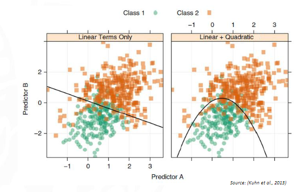

[Correlation](Correlation.md)
> [!info] Note: #card
> To fix [[Colinearity](Correlation.md)] we remove var with highest VIF

### Variance Inflation Factor (VIF)
$$ VIF(X_i) = \frac{1}{1 - R_i^2} $$
The percentage of the **[[variance]] of a variable that can be explained by the other variables**.

 $R_i$ ≈ 1 ⇾ $X_i$ is explained by the other variables. 
 This means that $X_i$ is collinear with the other variables. E.g. 0.9 means that 90% of the variance of $X_i$ is explained by the other variables.
⏫⏫ VIF values **(greater than 10)** indicate that the variable is collinear with other variables.
> [!tip] Very important in [[regression]]

#### Code
```r
 vif(X)
```